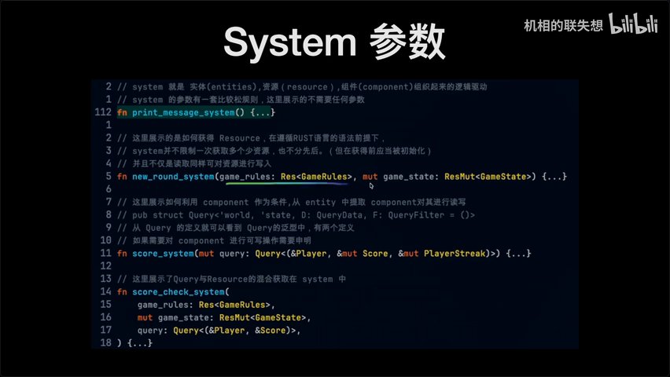
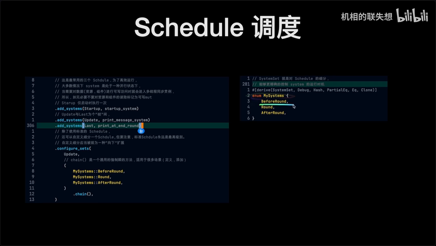
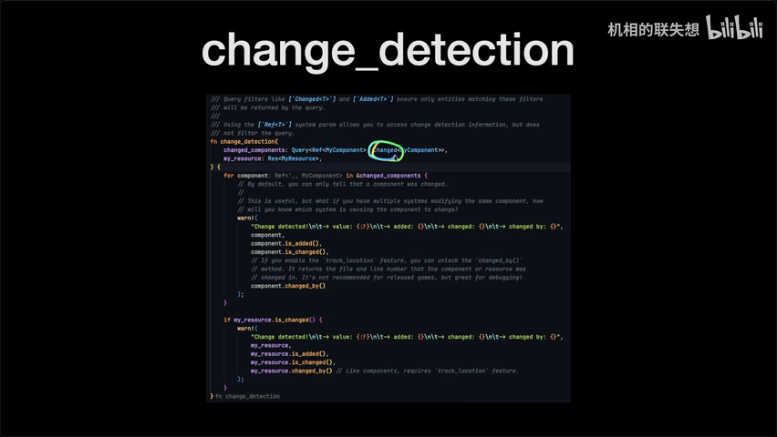
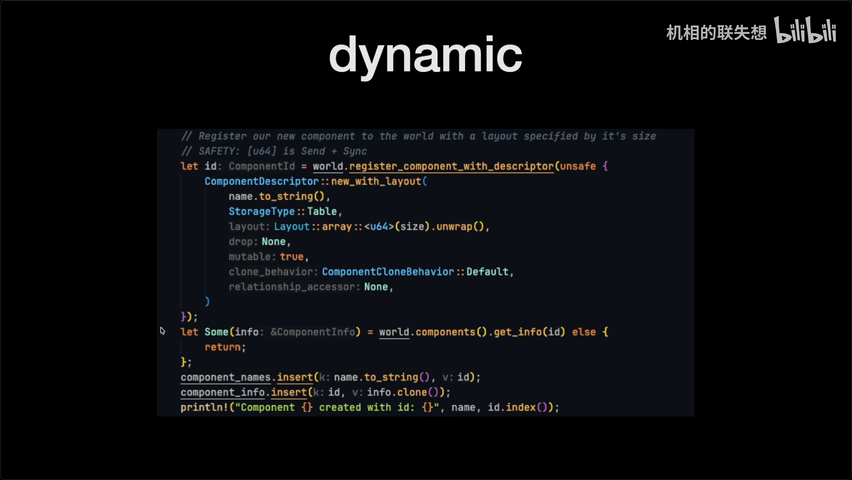
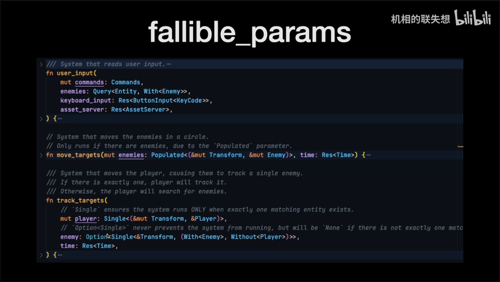
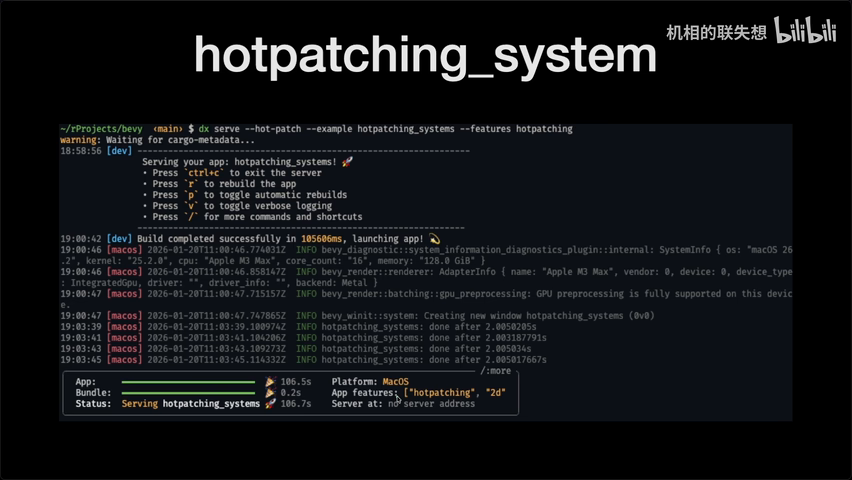

# Bevy ECS 全面学习笔记

> 来源：[Bilibili BV14UzWBLEXD](https://www.bilibili.com/video/BV14UzWBLEXD/) | 时长：~55 分钟 | 作者：Bevy 中文社区分享

---

## 一、AI 摘要

本视频是 Bevy ECS 的全面学习教程，基于 `ecs_guide` 官方示例系统讲解 Bevy 的核心架构，然后逐一梳理 ECS 目录下所有官方示例的重点。

核心内容涵盖：
- **Component**：标准 Rust 数据类型 + `#[derive(Component)]`，既是查询标记也是与 Entity 绑定的存储空间
- **Query**：从 World 中查询拥有特定 Component 的 Entity，支持 Data + Filter 两部分
- **System 参数**：支持 Query、Res/ResMut（Resource）、Commands（带缓冲区）、World（独占执行）、Local（绑定到 System 的变量）
- **Schedule 调度**：Startup（一次）、Update/Last（每帧）、自定义 SystemSet、条件运行（run_if）
- **Resource**：使用前必须初始化，推荐在 `App::init_resource()` 时完成
- **0.17 新特性**：Disabling 默认组件、Relationship 关系查询、Message 取代 Event、State Scoped 状态管理

---

## 二、核心概念

### 1. Component（组件）
- 标准 Rust 数据类型，用 `#[derive(Component)]` 派生
- 两个作用：① 用于 Query 查询标记 ② 与 Entity 绑定的存储空间
- 支持枚举类型、实现自定义 Trait 并与 Entity 绑定
- 不可变组件（`ImmutableComponent`）：只能替换，不能修改内部属性

### 2. Entity（实体）
- 组件的容器，一个 Entity 可绑定多个 Component
- 支持嵌套结构（父子关系），通过 `with_children` 或 `spawn` 链式调用创建

### 3. Query（查询）
- 分两部分：`QueryData`（查询什么）+ `QueryFilter`（过滤条件）
- 三种查询类型：
  - **Query**：普通查询，结果为空返回空序列
  - **Populated**：必须返回 ≥1 个结果，否则 System 不执行
  - **Single**：必须有且仅有 1 个结果，否则 panic

### 4. System（系统）
- 参数规则宽松：可无参数、可多个相同类型参数、可混合 Query/Resource
- 关键参数类型：

| 参数 | 说明 | 并行性 |
|------|------|--------|
| `Query` | 查询 Component | ✅ 并行 |
| `Res` / `ResMut` | 只读/可写 Resource | ✅ 并行 |
| `Commands` | 带缓冲区的命令模式 | ✅ 并行 |
| `World` | 独占执行，立即生效 | ❌ 阻塞所有并行 |
| `Local<T>` | 绑定到当前 System 的变量 | ✅ 并行 |

### 5. Schedule（调度）

| 调度 | 执行时机 |
|------|---------|
| `Startup` | 仅运行一次，在 Update 之前 |
| `Update` | 每帧运行（60fps = 每帧 1/60 秒） |
| `Last` | 每帧运行，在 Update 之后 |
| `FixedUpdate` | 固定时间步长，防止跳帧导致业务逻辑错误 |
| 自定义 `SystemSet` | Update 的向下扩展，支持 before/after 排序 |

### 6. Resource（资源）
- 使用前**必须初始化**，否则 panic
- 推荐在 `App::init_resource()` 时完成
- Commands 也可初始化 Resource，但因缓冲区机制不保证立即可用

### 7. Observer（监视器）— 0.17 新特性
- 类似 HTML 事件监听，自动响应变化
- 分两种：全局 Observer（带 `on`）和 Entity Observer（`spawn` 后链式追加 `observe`）
- 事件向上传播（Propagation），类似 HTML 冒泡

---

## 三、详细笔记（按时间顺序）

### 0:00 - 3:00 | 开场与 ECS Guide 概述

- 基于 `ecs_guide` 官方示例全面讲解
- Component 是标准 Rust 数据类型 + `#[derive(Component)]`
- Component 有两个作用：查询标记 + 与 Entity 绑定的存储空间

### 3:00 - 8:00 | Query 与 System 参数

- Query 由 `QueryData` + `QueryFilter` 组成
- System 参数宽松：可混合 Query、Resource、Commands
- `Res` = 只读引用，`ResMut` = 可写引用

### 8:00 - 13:00 | Commands vs World
- **Commands**：带缓冲区，利于高并发，可附加其他参数
- **World**：独占执行，立即生效，不允许其他参数
- `Local<T>`：变量绑定到 System，跟随 System 变动

### 13:00 - 18:00 | Schedule 调度机制

- Startup / Update / Last 三大调度
- 自定义 SystemSet 是 Update 的向下扩展
- 支持 `chain`、`before`、`after` 控制执行顺序
- Schedule 支持多层嵌套，非常灵活

### 18:00 - 22:00 | Resource 初始化

- Resource 使用前必须初始化
- 推荐 `App::init_resource()`
- Commands 也可初始化，但因缓冲区不保证时序

### 22:00 - 25:00 | Change Detection（变更检测）
- 使用 `Ref<T>` 包裹 Component，配合 `Changed` / `Added` 追踪变化
- 需要启用 `track_change_detection` feature
- Component 和 Resource 各有配套检测

### 25:00 - 28:00 | Component Hooks
- 四种事件：`Insert`、`Add`、`Replace`、`Remove`
- 通过 Hook 维护 Component 索引（HashMap/Vec），避免每次 Query 重复判断
- 提供 Hook Context（Entity ID、调用对象等）

### 28:00 - 30:00 | Custom Query Param
- 将常用 Query 组合封装为自定义类型
- 减少 System 中重复的参数声明，提高可读性

### 30:00 - 33:00 | Dynamic Component & Disabling

- 运行时动态创建 Component，无需编译时定义
- 0.17 新增 `Disabled` 默认 Component：Query 默认过滤掉含 `Disabled` 的 Entity
- 需要显式使用 `Without<Disabled>` 才能查询

### 33:00 - 36:00 | Error Handling
- 默认所有错误 panic
- 通过 `app.insert_resource(ErrorHandler)` 改为 warning 或自定义处理
- Observer 也支持错误处理

### 36:00 - 40:00 | 不可靠的 Query 参数

- `Query` → 空结果返回空序列
- `Populated` → 必须有结果，否则 System 不执行
- `Single` → 必须有且仅有 1 个，否则 panic
- Single 失败原因：Commands 缓冲区导致 spawn 的 Entity 在下一个 System 中不可见
- 解决方案：① 用 `World` 独占 spawn ② 用 `Option` 包裹

### 40:00 - 43:00 | Fixed Timestep
- `FixedUpdate` Schedule 提供固定时间步长
- 使用 `Res<Time<Fixed>>` 获取规整的时间
- 防止跳帧导致物理/业务逻辑错误

### 43:00 - 45:00 | System 范围（Scope）
- System 可附带泛型参数（如 Component 类型）
- 将泛型作为 Query 的 Filter，提高 System 复用性

### 45:00 - 48:00 | Hierarchy / Entity 嵌套
- 使用 `with_children` 创建父子嵌套
- 0.17 新增 `cmd!` 宏，可替代 `with_children`，但无法获取 Entity ID
- `with_children` 更灵活，可在内部获取 Entity ID

### 48:00 - 50:00 | 热补丁（Hot Patch）

- 基于 `dynamic_linking` feature
- 修改代码后自动重编译并重载，类似 Vite/React HMR
- 适合前期 UI 布局调整阶段

### 50:00 - 52:00 | 不可变组件（Immutable Component）
- `#[derive(ImmutableComponent)]` 标记
- 不允许通过 Query 的 `Mut<T>` 修改内部属性
- 只能通过 `insert` / `replace` 整体替换

### 52:00 - 53:00 | 组合查询（Combinations）
- 两两组合查询：A-B、A-C、B-C（自动去重，无 A-A）
- 适用于物理引擎碰撞检测等场景

### 53:00 - 55:00 | Message、Observer、管道系统
- 0.17 将 Event 改名为 Message
- Observer 全面使用 Event 传递信息（全局 Event vs Entity Event）
- `SystemPipe`：管道式流转，前置 System 结果传递到后继 System
- `SystemParam` 解构：类似 Query 解构，优化 System 参数可读性
- `SystemStepping`：代码级单步调试

---

## 四、关键术语表

| 英文术语 | 中文翻译 | 简要说明 |
|---------|---------|---------|
| Entity | 实体 | Component 的容器，本身只是一个 ID |
| Component | 组件 | 与 Entity 绑定的数据，标准 Rust 类型 |
| System | 系统 | 处理逻辑的函数，操作 Query/Resource/Commands |
| Query | 查询 | 从 World 中筛选拥有特定 Component 的 Entity |
| Resource | 资源 | 全局共享数据，不属于任何 Entity |
| Commands | 命令 | 带缓冲区的操作队列，支持并行 |
| World | 世界 | ECS 的全局上下文，独占访问时阻塞并行 |
| Schedule | 调度 | 控制 System 的执行时机和顺序 |
| Startup | 启动阶段 | 仅运行一次的调度 |
| Update | 更新阶段 | 每帧运行的调度 |
| SystemSet | 系统集 | 自定义调度分组，Update 的向下扩展 |
| Change Detection | 变更检测 | 追踪 Component/Resource 的变化 |
| Hook | 钩子 | Component 生命周期事件回调（Add/Insert/Replace/Remove） |
| Observer | 监视器 | 类似 HTML 事件监听，响应式处理变化 |
| Propagation | 事件传播 | 类似 HTML 冒泡，事件向上传递 |
| Local\<T\> | 局部变量 | 绑定到特定 System 的持久变量 |
| Populated | 填充查询 | 必须返回结果的查询，否则 System 不执行 |
| Single | 单一查询 | 必须有且仅有 1 个结果 |
| Fixed Timestep | 固定时间步长 | 防止跳帧影响业务逻辑 |
| Immutable Component | 不可变组件 | 只能整体替换，不能修改内部属性 |
| State Scoped | 状态作用域 | 与 AppState 绑定的 Entity 生命周期管理 |
| System Pipe | 系统管道 | 前置 System 的输出流转到后继 System |
| One Shot System | 一次性系统 | 只执行一次的 System（如按键响应） |
| Parallel Query | 并行查询 | 使用 `par_iter_mut` 高并发处理大量 Entity |
| Relationship | 关系 | 0.17 新增，用 `ChildOf` 简化层级查询 |

---

## 五、总结与思考

### 核心架构理解
Bevy ECS 的设计哲学是**数据驱动 + 并行优先**：
- Component 只管数据，System 只管逻辑
- Commands 的缓冲区设计保证并行安全，代价是时序不立即可见
- World 独占访问是"终极武器"，会阻塞所有并行

### 0.17 版本重大变更
1. **Event → Message**：用户消息叫 Message，Observer 传递的叫 Event
2. **Disabled 组件**：默认过滤，需显式查询
3. **Relationship**：`ChildOf` 替代手动遍历 children
4. **State Scoped**：Entity 生命周期与状态绑定

### 实践建议
- 优先用 Commands，少用 World（保持并行性）
- Resource 一定要在 App 初始化阶段完成 init
- 复杂查询封装为 Custom Query Param 提高可读性
- 物理引擎用 Combinations 两两组合
- 大量 Entity 操作用 `par_iter_mut` 并行加速
- 前期布局开发用 Hot Patch 热重载提效
