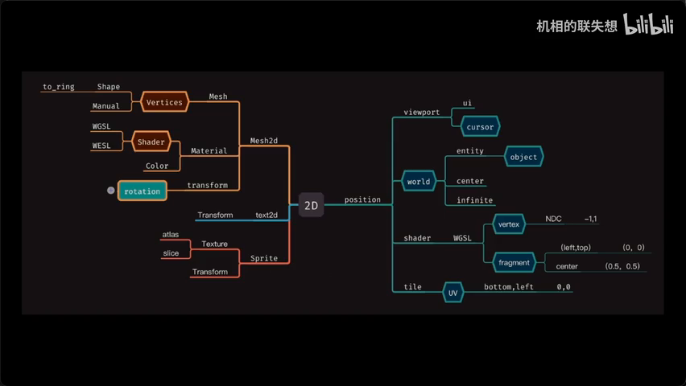
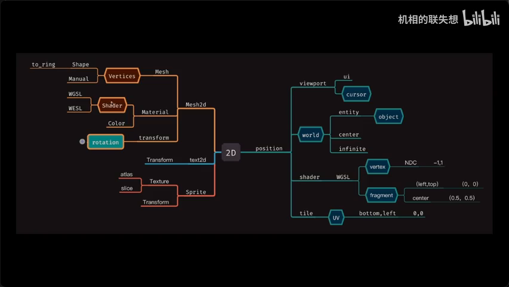
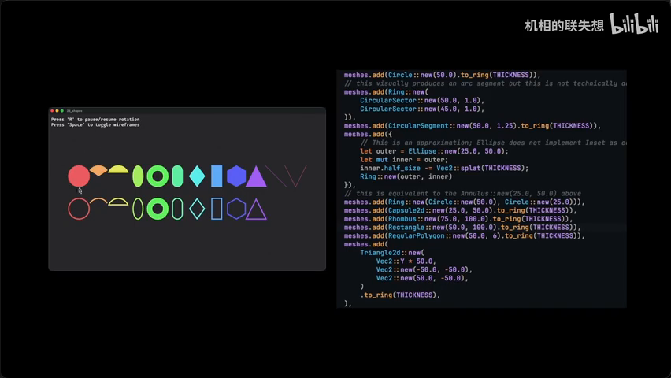
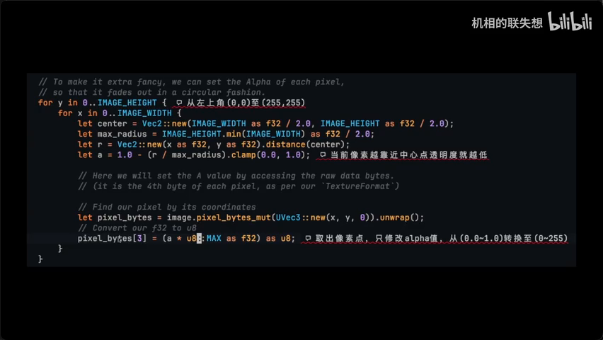
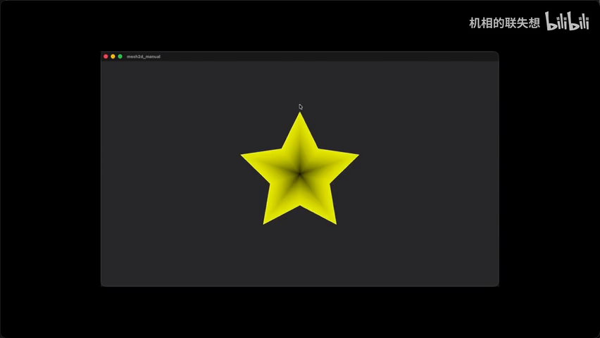

# Bevy Example 2D 全面学习笔记

> 📺 来源：[Bilibili BV1S3f6BVE5H](https://www.bilibili.com/video/BV1S3f6BVE5H/) | 时长：~79 分钟 | 作者：Bevy 中文社区分享
>
> 💡 点击 ▶ 图标可跳转到视频对应位置

---

## 一、AI 摘要

本视频系统性梳理 Bevy 0.18 版本 `Example2D` 目录下所有官方示例，涵盖 2D 游戏开发的完整知识图谱。

核心内容涵盖：
- **六种坐标系**：Viewport（视窗）、World（世界）、NDC（归一化）、Fragment（屏幕像素）、UV、Object（相对坐标），它们在渲染管线中各司其职
- **Mesh2D 图形系统**：多边形/圆形/扇形/拱形 + `to_ring()` 环形变换，AABB 包围盒检测
- **材质与 Shader**：`MeshMaterial2D` 是 WGSL/WESL 标准入口，支持透明模式（Blend/Opaque）、UV 重复、顶点颜色插值
- **Camera 与视窗**：多相机嵌套渲染（RenderLayer）、Pixel Perfect Snap、画布（Image Target）机制
- **旋转系统**：四元数（Quaternion）基础 + 点乘（Dot Product）两次判别实现炮塔缓慢追踪
- **Sprite 动画与 UI**：Atlas 材质集合、Sprite Sheet 序列动画、9-patch（九宫格）无限缩放边框
- **TileMap Chunk**：地图块系统，UV 索引定位（00=左下角），地块切换实现状态变化
- **批量纹理导入**：`TextureAtlasBuilder` 将零散图片合并为单张纹理，零近采样 vs 线性采样

---

## 二、核心概念

### 1. 六种坐标系（Bevy 2D 渲染管线）

| 坐标系 | 原点 | 特征 | 用途 |
|--------|------|------|------|
| **Viewport** | 视窗左上? | 鼠标/UI 相关 | `Cursor` 映射到 UI |
| **World** | 中心 (0,0) | 无限延伸，无边界 | 游戏世界坐标 |
| **NDC** | 中心 (0,0) | X/Y 区间 [-1,1] | 顶点着色器 (Vertex) |
| **Fragment** | 左上角 (0,0) | X/Y 区间 [0,1]，右下角 (1,1) | 片源着色器 (Fragment) |
| **UV** | 左下角 (0,0) | 纹理采样坐标 | 图像采样/Texture |
| **Object** | 各 Mesh 独立 | 相对坐标 | 每个网格的局部空间 |

### 2. Mesh2D（2D 图形系统）
- **封装好的顶点网格**：多边形（Polygon）、圆形（Circle）、扇形（Sector）、拱形（Segment）
- `to_ring()`：将实心图形变为环形（有厚度），线段等非闭合图形无 `to_ring()`
- `MeshMaterial2D`：Shader 文件的标准入口，也是实体颜色材质
- AABB 包围盒：`Isometry`（同轴等距），红色矩形框包络，常用于碰撞检测

### 3. Camera 与 RenderLayer
- `Camera` 的 `projection` 控制缩放
- `viewport_to_world_2d()` / `world_to_viewport_2d()` 坐标转换
- 多 Camera 嵌套：低层 Camera 渲染到 Image Target → 高层 Camera 将 Image 以 Sprite 方式再渲染

### 4. 旋转数学（Quaternion + Dot Product）
- `from_rotation_z()`：简单跟随鼠标（Z 轴旋转）
- 炮塔缓慢追踪：两次 Dot Product 确定旋转方向（计算短弧而非长弧）
- 右手坐标系 → 逆时针旋转，需取反符号

### 5. Sprite 系统
- **Atlas**：材质集合，通过 index 切换实现动画
- **Sprite Sheet**：序列动画（如 RPG 角色走路 0-6 帧循环）
- **Sprite Slice（9-patch）**：4 角固定 + 中间拉伸，实现 UI 边框无限缩放
- **Flipping**：X/Y 轴翻转

### 6. TileMap Chunk（地图块）- 0.18 新特性
- UV 索引定位（左下角 0,0），直接获得地块中心 `Transform`
- 地块状态切换只需改变索引（如建筑物 → 焦土）
- 8x8 的 Tile Display Size 自动缩放 250×250 的纹理

---

## 三、详细笔记（按时间顺序）

### [▶ 0:00](https://www.bilibili.com/video/BV1S3f6BVE5H/?t=0) - 5:00 | 开场与坐标系总览


> 📸 [截图于 0:00](https://www.bilibili.com/video/BV1S3f6BVE5H/?t=0)

- **总览地图**：视频覆盖 Example2D 目录全部示例，可按需跳转
- **六种坐标系**一次讲清：Viewport → World → NDC（顶点着色器）→ Fragment（片源着色器）→ UV（纹理采样，00=左下角）→ Object（相对坐标）
- 关键认知：UV 原点在**左下角**，这是 Shader 里图像采样"反图"的原因
- World 坐标：中心点 (0,0)，通过 Camera projection 可以无限缩放

### [▶ 5:00](https://www.bilibili.com/video/BV1S3f6BVE5H/?t=300) - 10:00 | 2D Shapes（图形样式）

- 上半部分图 = 基本图形（多边形/圆形/扇形/拱形）
- 下半部分图 = `to_ring()` 变换（带厚度的环形）
- 注意：**线段（非闭合）无 `to_ring()`**；**已闭环不再产生闭环**
- 适合做简单游戏 Demo 的原型图形

### [▶ 10:00](https://www.bilibili.com/video/BV1S3f6BVE5H/?t=600) - 15:00 | 鼠标交互 & Camera 控制


> 📸 [截图于 5:00](https://www.bilibili.com/video/BV1S3f6BVE5H/?t=300)

- 图形跟随鼠标 → `viewport_to_world_2d()` 将鼠标映射到世界坐标
- 键盘方向键 → 移动 Camera（`Transform`）
- `,` / `.` 键 → 缩放 Camera（修改 `projection` 属性）
- WASD → 改变物理视窗（`camera.viewport.physical`）
- IJKL → 视窗对角缩放

### [▶ 15:00](https://www.bilibili.com/video/BV1S3f6BVE5H/?t=900) - 20:00 | Bloom2D / CPU Draw / MIP

- **Bloom2D**：全局泛光，色相偏移，用于过场动效
- **CPU Draw**：手动绘制纹理 — 凭空创建 Image，在 Update 中逐像素修改 RGBA
  - 圆形渐变：`RGBA(0,0,0,A)` 中 A 通道 = 透明度，0=透明（黑），靠近中心→明亮
  - 螺旋纹理：`sin` + `full_angle` + center 偏移
- **MIP Generation**：多级渐远纹理，提前做好 2048→2×2 各种尺寸适配
  
### [▶ 20:00](https://www.bilibili.com/video/BV1S3f6BVE5H/?t=1200) - 26:00 | Mesh2D 细节 / 扇形拱形 / AABB


> 📸 [截图于 10:30](https://www.bilibili.com/video/BV1S3f6BVE5H/?t=630)

- `MeshMaterial2D`：官方推荐的 Shader 文件入口点
- `MeshAlphaMaterial2D`：透明模式 — `AlphaMode::Opaque`（默认黑色）vs `AlphaMode::Blend`（真实透明叠加）
- 扇形：1% 进度量推进，逆时针展开（代码里做了取反处理以匹配顺时针视觉效果）
- AABB 包围盒：两种 — 矩形 AABB + 圆形 AABB

### [▶ 26:00](https://www.bilibili.com/video/BV1S3f6BVE5H/?t=1560) - 32:00 | 手动绘制 / Repeat Texture / Vertex Color

- **Mesh2D Manual**：手动定义顶点构建五角形（每个三角形 = 最小渲染单位）
- **Repeat Texture**：`UVTransform` + `Repeat` 采样模式 → 2 列 3 行仿射缩放；不设 Repeat → 拉伸到边缘
- **Vertex Color**：顶点绑定颜色 + 片源着色器插值 → 颜色渐变叠加纹理

### [▶ 32:00](https://www.bilibili.com/video/BV1S3f6BVE5H/?t=1920) - 38:00 | Pixel Perfect Snap / Render Layer


> 📸 [截图于 15:30](https://www.bilibili.com/video/BV1S3f6BVE5H/?t=930)

- **Pixel Perfect Snap**：`RenderLayer` 嵌套渲染解决像素化"呼吸效果"
  - 底层 Camera：渲染到 Image Target（画布），仅作用于 `PerfectPixelLayer`
  - 高层 Camera：将 Image 以 Sprite 形式再次渲染到 `HighResolutionLayer`
  - 两层 Camera 的 projection 需适配

### [▶ 38:00](https://www.bilibili.com/video/BV1S3f6BVE5H/?t=2280) - 46:00 | 旋转系统（Quaternion + 点乘）


> 📸 [截图于 20:00](https://www.bilibili.com/video/BV1S3f6BVE5H/?t=1200)

- **简单跟随**：`from_rotation_z(angle - π/2)` ，Y 轴朝向 → X 轴夹角（初始多 90°）
- **炮塔缓慢追踪**（核心算法）：
  1. 第一次 Dot Product → 确定目标在飞机朝向的哪个半轴
  2. 第二次 Dot Product（基于右侧向量）→ 消除镜像歧义
  3. 取 `min(angle, rotation_speed)` 逐步旋转
- 关键理解：**Dot Product 只能判别一个半球**，需两次才能确定准确方向
- 右手坐标系 → 逆时针旋转 → 符号取反

### [▶ 46:00](https://www.bilibili.com/video/BV1S3f6BVE5H/?t=2760) - 52:00 | Sprite 动画系统

- **Sprite Animation**：Gabby RPG 角色，7 帧序列 (0-6)，`AtlasLayout` + index 循环
- `just_pressed` 作为 `run_if` 条件
- **Flipping**：X 轴翻转 / Y 轴翻转
- **Scale**：与 Anchor（锚点）相关，不同锚点缩放效果不同

### [▶ 52:00](https://www.bilibili.com/video/BV1S3f6BVE5H/?t=3120) - 58:00 | Sprite Slice（9-patch 九宫格）


> 📸 [截图于 25:00](https://www.bilibili.com/video/BV1S3f6BVE5H/?t=1500)

- **4 角固定 + 中间拉伸** → UI 对话框/提示框无限缩放
- 核心参数：`corner`（四角大小）、`center`（中心缩放倾向，越小越接近原尺寸）、`side`（四边最大缩放限制）
- 实用场景：对话框、Tips、工具栏边框

### [▶ 58:00](https://www.bilibili.com/video/BV1S3f6BVE5H/?t=3480) - 65:00 | Texture Atlas 批量导入

- **场景**：游戏有大量零散素材图片，不可能全合在一张图
- **方案**：`load_folder()` 导入整个目录 → `TextureAtlasBuilder` 合成单张纹理
- `type_uncheck<Image>()` 过滤非图片文件
- 两种采样：**零近采样**（像素感强）vs **线性采样**（远看舒服，近看模糊）
- 后添加的 Image 也会受 Atlas Layout 采样设置影响
- 建议：提前做 `路径 → 名称` 映射，便于 Sprite 用 index 提取

### [▶ 65:00](https://www.bilibili.com/video/BV1S3f6BVE5H/?t=3900) - 72:00 | TileMap Chunk（地图块）

- **核心价值**：替代手动计算地块中心点 → 直接用 UV 索引(`chunk_index`)获取 `Transform`
- 64×64 个 Tile 组成的棋盘（512×512 实际像素，8×8 的 Tile Display Size）
- UV 坐标原点在**左下角 (0,0)**（此处得到验证），右上角 (63,63)
- fake_player 固定在 (5,6)，move_player 从 (0,0) 开始移动
- 地块状态切换：只需改变 index（如建筑物 → 焦土），类似 Sprite Sheet

### [▶ 72:00](https://www.bilibili.com/video/BV1S3f6BVE5H/?t=4320) - 79:00 | 收尾与要点回顾

- **Transparency**：RGBA 的 A 通道控制透明度
- **Wireframe**：提取顶点连接线框，用于美术排查贴图问题
  - 三角形**没有**线框（已是片源着色器最小单位）
  - 方形及以上多边形才会有线框
- **总结**：多练才是关键 — 作者本人回看代码时也发现有些内容已经忘了

---

## 四、关键术语表

| 英文术语 | 中文翻译 | 简要说明 |
|---------|---------|---------|
| Viewport | 视窗坐标 | 鼠标/UI 相关坐标系 |
| World Coordinate | 世界坐标 | 中心 (0,0)，无限延伸 |
| NDC | 归一化设备坐标 | [-1,1] 区间，顶点着色器使用 |
| Fragment Coordinate | 片源像素坐标 | [0,1] 区间，左上角原点 |
| UV Coordinate | UV 纹理坐标 | 左下角原点，纹理采样用 |
| Mesh2D | 2D 顶点网格 | 封装好的图形（多边形/圆/扇形等） |
| AABB | 轴对齐包围盒 | 碰撞检测的矩形包络框 |
| Quaternion | 四元数 | 3D/2D 旋转的数学工具 |
| Dot Product | 点乘/点积 | 计算两向量夹角，值域 [-1, 1] |
| Atlas | 材质集合 | 多张图合为一张纹理，index 切换 |
| Sprite Sheet | 精灵序列帧 | 按 index 循环播放动画 |
| 9-patch (Sprite Slice) | 九宫格 | 4 角固定 + 中间拉伸的 UI 边框 |
| Texture Atlas | 纹理图集 | 批量导入多张图合成单纹理 |
| MIP | 多级渐远纹理 | 提前优化不同尺寸的纹理映射 |
| RenderLayer | 渲染层 | 控制 Camera 渲染哪些 Entity |
| Pixel Perfect Snap | 像素完美对齐 | 避免旋转时产生模糊/呼吸效果 |
| Bloom | 泛光 | 全局色彩偏移动效 |
| TileMap Chunk | 地图块 | UV 索引定位，地块状态切换 |
| Blend Mode | 透明混合模式 | `AlphaMode::Blend` 实现真实透明 |
| WGSL/WESL | WebGPU/Web Shader Language | Bevy 支持的两种 Shader 语言 |

---

## 五、总结与思考

### 核心架构理解
Bevy 2D 渲染管线的坐标系链路：
```
Object → World → Viewport → NDC → Fragment → UV
(局部)  (世界)  (视窗)   (顶点)  (片源)   (采样)
```
每一层坐标都有明确的职责和转换函数。

### 关键技术决策

| 场景 | 推荐方案 |
|------|---------|
| 简单图形 | Mesh2D（多边形/圆/扇形） |
| Shader 入口 | `MeshMaterial2D` + WGSL |
| 角色动画 | Atlas + Sprite Sheet index 循环 |
| UI 边框 | 9-patch Sprite Slice |
| 地图系统 | TileMap Chunk + UV 索引 |
| 大量素材 | TextureAtlasBuilder 批量导入 |
| 旋转追踪 | 两次 Dot Product + Quaternion |
| 多 Camera | RenderLayer 嵌套 + Image Target |

### 实践建议
- 坐标系转换多用 `viewport_to_world_2d()`，它是 2D 开发的桥梁
- 炮塔旋转算法是经典模式，**理解 Dot Product 的半球局限**是关键
- 地图块用 UV 索引替代手动计算，代码复杂度大幅降低
- 零散素材 → `TextureAtlasBuilder` 合成单纹理 + 路径映射
- 不懂就**多抄多练**，作者也承认回看时有些内容已忘记
