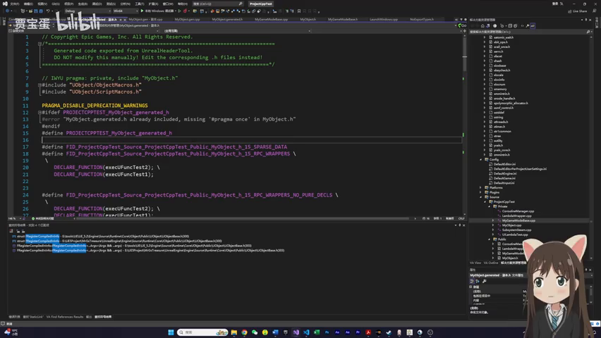
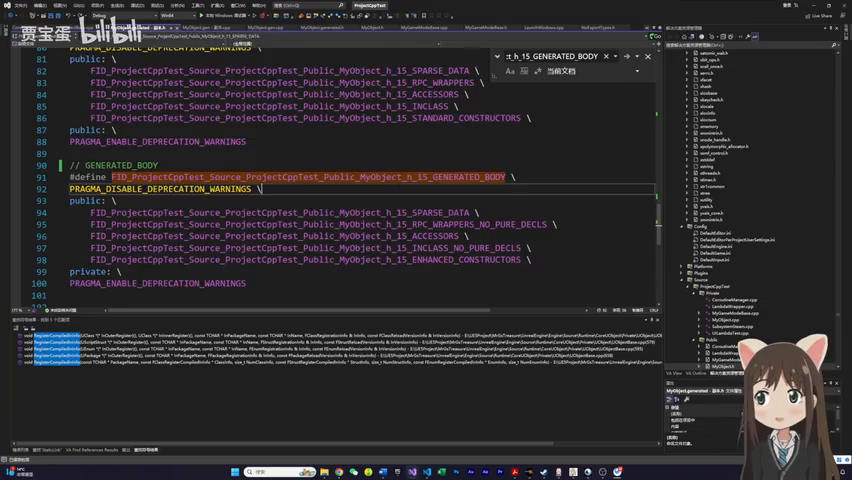
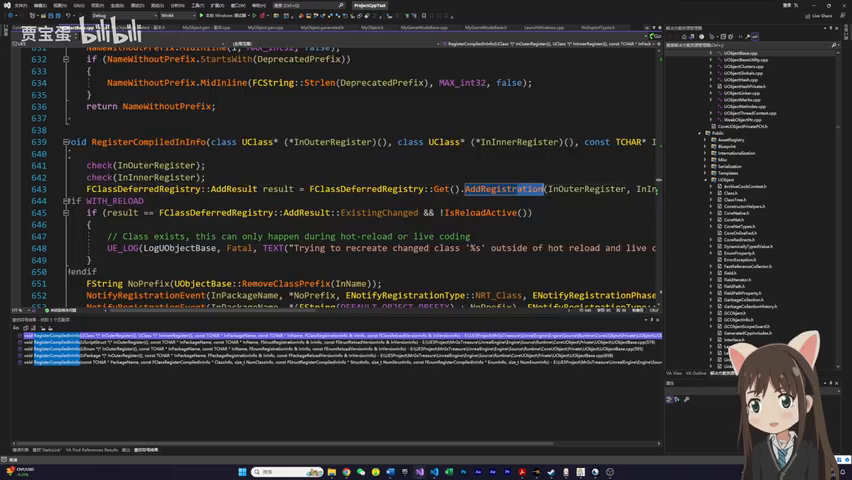

# UE5 类型系统（反射）源码解读 — 编译与注册流程

> 📺 来源：[Bilibili BV1bH4y1k7Wg](https://www.bilibili.com/video/BV1bH4y1k7Wg/) | 时长：~40 分钟 | 基于 UE 5.2 源码
>
> 参考：[潘方大高 知乎系列文章](https://zhuanlan.zhihu.com/p/XXX)（基于 UE 4.1x，本文已适配 5.2 差异）
>
> 💡 点击 ▶ 图标可跳转到视频对应位置

---

## 一、AI 摘要

本视频深入解读 Unreal Engine 5.2 类型系统（反射系统）的源码实现，从编译期到运行期完整梳理 UClass 的构建与注册流程。

核心内容涵盖：
- **反射的价值**：GC、蓝图交互、序列化等底层模块的基石；无需改引擎源码即可访问/修改 Private 成员
- **UHT 两趟编译**：第一趟预扫描生成 `.generated.h`，第二趟实际编译生成 `.gen.cpp`
- **关键宏展开**：`GENERATED_BODY` → 一系列嵌套宏，定义 StaticClass、序列化函数、构造/析构等
- **静态自动注册**：C++ static 对象在 `main()` 前初始化，将类信息收集到全局链表
- **运行时构造流程**：`LoadCoreModules` → `RegisterClass` → `ProcessNewlyLoadedObjects` → `ConstructUClass` → 创建 CDO
- **重要差异**：UE5.2 中 `UProperty` 已废弃，全改用 `FProperty`；`IMPLEMENT_CLASS` 改为 `IMPLEMENT_CLASS_NO_AUTO_REGISTRATION`

---

## 二、核心概念

### 1. 反射系统是什么
- UE 在标准 C++ 之上构建的一套**运行时类型信息系统**
- 通过 `UCLASS`/`USTRUCT`/`UPROPERTY`/`UFUNCTION` 等宏标记
- UHT（Unreal Header Tool）扫描这些宏，生成额外的 C++ 代码
- 最终让引擎在运行时可以：枚举属性、调用函数、创建对象 —— 全部通过字符串名称

### 2. 反射的三大价值
1. **访问 Private/Protected 成员**：拿到 `FProperty` 对象即可修改
2. **理解其他模块**：GC、蓝图、序列化都依赖反射
3. **策划配表更优雅**：配字符串名即可，避免大量 `switch-case`

### 3. UClass 构建四阶段
```
内存分配 → 注册命名 → 填充属性/函数/元数据 → 创建 CDO
```

---

## 三、详细笔记（按时间顺序）

### [▶ 0:00](https://www.bilibili.com/video/BV1bH4y1k7Wg/?t=0) - 5:00 | 开场与反射使用示例


> 📸 [截图于 0:00](https://www.bilibili.com/video/BV1bH4y1k7Wg/?t=0)

- 视频基于 UE 5.2 源码，对[潘方大高](https://zhuanlan.zhihu.com/p/XXX)的 UE 4.1x 系列文章进行版本适配和简化
- **反射是什么**：引擎底层功能，被 GC、蓝图交互、序列化等模块依赖
- **基础 API 速览**：
  - 获取所有 UClass：`GetObjectsOfClass(UClass::StaticClass(), ...)`
  - 通过类名字符串获取 UClass：`FindObject<UClass>("MyObject")`
  - 遍历 `UFunction`（含参数、返回值）和 `FProperty`
  - 通过反射**修改 Private 属性**、**调用 Private 函数**
  - 通过反射 NewObject 创建实例

### [▶ 5:00](https://www.bilibili.com/video/BV1bH4y1k7Wg/?t=300) - 12:00 | GENERATED_BODY 宏展开


> 📸 [截图于 4:00](https://www.bilibili.com/video/BV1bH4y1k7Wg/?t=240)

- **UHT 两趟编译**：
  1. 第一趟预扫描 → 生成 `.generated.h`（声明各种宏/函数）
  2. 第二趟实际编译 → 生成 `.gen.cpp`（实现注册逻辑）
- 文件位置：`Intermediate/Build/Win64/.../UHT/`
- **`GENERATED_BODY()` 宏展开链路**（多层嵌套）：
  ```
  GENERATED_BODY() → BODY_MACRO_COMBINE → 最终产出：
  - KirinFileID（文件名标识）
  - StaticClass() 声明
  - 序列化函数
  - 构造函数/析构函数（Public）
  ```
- `GENERATED_BODY` vs `GENERATED_BODY_LEGACY`：区别仅是构造函数从 Private → Public，用新版即可

### [▶ 12:00](https://www.bilibili.com/video/BV1bH4y1k7Wg/?t=720) - 18:00 | .gen.cpp 结构与静态注册


> 📸 [截图于 8:00](https://www.bilibili.com/video/BV1bH4y1k7Wg/?t=480)

- `.gen.cpp` 中**最重要的宏** → 定义静态结构体对象 + `GetPrivateStaticClass()` 函数
- `StaticClass()` 调用链：`UMyObject::StaticClass()` → `GetPrivateStaticClass()`（实现在 gen.cpp 的宏里）
- **C++ 静态自动注册模式**：
  ```cpp
  static FCompiledInDefer Z_CompiledInDefer_UClass_UMyObject(...);
  // ↑ static 对象在 main() 之前自动初始化
  ```
- **UE 5.2 变化**：`IMPLEMENT_CLASS` → `IMPLEMENT_CLASS_NO_AUTO_REGISTRATION`
- 静态注册阶段**只做一件事**：收集类信息添加到 `FClassDeferredRegistry` 全局链表

### [▶ 18:00](https://www.bilibili.com/video/BV1bH4y1k7Wg/?t=1080) - 26:00 | 引擎启动 → LoadCoreModules


> 📸 [截图于 12:00](https://www.bilibili.com/video/BV1bH4y1k7Wg/?t=720)

**引擎启动调用链**：
```
LaunchWindowsStartup() → GuardedMain() → EnginePreInit() 
  → LoadCoreModules() → CoreUObject 模块 → StartupModule()
    → ClassAddReferencedObjects + CompiledInClasses
```

- `CompiledInClasses` 函数：遍历 `FClassDeferredRegistry`，调用每个类的 `StaticClass()`
- `StaticClass()` → `GetPrivateStaticClass()` → 创建 UClass 对象（内存分配 + Register）

**Register 函数的两个作用**：
1. 将 UClass 加入**全局 TMap**（按名字索引）
2. 添加到一个**全局链表**（Lambda list，后续遍历用）

### [▶ 26:00](https://www.bilibili.com/video/BV1bH4y1k7Wg/?t=1560) - 34:00 | ProcessNewlyLoadedObjects 完整构造


> 📸 [截图于 16:00](https://www.bilibili.com/video/BV1bH4y1k7Wg/?t=960)

- `FEngineLoop::AppInit()` 完成后广播委托 → 触发 `InitUObject()`
- `StaticUObject::Init()` → `ProcessNewlyLoadedObjects()`：
  1. 将全局链表中所有对象收集到 TArray
  2. 调用 `UObjectForceRegistration()` → `DeferredRegister()`：设置 Name/Package/ClassWithin
  3. 每次注册后**重新遍历**链表（因为注册过程中可能加载其他模块）
  
- 关键：`AllCompiledInDefaultProperties()` → 调用 `ConstructUClass` 构造函数
- **ConstructUClass 做的事**：
  - 构造 UFUNCTION 对象
  - 构造 FProperty 对象
  - 收集 Metadata
  - StaticLink

### [▶ 34:00](https://www.bilibili.com/video/BV1bH4y1k7Wg/?t=2040) - 40:00 | CDO 创建 + 总结


> 📸 [截图于 20:00](https://www.bilibili.com/video/BV1bH4y1k7Wg/?t=1200)

- **CDO（Class Default Object）**：每个 UClass 有一个默认对象实例
  - 用途：属性修改后对比默认值；作为单例使用（如 DataTable `GetMutableDefault<T>()`）
  - 实现：本质上就是 `NewObject` 的简化版

- **ProcessNewlyLoadedObjects 会被多次调用**：
  1. `EnginePreInit` 中加载引擎默认模块
  2. 每个新 Module 加载完成时

---

## 四、UClass 构造完整流程图

```
编译期                        运行期
───────                       ───────
UHT 第一趟扫描                    │
  │                              │
  ▼                              │
.generated.h                    │
(宏声明: GENERATED_BODY,        │
 StaticClass, etc.)             │
  │                              │
UHT 第二趟扫描                    │
  │                              │
  ▼                              ▼
.gen.cpp                  main() 之前
(IMPLEMENT_CLASS_          static 对象初始化
 NO_AUTO_REGISTRATION,       │
 static FCompiledInDefer      ▼
 对象定义)              收集到 FClassDeferredRegistry
                              │
                              ▼ (main 之后)
                      LoadCoreModules()
                        │
                        ▼
                      CompiledInClasses()
                        │
                        ▼
                  分配内存 → UClass 对象
                  调用 Register()
                  加入全局 TMap + 链表
                        │
                        ▼
                  AppInit() 完成 →
                  ProcessNewlyLoadedObjects()
                        │
                        ▼
                  ConstructUClass()
                  填充: UFUNCTION / FProperty
                        / Metadata
                        │
                        ▼
                  StaticLink → 创建 CDO → 完成!
```

---

## 五、关键术语表

| 英文术语 | 中文翻译 | 简要说明 |
|---------|---------|---------|
| UHT | Unreal Header Tool | 扫描 UCLASS 等宏，生成反射代码的工具 |
| Reflection | 反射 | 运行时获取类型信息的能力 |
| UClass | U类对象 | 每个 UE 类型在运行时的元数据对象 |
| FProperty | 属性描述对象 | UE5.2 替代 UProperty 的类型描述 |
| GENERATED_BODY | 生成体宏 | 替代手写样板代码的核心宏 |
| Static Auto-Registration | 静态自动注册 | C++ static 对象在 main 前自动初始化 |
| CDO | Class Default Object | 每个 UClass 的默认实例 |
| DeferredRegister | 延迟注册 | 设置 Name/Package 等基础信息 |
| FCompiledInDefer | 编译期延迟对象 | .gen.cpp 中 static 对象类型 |
| ProcessNewlyLoadedObjects | 处理新加载对象 | 完成 UClass 最终构造的关键函数 |

---

## 六、总结与思考

### 关键理解
1. **反射不是魔法，是代码生成 + 静态注册**：UHT 扫描宏 → 生成 .gen.cpp → static 对象自动注册 → 运行时完成构造
2. **UE5.2 vs UE4.x 差异**：`UProperty→FProperty`、`IMPLEMENT_CLASS→IMPLEMENT_CLASS_NO_AUTO_REGISTRATION`
3. **学习这套流程的最大价值**：以后遇到反射相关 Bug，知道去哪个模块、哪个函数打断点

### 实践建议
- 理解 `GENERATED_BODY()` 展开后是什么，能帮你读懂引擎报错
- 策划配表用字符串反射调用，比 switch-case 优雅得多
- **不要手动改 .generated.h / .gen.cpp**（会被覆盖）
- 下一期预告：GC 引用链管理
