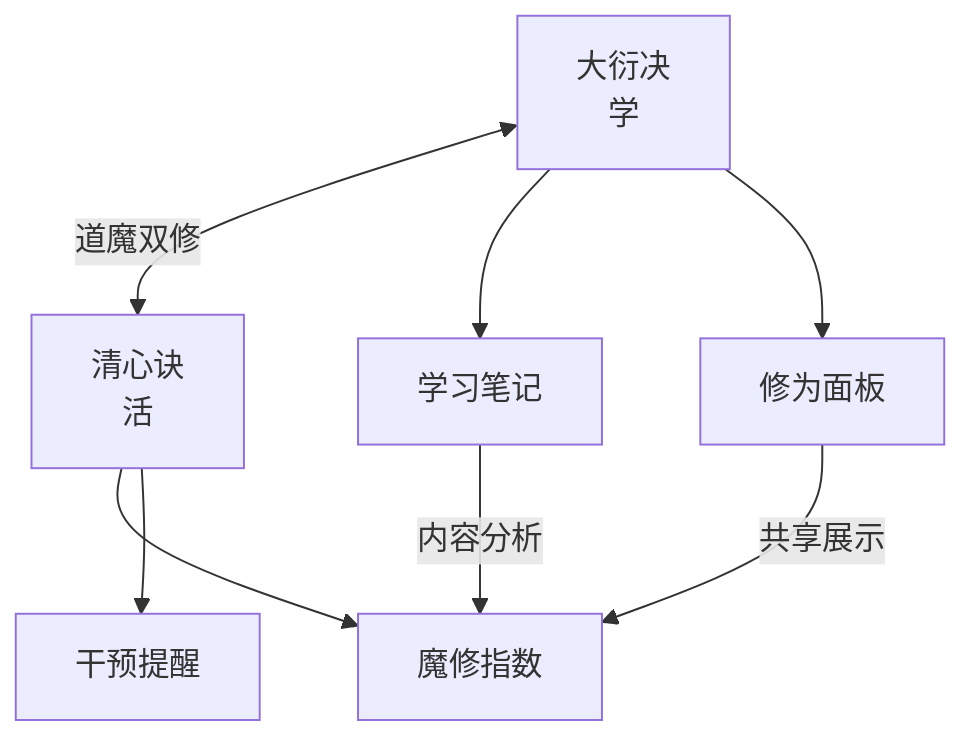

# 清心诀 (Clear Heart) — Skill 设计文档

> 大衍决管"学"，清心诀管"活"——道魔双修，方为上境。

---

## 一、概述

### 定位

清心诀是 [大衍决 (myriad-mind)](../myriad-mind/) 的 companion skill。大衍决把万物炼化为学习笔记，清心诀守护学习者的身心健康——监测过劳倾向，计算**魔修指数**，在入魔前拉你回到人间。

### 核心概念：魔修指数

修仙世界中，一味苦修不问道心的修士最终会**走火入魔**。清心诀用一个 0-300 的数值量化这种风险：

```
 0 ────────────────────────────── 300
 ↑                                     ↑
道心稳固                          走火入魔
（学习生活平衡）                  （只工作不玩耍）
```

| 区间 | 等级 | 状态 |
|------|------|------|
| 0-30 | 🟢 道心清明 | 学习与生活平衡，继续保持 |
| 31-60 | 🟡 心神微澜 | 略有偏斜，建议看看窗外 |
| 61-100 | 🟠 心魔初现 | 已经开始入魔，需要干预 |
| 101-150 | 🔴 魔气缠身 | 持续过劳，强制休息建议 |
| 151-200 | 🟣 走火入魔 | 高频高强度学习，健康风险 |
| 200+ | ⚫ 魔尊降世 | 你已经不是人了，是炼丹炉 |

---

## 二、魔修指数计算规则

### 加分项（魔修倾向 ↑）

| 事件 | 分值 | 触发条件 |
|------|:--:|------|
| 连续工作 | +5/30min | Claude Code 会话持续 >2h |
| 今日零娱乐 | +15 | 当天无生活类内容消费记录 |
| 深夜修炼 | +20 | 22:00-06:00 有 Claude Code 活动 |
| 周末全勤 | +25 | 周六或周日全天学习无休息 |
| 只学不活 | +10 | B站/社媒只消费教程类内容 |
| 无运动日 | +10/天 | 连续 N 天无运动/户外记录 |
| 拒绝休息 | +15 | 被提醒后 30 分钟内未响应 |
| 暴学模式 | +30 | 单日学习笔记 >3 篇 |
| 社交孤立 | +10/天 | 连续 N 天无社交平台互动 |

### 减分项（魔修倾向 ↓）

| 事件 | 分值 | 触发条件 |
|------|:--:|------|
| 主动休息 | -20 | 响应提醒，离开 Claude Code >30min |
| 生活消费 | -15 | 观看/阅读非技术内容 |
| 户外运动 | -25 | 记录运动/户外活动 |
| 社交互动 | -10 | B站评论/弹幕/社媒互动 |
| 准时下线 | -15 | 23:00 前结束所有 Claude Code 会话 |
| 周末放松 | -30 | 周六或周日无任何学习记录 |
| 自我觉察 | -10 | 主动查询魔修指数（有自知之明） |

### 衰减机制

- 每天自然衰减 **-5**（睡一觉总是好的）
- 连续 3 天不触发任何加分项 → 额外衰减 **-15**
- 周末自动衰减加倍（**-10/天**）

---

## 三、数据采集

### 来源矩阵

| 来源 | 采集内容 | 方式 | 隐私等级 |
|------|---------|------|:--:|
| Claude Code hooks | 会话启停、prompt 频率、时长 | `settings.json` hooks | 🟢 本地 |
| Claude Code `/insights` | 30 天工作模式回顾 | Claude Code 内置 | 🟢 本地 |
| 大衍决笔记 | 学习内容标签、篇数、时间 | 共享 `NOTE_OUTPUT_DIR` | 🟢 本地 |
| 用户主动 log | 运动/户外/社交打卡 | `/clear-heart log` | 🟢 本地 |
| B站 API（可选） | 观看历史分类（教程/生活/娱乐） | cookie 导出 | 🟡 需授权 |
| 浏览器历史（可选） | 网站分类统计 | 浏览器插件 | 🔴 需谨慎 |

> 原则：**默认只用前 4 项**。后 2 项作为高级功能，用户主动开启才采集。

### Claude Code Hook 设计

```json
// ~/.claude/settings.json
{
  "hooks": {
    "PostToolUse": [
      {
        "matcher": "",
        "command": "python3 ~/.claude/skills/clear-heart/scripts/heartbeat.py post-tool"
      }
    ],
    "Stop": [
      {
        "command": "python3 ~/.claude/skills/clear-heart/scripts/heartbeat.py session-end"
      }
    ],
    "SessionStart": [
      {
        "command": "python3 ~/.claude/skills/clear-heart/scripts/heartbeat.py session-start"
      }
    ]
  }
}
```

### 手动日志

```
/clear-heart log 去爬了香山，2小时户外
/clear-heart log 和朋友吃了顿火锅
/clear-heart log 看了一下午生活区视频，放松
```

自然语言输入，Claude 解析意图并更新魔修指数。

---

## 四、干预系统

### 三级干预机制

#### L1 — 轻提醒（魔修 30-60，每日最多 2 次）

不打断工作流，在 Claude Code 回复末尾轻量注入：

```
> 🍃 清心诀提醒：你已经连续修炼 3 小时了。窗外春天还没走，去看一眼？
```

#### L2 — 推荐干预（魔修 61-100，每日 1 次）

主动推荐生活内容，附跳转链接：

```
> ⚠️ 心魔预警：魔修指数已达 72（心魔初现）

你的 B站观看记录 100% 是教程。要不要试试这些：

📺 生活区推荐（来自你关注的 UP 主）：
  - [旅行Vlog: 一个人的云南](bilibili://...) 
  - [美食: 深夜食堂·成都篇](bilibili://...)
  
🌿 或者：站起来走 5 分钟，喝杯水，看看窗外。
```

#### L3 — 强制休息（魔修 100+，触发即弹）

```
> 🔴 走火入魔警告：魔修指数 135（魔气缠身）

清心诀已锁定你的修炼权限。
建议立即：
  1. 离开电脑，活动身体
  2. 喝一大杯水
  3. 15 分钟后再回来

（此提醒每 30 分钟重复一次，直到魔修指数降至 100 以下）
```

### 内容推荐引擎

```
用户偏好配置
    │
    ├── B站生活区 UP 主列表
    ├── 兴趣爱好标签（旅行/美食/摄影/音乐/宠物...）
    ├── 社交媒体关注列表
    └── 线下活动偏好（徒步/展览/演出...）
        │
        ▼
    魔修指数触发 → 匹配推荐 → 跳转链接 + 一句话推荐理由
```

初期用 B站 API 的热门推荐 + 用户配置的 UP 主。后期可接推荐算法。

---

## 五、与大衍决的联动

### 修为面板集成

```
┌─────────────────────────────────────────┐
│            🗺️ 我的修为面板               │
│                                         │
│  ⚡ 修为：筑基期 (86%)                   │
│  🧘 道心：🟡 心神微澜 (魔修 42)          │
│                                         │
│  道魔双修，方为上境                      │
│  ▰▰▰▰▰▰▰▰▰▰▰▰▰▰▰▰▱▱▱▱ 修为             │
│  ▰▰▰▰▰▰▰▰▱▱▱▱▱▱▱▱▱▱▱▱ 魔修（越低越好）   │
└─────────────────────────────────────────┘
```

### 共享数据

| 大衍决 → 清心诀 | 清心诀 → 大衍决 |
|----------------|----------------|
| 笔记篇数/时间戳 | 魔修指数历史 |
| 技术栈标签分布 | 休息质量评分 |
| 学习时长统计 | 生活内容消费记录 |
| 修炼等级 | 道心等级 |

### 知识关系



---

## 六、用户故事

### 场景 1：深夜暴学

```
22:30  用户开始看 Bevy 教程
23:00  大衍决生成第 3 篇笔记
23:15  清心诀检测：深夜修炼 +20，暴学模式 +30
       魔修指数：45 → 95（心魔初现）
       → L2 干预：推荐 B站旅行视频 + 建议下线
23:20  用户点了推荐视频，看了 10 分钟
       魔修指数：95 → 80（生活消费 -15）
```

### 场景 2：周末全勤

```
周六 09:00-18:00  用户连续学习 9 小时
                  触发：周末全勤 +25，连续工作 +50
                  魔修指数：30 → 105（魔气缠身）
18:00             → L3 强制休息
                  用户出去跑步 40 分钟
                  魔修指数：105 → 80（户外运动 -25）
```

### 场景 3：自觉查询

```
用户：/clear-heart
清心诀：☯ 道心状态
       魔修指数：28（道心清明 🟢）
       今日：学习 2h | 休息 3 次 | B站生活视频 3 条
       评价：学得认真，活得也认真。继续保持。
       
       自我觉察 -10（主动查询，有自知之明）
```

---

## 七、配置项

```bash
# ========== 清心诀 .env ==========

# 魔修阈值（触发对应干预等级）
DEMON_L1_THRESHOLD=30      # 轻提醒
DEMON_L2_THRESHOLD=60      # 推荐干预
DEMON_L3_THRESHOLD=100     # 强制休息

# 工作时间窗口
WORK_START_HOUR=8           # 最早允许工作时间
WORK_END_HOUR=22            # 22点后算深夜修炼

# 提醒频率
L1_MAX_PER_DAY=2            # 轻提醒每日上限
L2_MAX_PER_DAY=1            # 推荐干预每日上限
REMIND_COOLDOWN_MIN=30      # 同类型提醒冷却（分钟）

# 生活内容源
LIFE_BILIBILI_UPERS=        # 关注的B站生活区UP主（逗号分隔）
LIFE_HOBBIES=旅行,美食,摄影  # 兴趣爱好标签
LIFE_SPORTS=跑步,登山,游泳   # 运动类型

# 联动
MYRIAD_MIND_PANEL=../大衍决残卷/修为面板.md  # 大衍决修为面板路径
NOTE_OUTPUT_DIR=../大衍决残卷                # 共享笔记目录

# 数据存储
CLEAR_HEART_DATA=~/.claude/skills/clear-heart/data/
```

---

## 八、文件结构

```text
clear-heart/
├── README.md                    # 用户文档
├── DESIGN.md                    # 本文件
├── SKILL.md                     # Claude Code Skill 定义
├── CHANGELOG.md                 # 版本记录
├── .env.example                 # 配置模板
├── LICENSE                      # MIT
├── scripts/
│   ├── heartbeat.py             # Claude Code hook 心跳采集
│   ├── demon_index.py           # 魔修指数计算引擎
│   ├── recommend.py             # 内容推荐引擎
│   └── install.py               # 安装脚本
└── data/
    ├── demon_history.jsonl      # 魔修指数历史
    └── user_prefs.json          # 用户偏好
```

---

## 九、开发路线

### Phase 1 — 道心初现（最小可用）

- [ ] Claude Code hooks 采集会话时长
- [ ] 魔修指数基础计算（连续工作/深夜/周末 3 项加分 + 自然衰减）
- [ ] `/clear-heart` 查询命令
- [ ] L1 轻提醒（纯文本注入）

### Phase 2 — 心魔可测

- [ ] 手动日志（`/clear-heart log`）
- [ ] L2 推荐干预（预配置 UP 主推荐）
- [ ] 大衍决联动（读笔记标签、篇数）
- [ ] 魔修指数置入修为面板

### Phase 3 — 道魔双修

- [ ] B站 API 生活内容推荐
- [ ] L3 强制休息
- [ ] 魔修历史趋势图
- [ ] 内容偏好学习（用户点击反馈）
- [ ] 成就系统（"回头是岸"：魔修 100+ 后降至 0）

### Phase 4 — 人间烟火

- [ ] 浏览器历史分析（可选功能）
- [ ] 社交平台互动追踪
- [ ] 团队模式（群友互相监督魔修指数）
- [ ] 清心诀独立面板

---

## 十、待讨论问题

1. **魔修指数要不要完全自动，还是需要手动 log？** — 初期建议混合：自动采集工作数据 + 手动记录生活数据
2. **提醒语气** — 温柔道长 vs 严厉护法？建议用户可选
3. **要不要真的"锁"Claude Code？** — 技术上可行（session 退出），但太激进。建议只提醒不强制
4. **隐私边界** — 浏览器历史采集慎之又慎，必须 opt-in
5. **与大衍决的耦合度** — 建议松耦合：清心诀可独立运行，联动是加分项

---

> 📋 文档元信息
>
> | 项目 | 内容 |
> | --- | --- |
> | 文档版本 | v0.1 |
> | 创建时间 | 2026-05-31 |
> | Skill | clear-heart（清心诀） |
> | 姊妹 Skill | myriad-mind（大衍决） |
