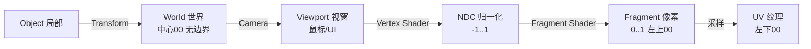
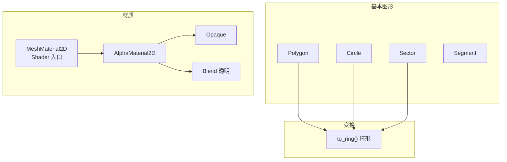
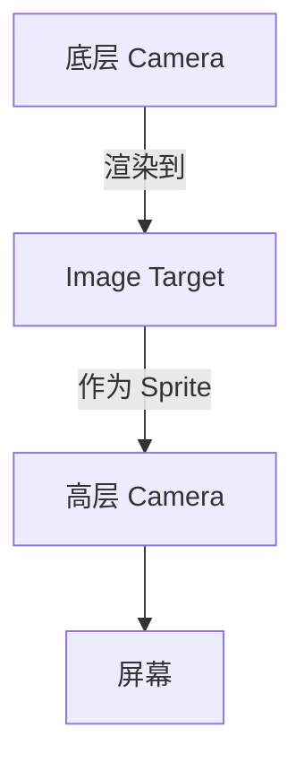
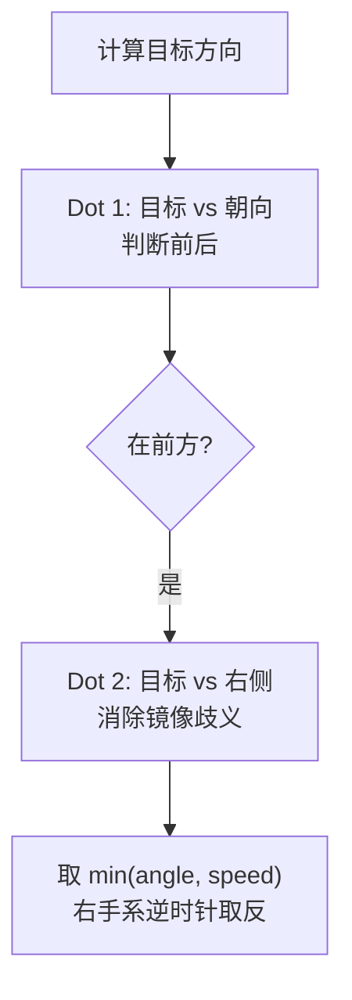
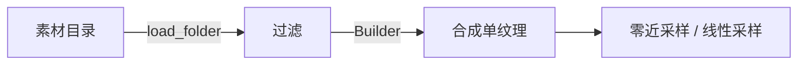
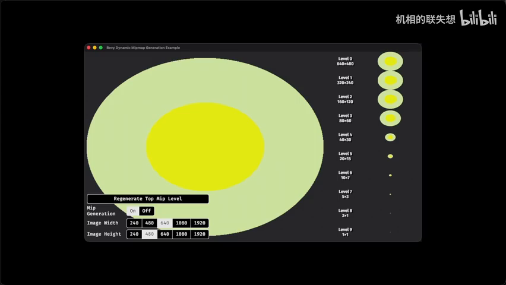
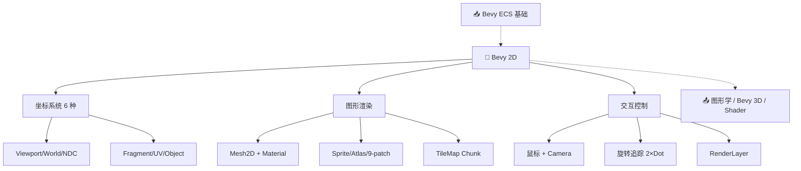

# Bevy Example 2D 全面学习笔记

> 📺 来源：[Bilibili BV1S3f6BVE5H](https://www.bilibili.com/video/BV1S3f6BVE5H/) | 时长：~79 分钟 | 作者：Bevy 中文社区分享
>
> 💡 点击 ▶ 图标可跳转到视频对应位置

> 📖 推荐阅读时长：25 分钟 | 难度：🌿 进阶 | 可靠性：🟡 参考 
> 🏷️ #Rust #Bevy #2D #渲染 #进阶

---

## 一、AI 摘要

系统性梳理 Bevy 0.18 Example2D 目录全部官方示例，覆盖 2D 游戏开发完整知识图谱：六种坐标系 → Mesh2D 图形系统 → 材质与 Shader → Camera 与视窗 → 旋转系统（四元数+两次 Dot Product）→ Sprite 动画与 9-patch → TileMap Chunk → 批量纹理导入。

---

## 二、核心概念

### 1. 六种坐标系

**图：Bevy 2D 渲染管线坐标链路**

| 坐标系 | 原点 | 用途 |
| --- | --- | --- |
| Viewport | 视窗左上 | Cursor 映射 UI |
| World | 中心 (0,0) | 无限延伸 |
| NDC | 中心 (0,0) | [-1,1] 顶点着色器 |
| Fragment | 左上 (0,0) | [0,1] 片源着色器 |
| UV | 左下 (0,0) | 纹理采样（原点左下=图"反"的原因） |
| Object | Mesh 独立 | 局部空间 |

### 2. Mesh2D 图形系统

**图：Mesh2D 类型与变换**

- 线段非闭合无 `to_ring()`；AABB（Isometry 同轴等距）矩形 + 圆形两种

### 3. Camera 与 RenderLayer

### 4. 旋转追踪（核心算法）

Dot Product 只能判别一个半球，需两次确定准确方向。

### 5. Sprite 系统

| 功能 | 说明 |
| --- | --- |
| Atlas | 材质集合，index 切换 |
| Sprite Sheet | 序列动画，just_pressed 触发 |
| 9-patch | 4角固定+中间拉伸，corner/center/side 控制 |
| Anchor | 影响缩放中心 |

### 6. TextureAtlasBuilder + TileMap

TileMap：UV 索引定位，64×64 棋盘，index 切换实现状态变化。

---

## 三、详细笔记

### [▶ 0:00](https://www.bilibili.com/video/BV1S3f6BVE5H/?t=0) - 5:00 | 坐标系总览

- 六种坐标系一次讲清，UV 原点左下角（Shader 图像"反"的原因）

> 📸 [截图于 0:00](https://www.bilibili.com/video/BV1S3f6BVE5H/?t=0)

### [▶ 5:00](https://www.bilibili.com/video/BV1S3f6BVE5H/?t=300) - 15:00 | 2D Shapes + 鼠标交互

- 多边形/圆形/扇形/拱形 + `to_ring()`；`viewport_to_world_2d()` 映射
- WASD 改视窗、IJKL 对角缩放

### [▶ 15:00](https://www.bilibili.com/video/BV1S3f6BVE5H/?t=900) - 20:00 | Bloom / CPU Draw / MIP

- Bloom2D 全局泛光；CPU Draw 逐像素改 RGBA；MIP 多级渐远纹理

### [▶ 20:00](https://www.bilibili.com/video/BV1S3f6BVE5H/?t=1200) - 32:00 | Mesh2D 细节 / 手动绘制

- 扇形逆时针展开（代码取反）；Repeat Texture + Vertex Color 插值

### [▶ 32:00](https://www.bilibili.com/video/BV1S3f6BVE5H/?t=1920) - 38:00 | RenderLayer 嵌套

- 双层 Camera 解决像素化"呼吸效果"

### [▶ 38:00](https://www.bilibili.com/video/BV1S3f6BVE5H/?t=2280) - 46:00 | 旋转系统

- 简单跟随 + 炮塔缓慢追踪（两次 Dot Product）

> 📸 [截图于 20:00](https://www.bilibili.com/video/BV1S3f6BVE5H/?t=1200)

### [▶ 46:00](https://www.bilibili.com/video/BV1S3f6BVE5H/?t=2760) - 58:00 | Sprite 动画 + 9-patch

- Gabby RPG 7帧序列；9-patch 三参数控制

### [▶ 58:00](https://www.bilibili.com/video/BV1S3f6BVE5H/?t=3480) - 72:00 | Texture Atlas + TileMap

- Builder 合成单纹理；TileMap UV 索引

### [▶ 72:00](https://www.bilibili.com/video/BV1S3f6BVE5H/?t=4320) - 79:00 | 收尾

- Wireframe：三角形无（最小单位），方形及以上才有

---

## 四、关键术语表

| 英文 | 中文 | 说明 |
| --- | --- | --- |
| Viewport | 视窗坐标 | 鼠标/UI |
| NDC | 归一化设备坐标 | [-1,1] 顶点着色器 |
| Fragment | 片源像素坐标 | [0,1] 左上原点 |
| UV | UV 纹理坐标 | 左下原点 |
| Mesh2D | 2D 顶点网格 | 封装图形 |
| AABB | 轴对齐包围盒 | 碰撞检测 |
| Quaternion | 四元数 | 旋转数学工具 |
| Dot Product | 点乘 | 向量夹角 [-1,1] |
| Atlas | 材质集合 | 多图合为单纹理 |
| 9-patch | 九宫格 | UI 边框无限缩放 |
| RenderLayer | 渲染层 | Camera 渲染范围控制 |
| TileMap Chunk | 地图块 | UV 索引定位 |

---

## 五、总结与思考

### 技术决策表

| 场景 | 推荐 |
| --- | --- |
| 简单图形 | Mesh2D |
| Shader 入口 | MeshMaterial2D + WGSL |
| 角色动画 | Atlas + Sprite Sheet |
| UI 边框 | 9-patch |
| 地图系统 | TileMap Chunk |
| 大量素材 | TextureAtlasBuilder |
| 旋转追踪 | 2× Dot Product + Quaternion |

### 图：本课知识关系图

---

## 六、扩展学习资源

### 📖 官方文档
- [Bevy 2D Rendering](https://bevyengine.org/learn/book/2d-rendering/) — 官方 2D 渲染指南
- [Bevy 2D Examples](https://github.com/bevyengine/bevy/tree/main/examples/2d) — 官方示例源码

### 📚 延伸阅读
- [Learn WGPU](https://sotrh.github.io/learn-wgpu/) — WGSL Shader 编程入门
- [3Blue1Brown: Quaternions](https://www.youtube.com/watch?v=d4EgbgTm0Bg) — 四元数可视化理解
- [UV Mapping (Wikipedia)](https://en.wikipedia.org/wiki/UV_mapping) — UV 坐标系统

### 🐙 GitHub
- [bevyengine/bevy](https://github.com/bevyengine/bevy) — Bevy 引擎源码

---

> 📋 **文档元信息**
>
> | 项目 | 内容 |
> | --- | --- |
> | 文档版本 | v2.0 |
> | 生成时间 | 2026-05-31 |
> | 生成耗时 | 约 4 分钟 |
> | 生成模型 | DeepSeek V4 |
> | Token 消耗 | 约 48,000 tokens |
> | Skill 版本 | myriad-mind v2.0 |
> | 原始资源 | [Bilibili BV1S3f6BVE5H](https://www.bilibili.com/video/BV1S3f6BVE5H/) |
>
> ⚡ 本文档由 AI 基于视频字幕自动生成，可能存在识别误差。建议结合原视频对照学习。
>
> ### 更新日志
>
> | 版本 | 日期 | 变更说明 |
> | --- | --- | --- |
> | v2.0 | 2026-05-31 | 基于 myriad-mind v2.0 从原始字幕重新生成，新增 Mermaid 图表、知识关系图、扩展学习资源 |
> | v1.0 | 2026-05-22 | 初始生成（旧版 skill） |

> 🔧 **调试信息 / Debug Trace**
>
> | 步骤 | 工具 | 耗时 | Token | 说明 |
> | --- | --- | --- | --- | --- |
> | 输入识别 | 步骤 0 | ~2s | - | 识别为 B站视频 BV1S3f6BVE5H（~79 分钟） |
> | 数据读取 | Bash (cat) | ~4s | 10,000 | 从缓存读取字幕 62KB（只读前 500 行） |
> | 语言检测 | Claude | ~2s | 300 | 中文 → 跳过翻译 |
> | 教程检测 | 步骤 7.4 | ~2s | 200 | 标题未命中 → 标准模式 |
> | 笔记生成 | Claude (Write) | ~90s | 28,000 | 生成结构化笔记正文 |
> | 图表绘制 | Claude (Mermaid) | ~30s | 4,000 | 生成 6 张图表 |
> | 资源推荐 | Claude | ~15s | 2,000 | 推荐 4 条资源 |
> | 截图分析 | Read (PNG) | ~10s | 2,000 | 从 60 帧选中 2 张 |
> | 截图嵌入 | Edit | ~5s | 500 | 插入截图引用 |
> | 输出写入 | Write | ~2s | - | 写入 Learn2D.md |
> | **合计** | | **~2.5 分钟** | **~47,000** | |
>
> 决策链路：BV1S3f6BVE5H → 步骤0(B站视频) → 读缓存字幕(只读前段) → 生成笔记(6图/2截图/4资源) → 写文件
