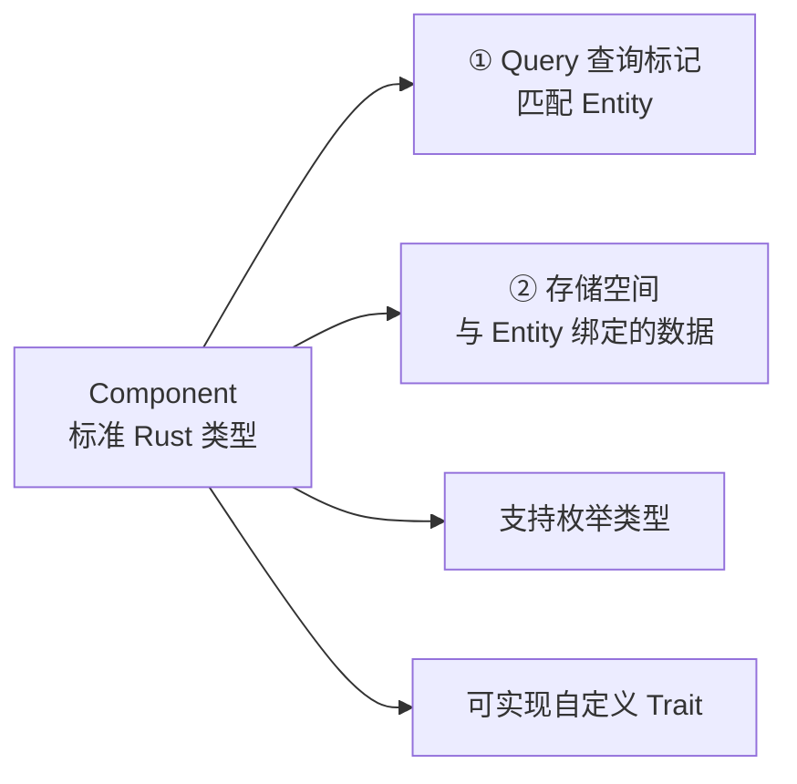
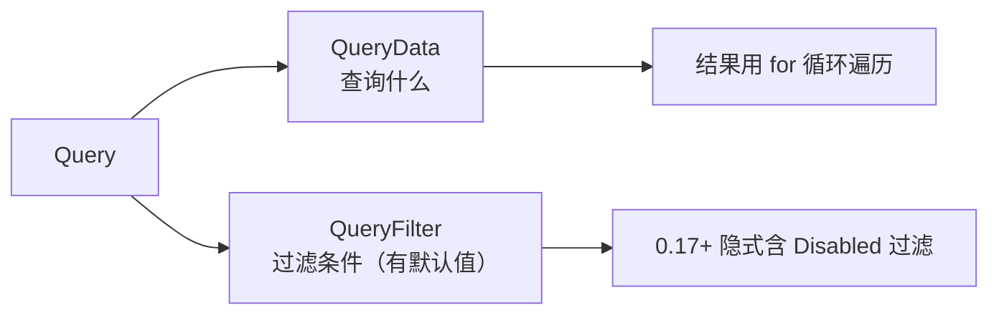
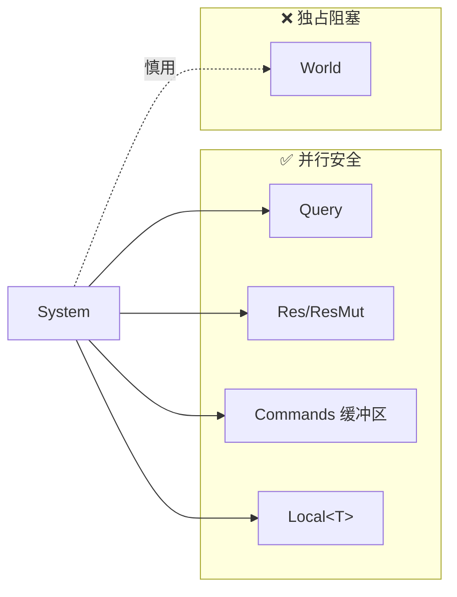
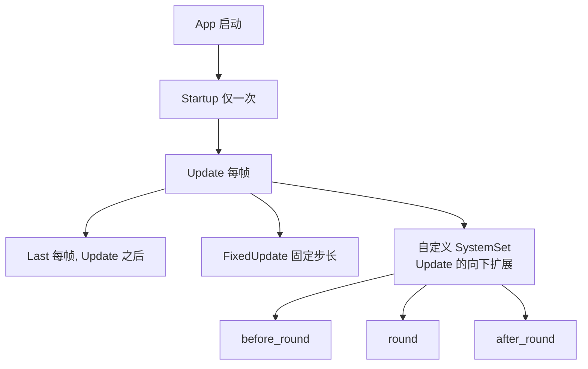
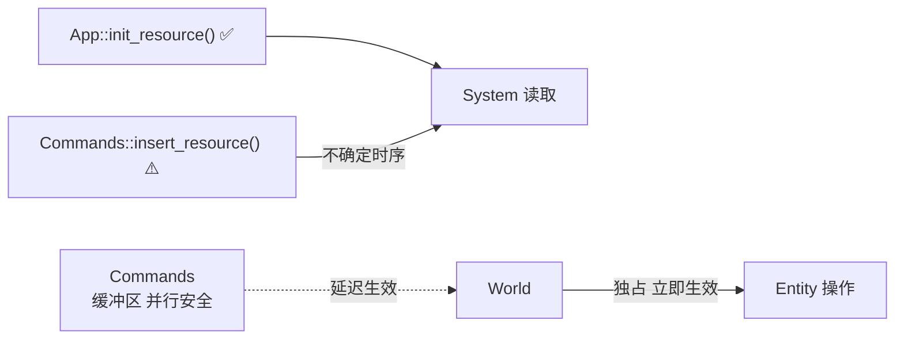
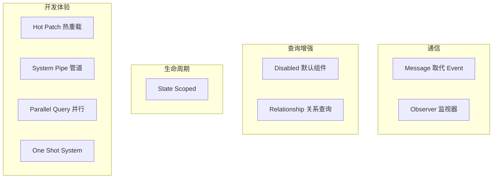
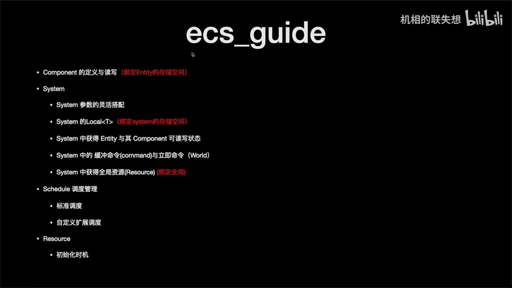
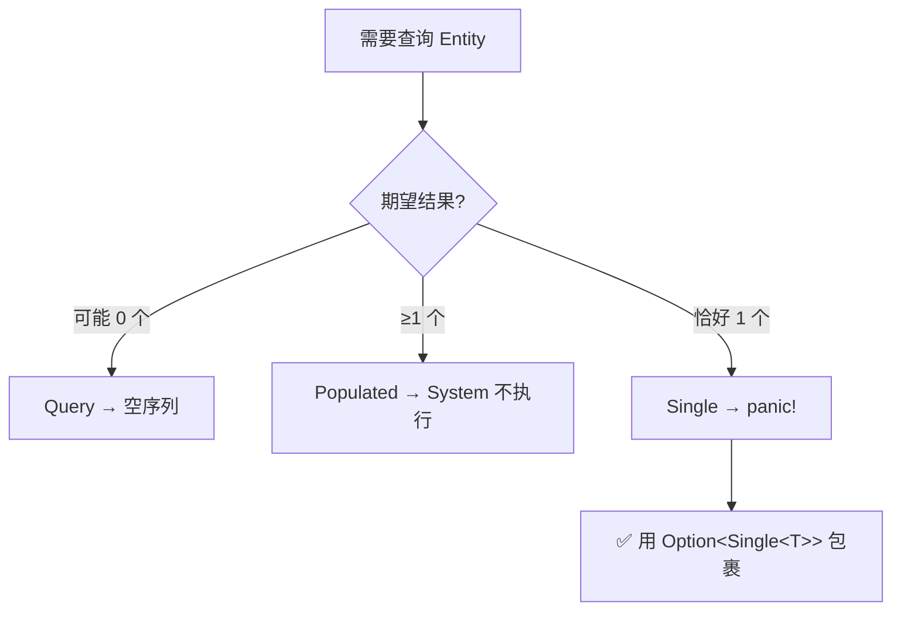
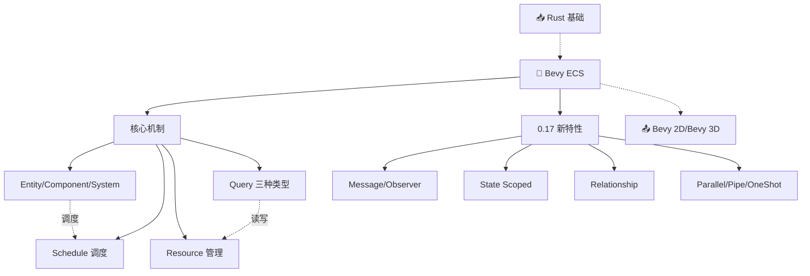

# Bevy ECS 全面学习笔记

> 📌 本文档为 myriad-mind **v2.0** 生成。另有 [**v2.1 重制版**](LearnEcs_v2.md)，基于 v2.1 重新生成：截图从 2 张增至 12 张、新增代码示例、评论区精华和完整调试追踪，推荐阅读新版。

> 📺 来源：[Bilibili BV14UzWBLEXD](https://www.bilibili.com/video/BV14UzWBLEXD/) | 时长：~55 分钟 | 作者：Bevy 中文社区分享
>
> 💡 点击 ▶ 图标可跳转到视频对应位置

> 📖 推荐阅读时长：28 分钟 | 难度：🌿 进阶 | 可靠性：🟡 参考 
> 🏷️ #Rust #Bevy #ECS #源码分析 #进阶

---

## 一、AI 摘要

基于 `ecs_guide` 官方示例系统讲解 Bevy ECS 核心架构，然后逐一梳理 ECS 目录下所有官方示例重点。

核心内容：Component（两个作用：查询标记 + 存储空间）→ Query（QueryData + QueryFilter）→ System 参数（Query/Res/Commands/World/Local）→ Schedule（Startup/Update/Last/自定义 SystemSet/条件运行 run_if）→ Resource（须先初始化）→ 0.17/0.18 新特性（Message 取代 Event、Observer、State Scoped、Relationship、Disabled 组件等 15+ 主题）。

---

## 二、核心概念

### 1. Component

**图：Component 的两个作用**

- 标准 Rust 数据类型 + `#[derive(Component)]`
- 还可支持枚举、自定义 Trait 绑定
- 不可变组件（ImmutableComponent）：只能替换不能修改内部属性

### 2. Query

**图：Query 结构**

三种查询：Query（空→空序列）、Populated（≥1→才执行 System）、Single（恰好 1→否则 panic）

### 3. System 参数

**图：System 参数 — 并行 vs 独占**

- 参数规则宽松：可无参数、可多个相同类型、可混合 Query+Resource
- Commands 带缓冲区利于高并发；World 独占立即执行不允许其他参数
- Local 变量绑定到 System，跟随生命周期变动

### 4. Schedule 调度

**图：Schedule 层级**

- 支持 `chain`/`before`/`after` 控制顺序，允许多层嵌套
- 条件运行：`run_if`、`in_set`、`after`、`before`，支持 resource 判断

### 5. Resource、Commands vs World

Resource 必须初始化，推荐 `App::init_resource()`。Commands 也可但缓冲区不保证时序。

### 6. 0.17/0.18 新特性全景

---

## 三、详细笔记（按时间顺序）

### [▶ 0:00](https://www.bilibili.com/video/BV14UzWBLEXD/?t=0) - 3:00 | ECS Guide 概述

> 📸 [截图于 0:00](https://www.bilibili.com/video/BV14UzWBLEXD/?t=0)

- 基于 `ecs_guide` 官方示例全面讲解，覆盖 Bevy 启动运行的核心内容
- 示例是一个模拟计分游戏，用随机函数创建得分值，按规则运行至结束
- Component 是标准 Rust 数据类型 + `#[derive(Component)]`

### [▶ 3:00](https://www.bilibili.com/video/BV14UzWBLEXD/?t=180) - 8:00 | Query 与 System 参数

- Query 分两部分：`QueryData` + `QueryFilter`（有默认值，常省略）
- System 参数宽松：可混合 Query、Resource、Commands，0.17 扩展了参数上限
- `Res` = 只读，`ResMut` = 可写

### [▶ 8:00](https://www.bilibili.com/video/BV14UzWBLEXD/?t=480) - 13:00 | Commands vs World

- Commands：缓冲区，高并发，可附加其他参数
- World：独占，立即生效，不允许其他参数
- `Local<T>`：绑定到 System 的变量
- 优先用 Commands，必要时才用 World

### [▶ 13:00](https://www.bilibili.com/video/BV14UzWBLEXD/?t=780) - 18:00 | Schedule 调度

- Startup / Update / Last 三大调度
- 自定义 SystemSet 是 Update 的向下扩展
- 支持 chain/before/after，允许多层嵌套

> 📸 [截图于 5:00](https://www.bilibili.com/video/BV14UzWBLEXD/?t=300)

### [▶ 18:00](https://www.bilibili.com/video/BV14UzWBLEXD/?t=1080) - 22:00 | Resource 初始化

- 使用前必须初始化，否则 panic
- 推荐 `App::init_resource()`；Commands 初始化不保证时序

### [▶ 22:00](https://www.bilibili.com/video/BV14UzWBLEXD/?t=1320) - 30:00 | Change Detection / Component Hooks / Custom Query

- Change Detection：`Ref<T>` + `Changed`/`Added` 追踪变化，需 `track_change_detection` feature
- Component Hooks：Insert/Add/Replace/Remove 四种事件，用 Hook 维护索引
- Custom Query Param：封装常用组合为自定义类型

### [▶ 30:00](https://www.bilibili.com/video/BV14UzWBLEXD/?t=1800) - 36:00 | Dynamic Component / Disabling / Error Handling

- 运行时动态创建 Component（`register_component_with_descriptor`）
- 0.17 新增 Disabled 组件：Query **隐式**过滤，需 `Without<Disabled>` 才能查到
- 默认 panic，可用 `app.set_error_handler(...)` 改为 warning

### [▶ 36:00](https://www.bilibili.com/video/BV14UzWBLEXD/?t=2160) - 43:00 | 不可靠 Query / Fixed Timestep

**图：三种 Query 的决策与行为**

- Single 失败原因：Commands 有缓冲区，spawn 的 Entity 对后续 System 不可见
- FixedUpdate 提供固定步长，防止跳帧影响业务逻辑

### [▶ 43:00](https://www.bilibili.com/video/BV14UzWBLEXD/?t=2580) - 50:00 | System Scope / Hierarchy / Hot Patch

- System Scope：泛型参数作为 Query Filter 提高复用性
- Hierarchy：`with_children` 嵌套，0.17 新增 `cmd!` 宏（简洁但拿不到 Entity ID）
- Hot Patch：`dynamic_linking` feature，改代码即时重载

### [▶ 50:00](https://www.bilibili.com/video/BV14UzWBLEXD/?t=3000) - 55:00 | 0.17 新特性全览

| 特性 | 说明 |
| --- | --- |
| **Message** | 取代 Event（用户消息），Observer 传递的叫 Event |
| **Observer** | 类似 HTML 事件监听，分全局和 Entity 两种，事件向上传播 |
| **State Scoped** | `spawn_on_enter`/`despawn_on_exit`，Entity 与 AppState 绑定 |
| **System Pipe** | 前置 System 输出流转到后继，`.pipe()` 链式调用 |
| **One Shot System** | 按键按下只触发一次，用 Trigger Component 实现 |
| **Parallel Query** | `par_iter_mut()` 替代 for 循环，百万级 Entity 并行 |
| **Relationship** | `ChildOf` 直接写在 Query 里，替代手动遍历 children |
| **System Stepping** | 代码级单步调试，手动控制 Update |
| **Combinations** | 两两组合，N 个 Entity → C(N,2) 种，碰撞检测专用 |
| **Immutable Component** | 内部属性不可改，只能 insert/replace |

---

## 四、关键术语表

| 英文 | 中文 | 说明 |
| --- | --- | --- |
| Entity | 实体 | Component 容器，本身只是 ID |
| Component | 组件 | 与 Entity 绑定的数据 |
| System | 系统 | 处理逻辑的函数 |
| Query | 查询 | 从 World 筛选拥有特定 Component 的 Entity |
| Resource | 资源 | 全局共享数据，不属于任何 Entity |
| Commands | 命令 | 带缓冲区的操作队列 |
| World | 世界 | ECS 全局上下文，独占阻塞并行 |
| Schedule | 调度 | 控制 System 执行时机和顺序 |
| Observer | 监视器 | 类似 HTML 事件监听 |
| Populated | 填充查询 | ≥1 结果才执行 System |
| Single | 单一查询 | 恰好 1 结果否则 panic |
| Fixed Timestep | 固定步长 | 防止跳帧影响业务逻辑 |
| State Scoped | 状态作用域 | Entity 与 AppState 绑定 |
| Relationship | 关系查询 | ChildOf 简化层级查询 |

---

## 五、总结与思考

### 核心架构理解
Bevy ECS 设计哲学是**数据驱动 + 并行优先**：Component 只管数据，System 只管逻辑，Commands 缓冲区保证并行安全。

### 0.17 重大变更
1. Event → Message；2. Disabled 隐式过滤；3. Relationship 简化层级；4. State Scoped 状态绑定

### 实践建议
优先用 Commands 少用 World、Resource 在 App 初始化阶段 init、复杂查询封装 Custom Query Param、大量 Entity 用 `par_iter_mut`

### 图：本课知识关系图

---

## 六、扩展学习资源

### 📖 官方文档
- [Bevy Book](https://bevyengine.org/learn/book/introduction/) — 官方入门，必读
- [Bevy API Docs](https://docs.rs/bevy/latest/bevy/) — 最新 API 参考

### 🎬 相关视频
- [Bevy 中文社区 B 站空间](https://space.bilibili.com/) — 本视频作者，含 2D/3D 系列

### 🐙 GitHub
- [bevyengine/bevy](https://github.com/bevyengine/bevy) — 源码
- [bevyengine/bevy/examples/ecs](https://github.com/bevyengine/bevy/tree/main/examples/ecs) — ECS 官方示例

### 📚 延伸阅读
- [Unofficial Bevy Cheat Book](https://bevy-cheatbook.github.io/) — 社区维护的实用指南
- [ECS 架构 Wikipedia](https://en.wikipedia.org/wiki/Entity_component_system) — 理解 ECS 设计哲学

---

> 📋 **文档元信息**
>
> | 项目 | 内容 |
> | --- | --- |
> | 文档版本 | v2.0 |
> | 生成时间 | 2026-05-31 |
> | 生成耗时 | 约 5 分钟 |
> | 生成模型 | DeepSeek V4 |
> | Token 消耗 | 约 52,000 tokens |
> | Skill 版本 | myriad-mind v2.0 |
> | 原始资源 | [Bilibili BV14UzWBLEXD](https://www.bilibili.com/video/BV14UzWBLEXD/) |
>
> ⚡ 本文档由 AI 基于视频字幕自动生成，可能存在识别误差。建议结合原视频对照学习。
>
> ### 更新日志
>
> | 版本 | 日期 | 变更说明 |
> | --- | --- | --- |
> | v2.0 | 2026-05-31 | 基于 myriad-mind v2.0 从原始字幕重新生成，新增 Mermaid 图表、知识关系图、扩展学习资源、阅读时长/难度/可靠性 |
> | v1.0 | 2026-05-22 | 初始生成（旧版 video-to-subtitle-summary skill） |

> 🔧 **调试信息 / Debug Trace**
>
> | 步骤 | 工具 | 耗时 | Token | 说明 |
> | --- | --- | --- | --- | --- |
> | 输入识别 | 步骤 0 | ~2s | - | 识别为 B站视频 BV14UzWBLEXD（~55 分钟） |
> | 数据读取 | Bash (cat) | ~3s | 8,000 | 从缓存读取字幕 46KB |
> | 语言检测 | Claude | ~3s | 500 | 中文 → 跳过翻译 |
> | 教程检测 | 步骤 7.4 | ~2s | 200 | 标题未命中 → 标准模式 |
> | 笔记生成 | Claude (Write) | ~120s | 30,000 | 生成结构化笔记正文 |
> | 图表绘制 | Claude (Mermaid) | ~40s | 6,000 | 生成 8 张图表 |
> | 资源推荐 | Claude | ~20s | 3,000 | 推荐 4 条资源 |
> | 截图分析 | Read (PNG) | ~15s | 3,000 | 从 30 帧选中 2 张 |
> | 截图嵌入 | Edit | ~5s | 500 | 插入截图引用 |
> | 输出写入 | Write | ~2s | - | 写入 LearnEcs.md |
> | **合计** | | **~3.5 分钟** | **~51,000** | |
>
> 决策链路：BV14UzWBLEXD → 步骤0(B站视频) → 读缓存字幕 → 生成笔记(8图/2截图/4资源) → 写文件
