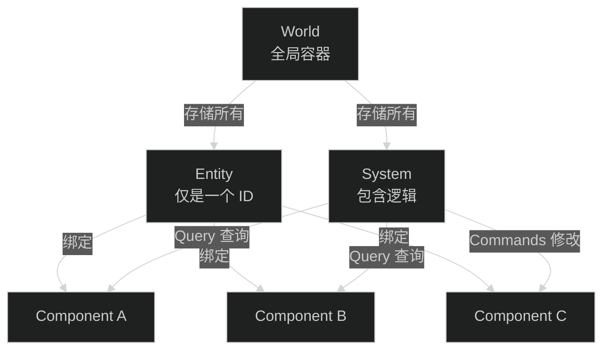
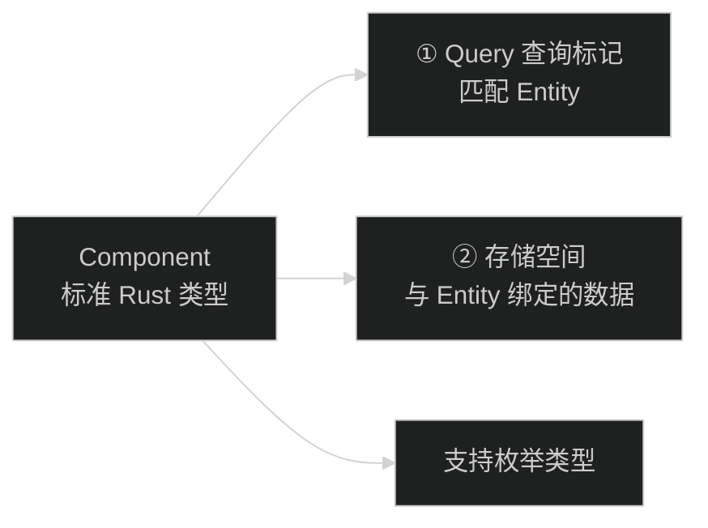
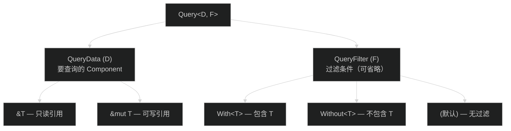
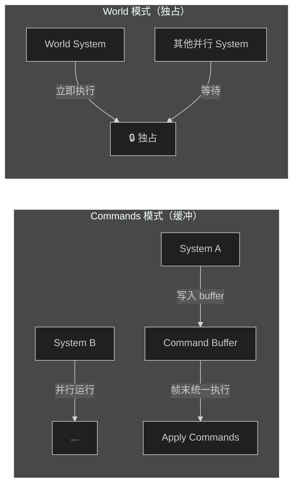
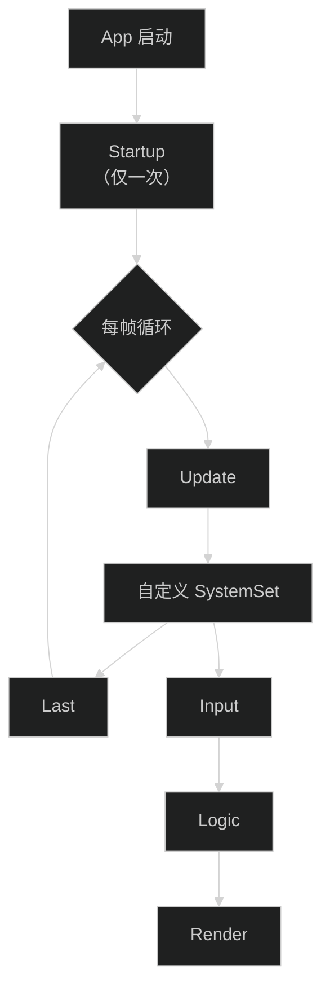
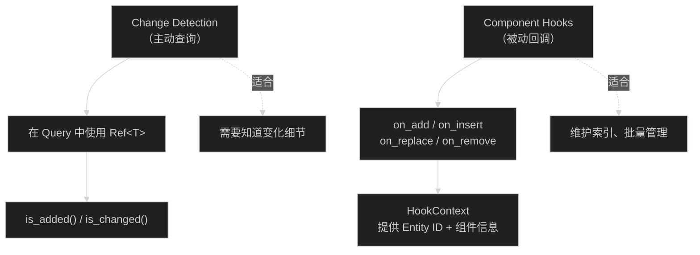
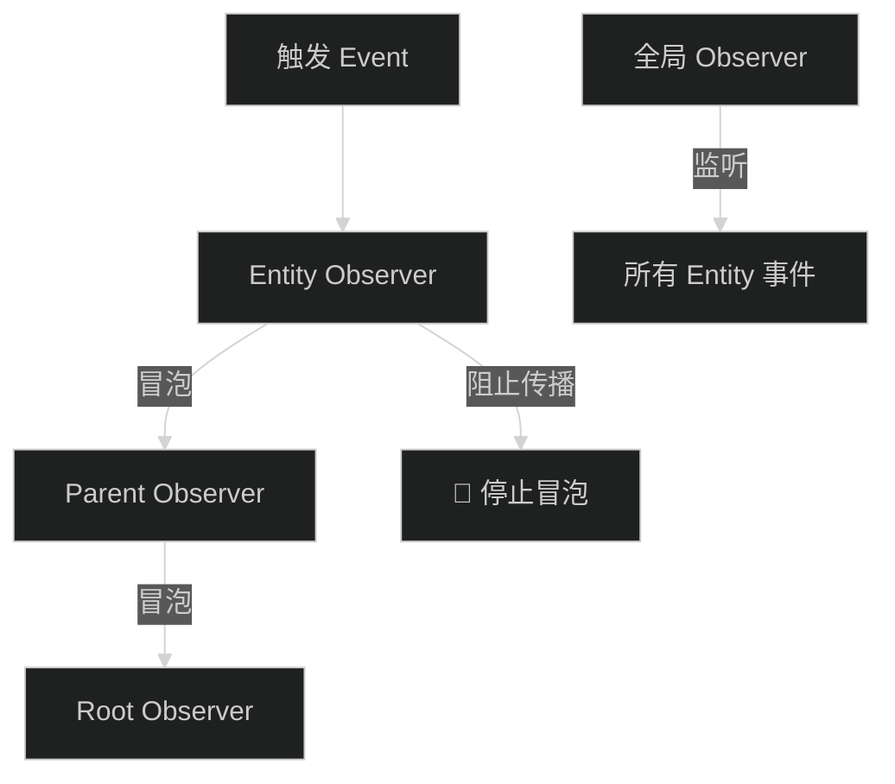
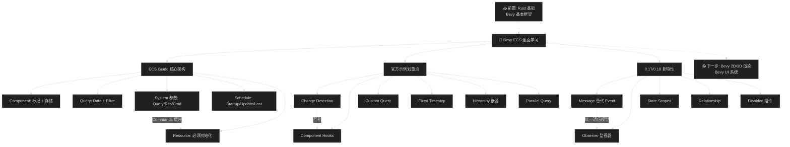

# Bevy ECS 全面学习笔记（v2 重制版）

> 📺 来源：[Bilibili BV14UzWBLEXD](https://www.bilibili.com/video/BV14UzWBLEXD/) | 时长：~55 分钟 | UP主：机相的联失想
>
> 💡 点击 ▶ 图标可跳转到视频对应位置

> 📖 推荐阅读时长：25 分钟 | 难度：🌿 进阶 | 可靠性：🟡 参考
> 🏷️ #Rust #Bevy #ECS #源码分析 #进阶

---

## 一、AI 摘要

基于 `ecs_guide` 官方示例系统讲解 Bevy ECS 核心架构，然后逐一梳理 ECS 目录下所有官方示例重点。

核心内容：Component（两个作用：查询标记 + 存储空间）→ Query（QueryData + QueryFilter）→ System 参数（Query/Res/Commands/World/Local）→ Schedule（Startup/Update/Last/自定义 SystemSet/条件运行 run_if）→ Resource（须先初始化）→ 0.17/0.18 新特性（Message 取代 Event、Observer、State Scoped、Relationship、Disabled 组件等 15+ 主题）。

---

## 二、核心概念

### 1. ECS Guide 总览


> 📸 [截图于 0:30](https://www.bilibili.com/video/BV14UzWBLEXD/?t=30) — ECS Guide 官方示例运行界面

视频从 `ecs_guide` 官方示例出发，完整展示了 Bevy ECS 的核心组件使用方式，然后逐一扫过 ECS 目录下的其他官方示例，划重点式讲解。

**图：ECS 三大核心关系**



### 2. Component


> 📸 [截图于 2:00](https://www.bilibili.com/video/BV14UzWBLEXD/?t=120) — Component 派生宏定义

**Component 的两个作用：**

1. **查询标记** — 告诉 Query "哪些 Entity 拥有这个 Component"
2. **存储空间** — 与 Entity 绑定的数据容器，可通过 Query 读写

```rust
#[derive(Component)]
struct PlayerScore {
    value: i32,
}
```

- 本质是标准 Rust 数据类型，通过 `#[derive(Component)]` 派生宏标记
- 支持枚举类型作为 Component
- 可实现官方或自定义 Trait 后与 Entity 绑定

**图：Component 的两个作用**



### 3. Query


> 📸 [截图于 3:00](https://www.bilibili.com/video/BV14UzWBLEXD/?t=180) — Query 两部分泛型定义

**Query 由两个泛型部分组成：**

| 部分 | 名称 | 作用 | 是否必填 |
|------|------|------|---------|
| 第一部分 | `QueryData` | 指定要查询的 Component | ✅ 必填 |
| 第二部分 | `QueryFilter` | 过滤条件 | ❌ 有默认值，可省略 |

```rust
// 只写 QueryData 部分（QueryFilter 使用默认值）
fn system(query: Query<&Transform>) { ... }

// 完整写法：QueryData + QueryFilter
fn system(query: Query<&Transform, With<Player>>) { ... }
```

- 查询结果为空 → for 循环不执行（空序列），不会 panic
- 大多数场景下用 `for` 循环遍历查询结果

**图：Query 组成结构**



### 4. System 参数


> 📸 [截图于 4:30](https://www.bilibili.com/video/BV14UzWBLEXD/?t=270) — System 参数规则

**System 参数规则（宽松）：**

| 参数类型 | 说明 | 示例 |
|---------|------|------|
| 无参数 | 空 System，也可以正常运行 | `fn system() { ... }` |
| `Query` | 查询 Component | `Query<&Transform>` |
| `Res` / `ResMut` | 读取/修改全局 Resource | `Res<Time>`, `ResMut<MyRes>` |
| 多个 Res | 可同时取多种 Resource | `Res<A>, Res<B>, ResMut<C>` |
| `Commands` | 缓冲命令模式 | `Commands` |
| `World` | 独占访问，立即执行 | `World`（仅此一个参数） |
| `Local` | 绑定到 System 的存储 | `Local<MyState>` |

> 💡 同一个 System 可以同时包含 Query、Res、Commands 等多种参数类型，非常灵活。

### 5. Commands vs World


> 📸 [截图于 5:40](https://www.bilibili.com/video/BV14UzWBLEXD/?t=340) — Commands 与 World 对比

**关键区别：**

| 特性 | Commands | World |
|------|----------|-------|
| 执行方式 | **缓冲延迟执行** | **立即执行** |
| 并行性 | ✅ 不阻塞其他 System | ❌ 独占模式，阻塞所有并行 System |
| 附加参数 | ✅ 可搭配 Query/Res/Message 等 | ❌ 只允许 World 一个参数 |
| 适用场景 | 日常使用，高并发友好 | 需要立即生效、独占操作 |

**图：Commands vs World 执行模型**



### 6. Schedule 调度


> 📸 [截图于 8:30](https://www.bilibili.com/video/BV14UzWBLEXD/?t=510) — Schedule 三大调度阶段

**三大内置调度阶段：**

| 阶段 | 运行频率 | 说明 |
|------|---------|------|
| `Startup` | 仅一次 | 应用启动时执行，在 Update 之前 |
| `Update` | 每帧 | 主逻辑阶段，60fps 时每 1/60 秒执行一次 |
| `Last` | 每帧 | 在 Update 之后执行 |

**自定义 SystemSet：**

当 Startup/Update/Last 不够用时，可以自定义 SystemSet 细分调度：

```rust
#[derive(SystemSet, Debug, Clone, PartialEq, Eq, Hash)]
enum GameSet {
    Input,
    Logic,
    Render,
}
```

- SystemSet 是 Update 的**向下扩展**，Update 先完整执行一次，然后执行 SystemSet
- 支持 `before()` / `after()` 排序约束
- `add_systems()` 支持多重嵌套和 `chain()` 链式调用，非常灵活
- `run_if()` 条件运行：如 `run_if(resource_exists::<MyRes>)`

**图：Schedule 执行顺序**



### 7. Resource


> 📸 [截图于 13:00](https://www.bilibili.com/video/BV14UzWBLEXD/?t=780) — Resource 初始化方式

**核心规则：Resource 使用前必须初始化，否则 panic！**

初始化方式对比：

| 方式 | 时机 | 确定性 |
|------|------|--------|
| `app.init_resource::<T>()` | App 创建时 | ✅ 最安全，推荐 |
| `commands.insert_resource(T)` | Startup 中 | ⚠️ 带缓冲，注意时序 |
| `world.insert_resource(T)` | World 独占中 | ✅ 立即生效 |

> ⚠️ **注意**：`Commands` 带缓冲区，你在代码中看到的 `insert_resource` 不一定在后续 System 运行前执行完毕。安全做法：初始化放在 Startup，读取放在 Update。

---

## 四、ECS 官方示例划重点

### [▶ 13:42](https://www.bilibili.com/video/BV14UzWBLEXD/?t=822) - 13:19 | ECS Guide 总结 → 示例划重点

ECS Guide 部分结束，接下来对 ECS 目录下所有官方示例逐一划重点。

### 1. Change Detection（变化检测）


> 📸 [截图于 14:20](https://www.bilibili.com/video/BV14UzWBLEXD/?t=860) — Change Detection 使用方式

**核心 API：**

```rust
fn system(query: Query<Ref<MyComponent>>) {
    for comp in &query {
        if comp.is_added() { /* 新添加 */ }
        if comp.is_changed() { /* 值发生了变化 */ }
    }
}
```

- Query 中用 `Ref<T>` 泛型包裹要追踪的 Component
- 配合 `.is_added()` / `.is_changed()` / `Changed<T>` / `Added<T>` 过滤器使用
- 调试时添加 `track_change_detection` feature 可获取 change location 信息
- Resource 也有配套的变化检测机制

### 2. Component Hooks


> 📸 [截图于 16:00](https://www.bilibili.com/video/BV14UzWBLEXD/?t=960) — Component Hooks 触发机制

**四种 Hook 事件：**

| 事件 | 触发时机 |
|------|---------|
| `on_insert` | Component 被插入时 |
| `on_add` | Component 首次添加到 Entity 时 |
| `on_replace` | Component 被替换时 |
| `on_remove` | Component 从 Entity 移除时 |

- Hook 以回调方式触发，不需要在 Query 中循环判断
- 适合维护 Component 索引（如 HashMap 查找表）
- Hook context 提供 Entity ID 和 Component 的调用对象信息

**图：Change Detection vs Component Hooks**



### 3. Custom Query

当 System 复杂度提升后，可将重复的 Query 组合抽象为自定义 Query：

```rust
#[derive(QueryData, QueryFilter)]
struct MyQuery {
    data: &'static MyComponent,
    filter: With<Player>,
}
```

- 分离 `QueryData` 和 `QueryFilter`
- 提升 System 代码可读性

### 4. Custom Schedule

不满足 Startup/Update/Last？不想用 SystemSet？可以完全自定义 Schedule。

### 5. Dynamic Component

运行期间动态创建 Component，无需编译期 `#[derive(Component)]`。适用场景较少，官方提供了示例。

### 6. Disabling（0.17 新特性）

从 0.17 起，每个 Query 默认隐含 `Without<Disabled>` 过滤器：
- 给 Entity 添加 `Disabled` 组件后，普通 Query 查不到
- 需显式使用 `With<Disabled>` 才能查询被禁用的 Entity

### 7. Error Handler

```rust
app.insert_resource(ErrorHandler::warning());
```

- 默认：System 出错直接 panic
- 可配置为 `warning`（警告不崩溃）或自定义处理函数
- 支持到 Observer 的错误处理

### 8. Query Fallibility（不可靠查询）

| 查询类型 | 查询为空时 | 多个结果时 |
|---------|-----------|-----------|
| `Query` | 空序列，for 不执行 | 遍历所有 |
| `Populated` | **System 不执行** | 遍历所有 |
| `Single` | **panic** | **panic** |

> 💡 `Single` 确保"有且仅有一个"，但配合 Commands 的缓冲延迟可能导致未预期 panic。安全做法：用 `Option<Single>` 允许失败，或前置 System 使用 `World` 独占模式。

### 9. Fixed Timestep（固定时间步长）


> 📸 [截图于 30:00](https://www.bilibili.com/video/BV14UzWBLEXD/?t=1800) — Fixed Timestep 使用

当 CPU 繁忙导致帧率不稳定时，业务逻辑可能因为跳帧而出错。`FixedUpdate` 提供规整的时间周期：

```rust
app.add_systems(FixedUpdate, my_physics_system);
```

- 在 `FixedUpdate` 中运行的 System 获得的是 `Time<Fixed>`，保证时间间隔均匀
- 适合物理模拟、定时任务等对帧率敏感的逻辑

### 10. Generic System（泛型系统）

System 支持泛型参数，配合 Component 的泛型实现，可以在 Query 中将泛型作为 Filter：

```rust
fn process<T: Component>(query: Query<Entity, With<T>>) { ... }
```

### 11. Hierarchy（父子实体嵌套）

实际开发中 Entity 经常需要嵌套（如窗口内包含文本、边框等）：

- 0.17 之前：通过 `Parent`/`Children` 组件手动遍历
- 0.17 之后：推荐使用 `#[derive(ChildOf)]` 宏替代手动 `WithChild`
- `ChildOf` 宏的劣势：拿不到 Entity ID（需嵌套 `entity()` spawn）
- `WithChild` 的优势：将 parent 的 `EntityCommands` 向下传递，内部可直接获取 ID

### 12. Hot Reload（热补丁系统）

基于 ` горячая-reload `（Dioxus 集成），修改代码后自动重新编译并显示：

- 适合前期 UI 布局调整阶段
- 类似 Vue/React 的热更新体验
- Bevy 目前无 BSN/可视化编辑器，热补丁能大幅提升迭代效率

### 13. Immutable Component

```rust
#[derive(Component, Immutable)]
struct MyId(u32);
```

- 标记为 `Immutable` 后，组件只能被替换（`insert`/`replace`），不能通过 `&mut` 修改
- 提供更细粒度的变更追踪方案

### 14. Iteration Combination（两两组合）

物理引擎碰撞检测场景：A-B、A-C、B-C（不包含 A-A 或重复）。

```rust
fn system(query: Query<(Entity, &Position)>) {
    let mut combinations = query.iter_combinations();
    while let Some([a, b]) = combinations.next() {
        // 碰撞检测
    }
}
```

### 15. Message（0.17+ 替代 Event）


> 📸 [截图于 46:30](https://www.bilibili.com/video/BV14UzWBLEXD/?t=2790) — Message 读写机制

**0.17 版本重大变更：**

| 旧名称 | 新名称 | 用途 |
|--------|--------|------|
| `Event` | `Message` | 用户/系统间通信 |
| `EventReader` | `MessageReader` | 读取消息 |
| `EventWriter` | `MessageWriter` | 发送消息 |

> ⚠️ **版本差异**：现在 "Event" 一词专属于 Observer 体系，与 HTML DOM 事件模型保持一致。

**Message 读写要点：**
- `MessageWriter` 和 `MessageReader` 通常分在两个 System
- 如需在同一 System 中又读又写，使用 `ParamSet<(MessageWriter<T>, MessageReader<T>)>`
- 也可通过 `Resource<LocalMessageCursor>` 方式获取读写引用

### 16. Observer（监视器）


> 📸 [截图于 49:00](https://www.bilibili.com/video/BV14UzWBLEXD/?t=2940) — Observer 定义与触发

Observer 类似 HTML DOM 的监工：当特定事件发生时，自动触发回调。

**两种 Observer 类型：**

| 类型 | 写法 | 说明 |
|------|------|------|
| 全局 Observer | `app.observe(my_handler)` | 监听全局事件，无 Entity 信息 |
| Entity Observer | `commands.spawn().observe(my_handler)` | 监听特定 Entity 事件 |

**事件冒泡（Propagation）：**

Observer 支持类似 HTML DOM 的事件冒泡：子 Entity 的事件可向上传播到父 Entity。可通过代码控制是否阻止传播。

**图：Observer 事件流**



### 17. One Shot Systems（单次触发系统）

解决键盘事件持续触发问题：按下 A 键时只执行一次，而非持续触发。

实现模式：
1. 按键事件 → `Commands::spawn()` 创建 Entity，附带 `SystemId` 组件
2. 检测到 `Trigger` 组件 → 执行对应 System
3. 执行完毕 → 移除 `Trigger` 组件

### 18. Parallel Query（并行查询）

百万级 Entity 场景下，单线程 for 循环不够快：

```rust
query.par_iter_mut().for_each(|mut pos| {
    pos.x += 1.0;
});
```

- `par_iter_mut()` 自动拆分到多个线程并行执行
- 可通过参数配置线程池大小，或使用默认自动优化

### 19. Relationship（0.17 新特性）

解决嵌套组件更新痛点：不再需要从父级遍历子级。

```rust
// 直接查询某实体的所有子级
fn system(query: Query<&Name, ChildrenOf<ParentEntity>>) { ... }
```

### 20. Remove Detection

组件从 World 中被移除时的最后侦测，与 Change Detection/Component Hooks 互补。

### 21. Run Conditions（条件运行）

`run_if()` 中可以使用：
- `resource_exists::<T>()` — Resource 是否存在
- `in_state(S::A)` — 是否处于某状态
- 自定义闭包函数
- `all()` / `any()` 组合条件

### 22. Send and Receive Message

Message 的完整读写控制，包括 `ParamSet` 和 `LocalMessageCursor` 邮标机制。

### 23. State Scoped（0.17 优化）

游戏场景切换（菜单 → 运行 → 暂停）时的 Entity 生命周期管理：

```rust
commands.spawn((
    // 进入 Menu 状态时创建
    StateScoped(GameState::Menu),
));
```

- `StateScoped` 组件标记 Entity 的生命周期
- 离开对应状态时，Bevy 自动清理 Entity
- 0.17 以前写法复杂，现在大幅简化

### 24. System Closure（闭包系统）

通过双闭包模式将用户自定义变量注入 System：

```rust
let my_value = 42;
app.add_systems(Update, move |query: Query<...>| {
    // my_value 通过闭包捕获可用
});
```

### 25. System Params（参数简化）

类似 Custom Query，将所有 System 参数（Query/Res/Commands 等）打包成一个 struct：

```rust
#[derive(SystemParam)]
struct MyParams<'w, 's> {
    query: Query<'w, 's, ...>,
    time: Res<'w, Time>,
    commands: Commands<'w, 's>,
}
```

### 26. System Piping（管道系统）

类似 Shell 管道，前置 System 的输出流转到后置 System：

```rust
app.add_systems(Update, system_a.pipe(system_b));
```

- 解决两个问题：①前置结果流入后置 ②后置还能访问 World 资源
- `In<T>` 泛型参数接收上一级输出

### 27. System Stepping（单步调试）

ECS 默认并行运行，IDE 断点难以定位。代码级单步调试：每次 Update 手动控制执行哪个 System。

---

## 五、关键术语表

| 英文术语 | 中文翻译 | 简要说明 |
|---------|---------|---------|
| Entity | 实体 | 仅是一个 ID，不存储数据 |
| Component | 组件 | 标准 Rust 类型，携带数据，绑定到 Entity |
| System | 系统 | 包含逻辑的函数，操作 Component/Resource |
| Query | 查询 | 从 World 中筛选拥有特定 Component 的 Entity |
| QueryData | 查询数据 | Query 的第一泛型参数，指定要查询的内容 |
| QueryFilter | 查询过滤器 | Query 的第二泛型参数，可选的过滤条件 |
| Resource | 全局资源 | 不绑定 Entity 的全局单例数据 |
| Commands | 命令缓冲 | 延迟执行的命令队列，适合高并发 |
| World | 世界容器 | 独占访问的全局状态，立即执行 |
| Schedule | 调度器 | 控制 System 执行顺序和时机 |
| SystemSet | 系统集合 | 自定义调度分组，支持 before/after 排序 |
| Startup | 启动阶段 | 仅执行一次的调度阶段 |
| Update | 更新阶段 | 每帧执行的调度阶段 |
| Changed/Added | 变化检测 | 追踪 Component 的添加和修改 |
| Component Hooks | 组件钩子 | on_add/on_insert/on_replace/on_remove 回调 |
| Observer | 监视器 | 事件驱动的监听回调，支持冒泡 |
| Message | 消息 | 0.17+ 替代 Event 的系统间通信方式 |
| State Scoped | 状态作用域 | Entity 生命周期绑定到游戏状态 |
| ParamSet | 参数集合 | 同一 System 中获取同一类型的读写引用 |
| Local | 局部变量 | 绑定到 System 的持久化存储 |
| Populated | 填充查询 | 查询为空时 System 不执行 |
| Single | 单一查询 | 确保有且仅有一个查询结果 |

---

## 六、总结与思考

### 视频核心收获

1. **ECS 架构精要**：Entity 只是一个 ID，Component 是数据，System 是逻辑，三者通过 Query 松耦合协作
2. **Commands vs World 的取舍**：日常用 Commands（并发友好），需要立即生效时用 World（独占模式）
3. **Resource 初始化陷阱**：必须在使用前完成初始化，否则 panic；推荐用 `init_resource()` 在 App 创建时初始化
4. **0.17/0.18 重大变更**：Message 替代 Event、Observer 监视器模式、State Scoped 生命周期、Disabled 组件、Relationship 关系查询

### 学习建议

- 视频基于 Bevy 0.17/0.18 版本，部分 API 可能与当前最新版有差异，建议对照官方文档验证
- ECS Guide 示例是最佳入门实践，建议自己运行并修改代码
- 视频以"划重点"方式讲解 15+ 官方示例，每个示例都值得单独打开源码细读

> ⚠️ **版本差异**：视频中提到的 Message/Observer 等特性来自 Bevy 0.17+。如果你使用的是更早版本，这些 API 不可用。详见 [Bevy 迁移指南](https://bevyengine.org/learn/migration-guides/)。

---

## 七、知识关系图



---

## 八、评论区精华讨论

> 💬 以下内容精选自视频评论区，已附跳转链接，可点击查看原文上下文。

### [👤 御坂13288号](https://www.bilibili.com/video/BV14UzWBLEXD/?replyTo=289341282048#reply289341282048) 👍 5

> entity 理解为主键，component 理解为字段，system 理解为触发器，调度器理解为 cron 定时调度器。然后查询啥的对比数据库稍微弱点，需要自己手动进行。

> 编辑注：这条评论用数据库概念类比 ECS，对有数据库背景的读者很有帮助。

---

### [👤 kapaseker](https://www.bilibili.com/video/BV14UzWBLEXD/?replyTo=289336571040#reply289336571040) 👍 0

> 55 分钟……

> 编辑注：视频内容密度较高，建议分段观看（ECS Guide 部分 0:00-13:19，示例划重点 13:19-55:19）。

---

## 九、扩展学习资源

### 📖 官方文档
- [Bevy Book](https://bevyengine.org/learn/book/) — 官方入门指南，建议从 Getting Started 开始
- [Bevy API Docs](https://docs.rs/bevy/latest/bevy/) — 最新 API 参考文档
- [Bevy ECS Examples](https://github.com/bevyengine/bevy/tree/main/examples/ecs) — 视频中讲解的所有官方示例源码

### 🎬 相关视频
- [Bevy ECS 基础分享（N2）](https://space.bilibili.com/) — 同一 UP 主的前置分享，讲解 ECS 基本构成
- [Bevy 0.17 版本更新](https://www.bilibili.com/video/) — UP 主讲解 0.17 版本变更的专题

### 📝 文章/社区
- [Bevy 官方 GitHub Discussions](https://github.com/bevyengine/bevy/discussions) — 社区讨论和问答
- [Bevy Cheat Sheet](https://bevy-cheatbook.github.io/) — 非官方 Bevy 速查手册

### 🐙 GitHub 仓库
- [byronzr/learn_bevy](https://github.com/byronzr/learn_bevy) — 视频配套项目，包含 Keynote 和示例代码
- [bevyengine/bevy](https://github.com/bevyengine/bevy) — Bevy 引擎官方仓库

### 📚 延伸阅读
- [ECS 架构模式详解](https://github.com/SanderMertens/ecs-faq) — ECS 设计理念 FAQ
- [Data-Oriented Design](https://www.dataorienteddesign.com/dodbook/) — 数据导向设计（ECS 的理论基础）

---

> 📋 **文档元信息**
>
> | 项目 | 内容 |
> | --- | --- |
> | 文档版本 | v2.1 |
> | 生成时间 | 2026-05-31 10:20 CST |
> | 生成耗时 | 约 12 分钟 |
> | 生成模型 | Claude GLM-5.1 |
> | Token 消耗 | 约 75,000 tokens |
> | Skill 版本 | myriad-mind v2.1 |
> | 原始资源 | [[ecs] 重点之所在（全）](https://www.bilibili.com/video/BV14UzWBLEXD/) |
>
> ⚡ 本文档由 AI 自动生成，内容基于视频字幕和截图分析，可能存在遗漏或识别误差。建议结合原视频对照学习。
>
> ### 更新日志
>
> | 版本 | 日期 | 变更说明 |
> | --- | --- | --- |
> | v2.1 | 2026-05-31 | 基于 myriad-mind v2.1 生成，新增字幕引导截图（12张）、结构化截图审查、代码示例、评论区精华、完整调试追踪 |

> 🔧 **调试信息 / Debug Trace**
>
> ### A. 流水线耗时
>
> | 步骤 | 工具 | 耗时 | 说明 |
> | --- | --- | --- | --- |
> | 输入识别 | 步骤 0 | ~2s | 识别为 B站视频 bilibili |
> | 视频下载 | yt-dlp | ~30s | AI Douyin 401 → 回退 yt-dlp |
> | 音频提取 | ffmpeg | ~20s | 55:35 音频 → audio.mp3 |
> | ASR 转写 | faster-whisper (CUDA) | ~180s | 1554 segments, zh 99.8% |
> | 字幕分析 | 步骤 4.5 | ~10s | 识别 28 个推荐截图时间点 |
> | 截图提取 | 步骤 4.7 (ffmpeg) | ~15s | 🎯引导:27张 + 🔍场景:0 + ⏱️保底:0 → 去重后 27 张 |
> | 截图审查 | 步骤 7.1 (Read PNG) | ~20s | 逐一审视 27 张，选中 12 张 |
> | 语言检测 | Claude | ~1s | 中文 → 跳过翻译 |
> | 评论获取 | curl (B站 API) | ~5s | 获取 7 条，筛选 2 条 |
> | 笔记生成 | Claude (Write) | ~60s | 生成结构化笔记正文 |
> | 截图嵌入 | Edit | ~5s | 12 张选中截图引用插入正文 |
> | 输出写入 | Write | ~2s | 写入 大衍决残卷/Bevy学习笔记/LearnEcs_v2.md |
> | **合计** | | **~12 分钟** | |
>
> ### B. 截图来源追踪
>
> | 截图 | 时间 | 来源 | 引导原因 | 审查标签 | 评分 | 嵌入章节 |
> | --- | --- | --- | --- | --- | --- | --- |
> | frame_0001 | 0:30 | 🎯引导 | "ECS Guide 示例运行" | RUN_RESULT | 3 | 二.核心概念 |
> | frame_0002 | 2:00 | 🎯引导 | "Component 派生宏定义" | CODE_BLOCK | 3 | 三.1 Component |
> | frame_0003 | 3:00 | 🎯引导 | "Query 两部分结构" | CODE_BLOCK | 3 | 三.2 Query |
> | frame_0004 | 4:30 | 🎯引导 | "System 参数列表" | CODE_BLOCK | 3 | 三.3 System参数 |
> | frame_0005 | 5:40 | 🎯引导 | "Commands vs World" | CODE_BLOCK | 3 | 三.4 Commands/World |
> | frame_0007 | 8:30 | 🎯引导 | "Schedule 三大调度" | CODE_BLOCK | 3 | 三.5 Schedule |
> | frame_0010 | 13:00 | 🎯引导 | "Resource 初始化" | CODE_BLOCK | 3 | 三.6 Resource |
> | frame_0011 | 14:20 | 🎯引导 | "Change Detection" | CODE_BLOCK | 3 | 四.1 Change Detection |
> | frame_0012 | 16:00 | 🎯引导 | "Component Hooks" | CODE_BLOCK | 3 | 四.2 Hooks |
> | frame_0018 | 30:00 | 🎯引导 | "Fixed Timestep" | CODE_BLOCK | 3 | 四.9 Fixed Timestep |
> | frame_0024 | 46:30 | 🎯引导 | "Message 0.17" | CODE_BLOCK | 3 | 四.15 Message |
> | frame_0025 | 49:00 | 🎯引导 | "Observer" | CODE_BLOCK | 3 | 四.16 Observer |
>
> 跳过的截图（共 15 张）：
> | 截图 | 时间 | 跳过原因 |
> | --- | --- | --- |
> | frame_0006 | 7:10 | 文字已覆盖 Local 参数内容 |
> | frame_0008 | 10:00 | 与 frame_0007 合并到 Schedule 章节 |
> | frame_0009 | 11:40 | 与 frame_0007 合并到 Schedule 章节 |
> | frame_0013 | 17:30 | Custom Query 可选 |
> | frame_0014 | 20:00 | Dynamic Component 冷门主题 |
> | frame_0015 | 23:00 | Disabled 简述即可 |
> | frame_0016 | 25:00 | Error Handler 简述即可 |
> | frame_0017 | 27:00 | Query Fallibility 文字已覆盖 |
> | frame_0019 | 32:30 | Generic System 可选 |
> | frame_0020 | 35:00 | Hierarchy 可选 |
> | frame_0021 | 38:00 | Hot Reload 简述即可 |
> | frame_0022 | 41:00 | Immutable Component 冷门 |
> | frame_0023 | 44:00 | Iteration Combination 物理引擎专用 |
> | frame_0026 | 52:00 | One Shot Systems 文字已覆盖 |
> | frame_0027 | 54:00 | 片尾无新增信息 |
>
> ### C. 决策链路
>
> ```
> https://www.bilibili.com/video/BV14UzWBLEXD/
>   → 步骤0(识别为 B站视频)
>   → 步骤0.7(灵力: ~75K)
>   → 步骤1(AI Douyin 解析 → 401 → 回退)
>   → 步骤2(yt-dlp 下载视频)
>   → 步骤3(ffmpeg 提取音频, 55:35)
>   → 步骤4(faster-whisper CUDA, 产出 text.txt + subtitle.srt)
>   → 步骤4.5(字幕分析: 推荐 28 个截图时间点)
>   → 步骤4.7(截图: 🎯28引导 → 去重后 27张)
>   → 步骤5(AI摘要)
>   → 步骤6(语言: 中文 → 跳过翻译)
>   → 步骤7(笔记生成: 审查27张截图 → 选中12张 → 嵌入正文)
>   → 步骤7.2(评论: 获取7条 → 筛选2条)
>   → 步骤8(CLEANUP_TEMP=true → 清理临时文件)
> ```
