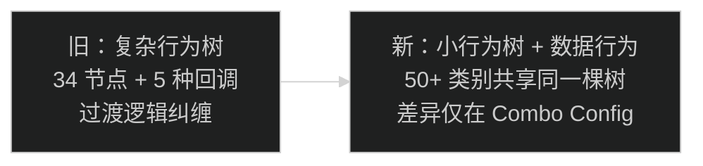
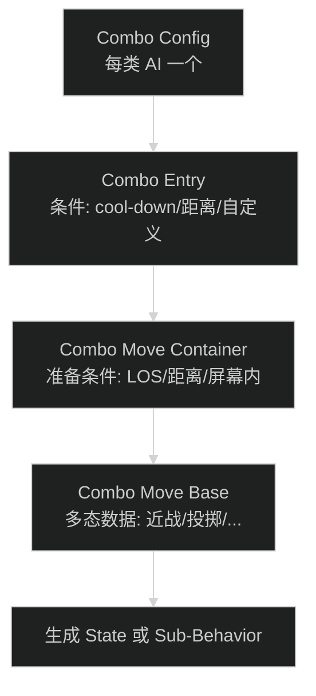
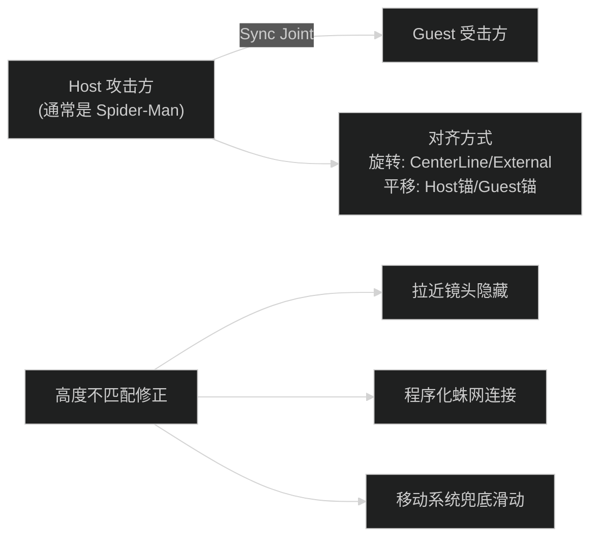
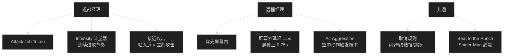
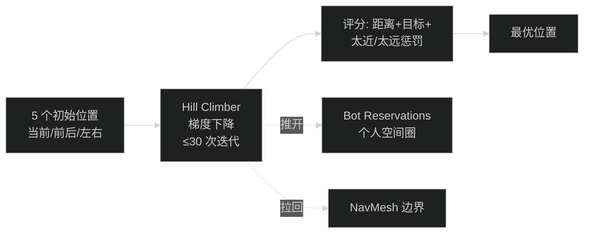
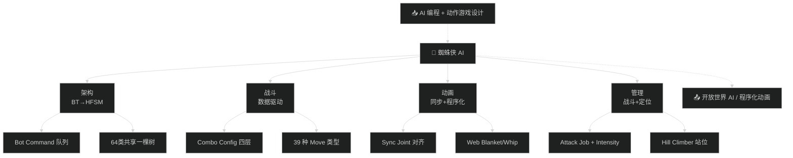

# GDC — 漫威蜘蛛侠 AI 开发剖析

> 📺 来源：[Bilibili BV1314y1X778](https://www.bilibili.com/video/BV1314y1X778/) | 时长：~56 分钟 | 作者：LeoSSSSSSSSSSS（搬运）
>
> 🎤 原演讲：Adam Neunchester (Lead Gameplay Programmer, Insomniac Games) | GDC
>
> 💡 英文演讲，已翻译 | 点击 ▶ 可跳转视频

> 📖 推荐阅读时长：18 分钟 | 难度：🌿 进阶 | 可靠性：🟢 可信
> 🏷️ #C++ #游戏AI #GDC #行为树 #状态机 #战斗系统 #动画

---

## 一、AI 摘要

Insomniac 首席玩法程序员 Adam Neunchester 复盘《漫威蜘蛛侠》AI 开发。核心转变：从复杂行为树→数据驱动的层级有限状态机（HFSM）。64 个 AI 类别共享同一棵行为树，差异仅在数据。覆盖五大系统：Bot Command 脚本控制、Combo Config 数据驱动战斗、Sync Animation 同步动画、Combat Manager 战斗管理、Hill Climber 定位算法。附带程序化动画（蛛网毯/鞭子）和四个"没做好"的教训。

---

## 二、核心概念

### 1. 行为树 → 数据驱动 HFSM

**图：架构演变**

Insomniac 自研引擎（C++），BT 在 2012 年引入。Sunset Overdrive 只需 19 个 AI 类，蜘蛛侠需要 **64 个**——不能再每类一棵树。

### 2. 数据驱动战斗（Combo Config）

- 39 种 Combo Move 类型（if-else 级联——作者承认需要清理）
- 优势：新招易加、状态与数据松耦合、设计师只看数据不管代码
- 劣势：数据量爆炸（一页 = 一个三连击的 1/3，重复 2 次）

### 3. 同步动画系统

- 只支持 2 角色（多人处决是最大遗憾）
- 为新骨骼添加处决动画耗时巨大

### 4. 战斗管理系统

### 5. Hill Climber 定位

---

## 三、详细笔记

### [▶ 0:00](https://www.bilibili.com/video/BV1314y1X778/?t=0) - 12:00 | BT→HFSM + 脚本控制

> 64 AI 类 × 复杂 BT = 不可行 → 全部共享同一棵树，差异在数据

- Insomniac 自研引擎，C++。2012 年引入 BT
- **Bot Command 系统**：设计器脚本 → Command Queue → Behavior Scripted 逐个消费
- 为什么不全数据化？AI 不应立即响应脚本（跳跃/过场/受击中需要代码兜底）

### [▶ 12:00](https://www.bilibili.com/video/BV1314y1X778/?t=720) - 25:00 | 数据驱动战斗

- Combo Config → Entry → Move Container → Move Base 四层数据结构
- Bot Combos 组件：选择最优 Combo（权重×条件×冷却）
- Behavior Use Combo：状态机，Wait→Goto→Attack→End
- 优势：新招易加（不改过渡逻辑）、状态松耦合、设计师只看数据
- 劣势：数据量恐怖（一页=1/3个三连击）

### [▶ 25:00](https://www.bilibili.com/video/BV1314y1X778/?t=1500) - 35:00 | 同步动画

- Sync Joint：攻击者的关节位置 → 受击者对齐
- 旋转对齐：CenterLine（双方面对面）/ External Anchor（外部指定）
- 平移对齐：Host as Anchor（受击方移动）/ Guest as Anchor（攻击方移动）
- 高度修正：镜头技巧 / 程序化蛛网 / 碰撞滑动
- ⚠️ 只支持 2 角色，多人处决未实现

### [▶ 35:00](https://www.bilibili.com/video/BV1314y1X778/?t=2100) - 48:00 | 战斗管理 + 定位

- **近战经理**：Attack Job Token（偷取+接近攻击+Intensity 计量器）
- **远程经理**：冷却→攻击窗口→屏幕内优先→屏幕外延迟→空中攻击概率
- **取消规则**：闪避/终结技/跳跃/落地等 12 种动作取消即将到来的攻击
- **Beat to the Punch**：Spider-Man 和敌人同时攻击→Spider-Man 必赢（红色球=激活）
- **Hill Climber**：梯度下降找最优位置，5 个种子→30 次迭代→评分→最优
- 内圈（高优先级 6 个）+ 外圈（低优先级）

### [▶ 48:00](https://www.bilibili.com/video/BV1314y1X778/?t=2880) - 56:00 | 程序化动画 + 教训

- **蛛网毯**：6×6 关节格，射线投射→适应凹凸表面→包裹物体→锁定
- **鞭子物理**：动画→Sim 混合，8 种约束（重力/曲率/碰撞胶囊/距离/地面），最多 8 次迭代
- **四个教训**：飞行敌人（手写 Spline+Volume）、移动卡车（NavMesh 不能动）、动态 NavMesh（只做了关闭/开启）、性能（30 敌人上限，物理+主线程 AI 逻辑）

---

## 四、关键术语表

| 英文 | 中文 | 说明 |
| --- | --- | --- |
| HFSM | 层级有限状态机 | 数据驱动的行为组织方式 |
| Bot Command | 机器人指令 | 设计器脚本→队列→逐个执行 |
| Combo Config | 连招配置 | 每类 AI 的完整攻击数据 |
| Sync Joint | 同步关节 | 攻击者与受击者对齐的锚点 |
| Hill Climber | 梯度下降算法 | 寻找最优 AI 站位 |
| Bot Reservation | 机器人预留区 | 个人空间避免重叠 |
| Beat to the Punch | 抢先一击 | Spider-Man 必赢判定 |
| Web Blanket | 蛛网毯 | 程序化 6×6 关节模型 |

---

## 五、总结与思考

1. **数据驱动 > 代码分支**：64 类共享一棵树，差异仅数据——适合工作量爆炸的项目
2. **迭代是王道**：战斗管理经历了 6+ 轮迭代才到"还行"
3. **核心优先**："玩家感觉自己就是 Spider-Man"不是偶然——是战斗基础打磨到位的必然
4. **NavMesh 是硬伤**：运行时生成性能不行，只能做最复杂状态+脚本关闭

### 图：本课知识关系图

---

## 六、扩展学习资源

### 🎬 相关演讲
- [GDC Vault: AI Postmortems](https://www.gdcvault.com/) — 历年 AI 复盘演讲
- Insomniac Games 其他 GDC 演讲 — 引擎与渲染相关

### 📚 延伸阅读
- [Data-Driven Game AI](https://www.gameaipro.com/) — Game AI Pro 系列
- [Behavior Trees vs HFSM](https://en.wikipedia.org/wiki/Behavior_tree) — 两种范式的对比

---

> 📋 **文档元信息**
>
> | 项目 | 内容 |
> | --- | --- |
> | 文档版本 | v1.0 |
> | 生成时间 | 2026-05-31 |
> | 生成模型 | DeepSeek V4 |
> | Token 消耗 | 约 70,000 tokens |
> | Skill 版本 | myriad-mind v2.0 |
> | 原始资源 | [Bilibili BV1314y1X778](https://www.bilibili.com/video/BV1314y1X778/) |
>
> ⚡ 本文档由 AI 基于 ASR 转写自动生成（英文→中文翻译），可能存在识别误差。
