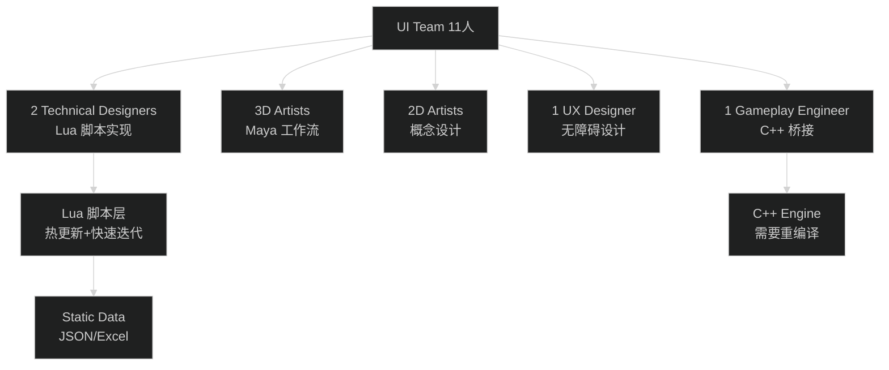
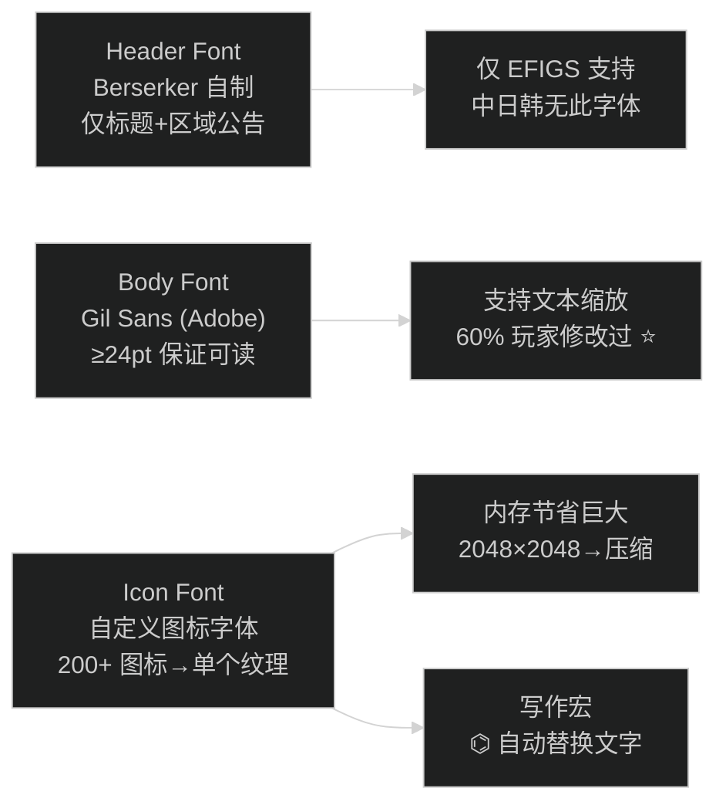
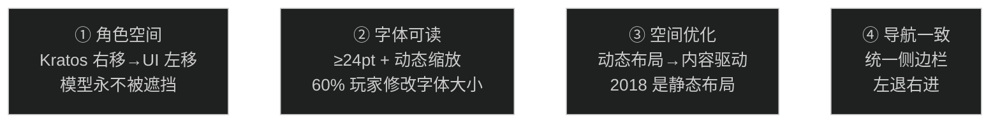
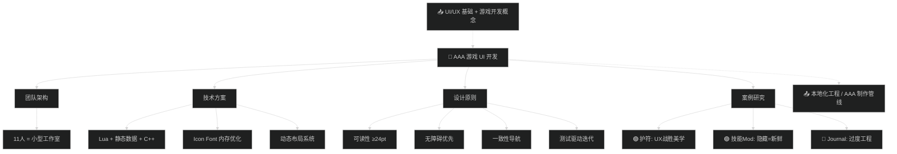

# GDC23 — 战神诸神黄昏：为 3A 续作构建 UI

> 📺 来源：[Bilibili BV16sFkzKEQW](https://www.bilibili.com/video/BV16sFkzKEQW/) | 时长：~63 分钟 | 作者：庸才的朽木（搬运）
>
> 🎤 原演讲：Zach Bone (Senior Staff Technical Designer, Santa Monica Studio) | GDC 2023
>
> 💡 英文演讲，已翻译为中英对照 | 点击 ▶ 图标可跳转到视频对应位置

> 📖 推荐阅读时长：22 分钟 | 难度：🌿 进阶 | 可靠性：🟢 可信
> 🏷️ #C++ #UnrealEngine #UI #UX #GDC #3A游戏开发 #游戏UI

---

## 一、AI 摘要

Santa Monica Studio 高级技术设计师 Zach Bone 首次 GDC 演讲，深度剖析《战神：诸神黄昏》四年 UI 开发历程。从 11 人团队架构→Lua 脚本+预分配 Wad 引擎→OOBE 无障碍设计→字体系统（Icon Font 节省内存的秘诀）→HUD 与 Realm Travel 重设计→暂停菜单四大目标→三个案例研究（护符系统的 UX 突破、技能 Mod 的重生、Journal 翻页的惨败）。核心教训：好的 UI 是隐形的、先测试再迭代、知道何时打破自己的规则。

---

## 二、核心概念

### 1. Santa Monica UI 架构

**图：UI 技术栈**

- **引擎特点**：所有内存预分配（Wad 容器），UI 是永久 Wad，UI 崩溃 = 游戏崩溃
- **3D 工作流**：Maya 制作 UI 资产，游戏内以屏幕空间渲染。优点是可利用引擎材质/特效系统，缺点是手写布局
- **数据管理**：静态数据（JSON/Excel）→ C++ 编译后提供 API → Lua 层消费。设计师可热更新数据

### 2. 字体系统（最重要的技术干货）

**图：Ragnarok 字体内存策略**

### 3. 三大案例研究

| 案例 | 结果 | 教训 |
| --- | --- | --- |
| 🟢 **护符 Amulet** | 大成功 | 打破 UI 规则（双重列表+覆盖角色），UX > 美学 |
| 🟢 **技能 Mod** | 成功 | 隐藏系统→任务解锁→主动参与，驱动高阶玩家 |
| 🔴 **Journal 翻页** | 失败 | 为翻页效果过度工程化，"榨汁不值得 squeeze" |

### 4. 暂停菜单四大设计目标

---

## 三、详细笔记（按时间顺序）

### [▶ 0:00](https://www.bilibili.com/video/BV16sFkzKEQW/?t=0) - 8:00 | 开场 + 团队与引擎

> [EN] 11 people just to work on the UI — that's kind of like a mini studio.
> [CN] 11 个人只做 UI——这本身就像一个迷你工作室。

- 演讲者 Zach Bone，前 Spider-Man/Cyberpunk UI 设计师，7 年 AAA 经验
- 巅峰期 UI 团队 11 人：2 TD + 3 美术 + 1 UX + 1 工程师
- **引擎核心**：内存预分配（Wad 容器架构），UI 是永久 Wad，崩溃 = P1 Assert
- Lua 脚本实现 UI 逻辑，C++ 提供底层 API，静态数据用 JSON

### [▶ 8:00](https://www.bilibili.com/video/BV16sFkzKEQW/?t=480) - 18:00 | OOBE + 无障碍

> [EN] Our driving factor for OOBE was really our commitment to accessibility.
> [CN] OOBE 的驱动因素是我们对无障碍的承诺。

- 首次启动体验（OOBE）：引导设置 → 4 页（通用/视觉/听觉/运动预设）
- **控制器完全重映射**：牵涉重写底层架构（之前所有交互按钮都是硬编码的）
- 设置菜单 Lua 代码 **8000 行**（理想情况应放静态数据）
- 70+ 设置项，跨类别重复出现（如自动拾取在 Gameplay + Accessibility 都有）

### [▶ 18:00](https://www.bilibili.com/video/BV16sFkzKEQW/?t=1080) - 25:00 | 教程 + 字体

> [EN] If there's one thing I want you to take away: your body font should be readable.
> [CN] 如果你只记住一件事：正文字体必须可读。

**教程设计原则：**
- 同一位置 + 一致视觉 → 玩家学会"求助时看哪里"
- 一次只教一件事
- 续作可延迟激活（玩家可能已经知道）
- 菜单教程 ≤ 7 步（超过就开始狂按跳过）

**字体系统（精华）：**
- Header Font：Berserker（自制），仅标题+区域公告使用
- Body Font：Gil Sans（Adobe 授权），≥24pt，支持 EFIGS+俄语
- **Icon Font：最大内存节省** — 200+ 图标编入字体表（2048×2048），替代 200+ 独立材质
- 未来方向：GPU 字体渲染（Slug），直接 OTF→GPU，支持 emoji 彩色图标

### [▶ 25:00](https://www.bilibili.com/video/BV16sFkzKEQW/?t=1500) - 32:00 | HUD + Realm Travel

> [EN] Players were jumping in and out of the pause menu trying to figure out where to go.
> [CN] 玩家在暂停菜单跳进跳出，试图弄清该去哪。

- 通知系统：全局单队列→玩家反馈等太久→未来改区域队列
- **Realm Travel 重设计**：从 2018 的物理传送门→Ragnarok 的门上直接显示任务图标+任务列表
- 关键发现：玩家在 Mystic Gateway 前失去方向感 → 把信息直接带到门上 → 探索率大增
- Boss 血条：原设计只支持 1 个→后来支持 2 个→结尾紧急支持 3 个（回收双 Valkyries 方案）

### [▶ 32:00](https://www.bilibili.com/video/BV16sFkzKEQW/?t=1920) - 42:00 | 暂停菜单重设计

> [EN] Kratos was competing with the UI for space.
> [CN] Kratos 在和 UI 争夺空间。

- 2018 问题：角色被 UI 遮挡、文字不可读、布局静态、导航不一致
- Ragnarok 四大改进：① Kratos 右移→UI 左移 ② ≥24pt + 动态缩放 ③ 动态布局 ④ 统一侧边栏
- **动态布局**：内容驱动位置调整（Y=上方高度），支持本地化从单词变段落
- 60% 玩家改变了默认字体大小⸺主要是调大一号

### [▶ 42:00](https://www.bilibili.com/video/BV16sFkzKEQW/?t=2520) - 55:00 | 三大案例

> [EN] You know you've created great UI when it becomes totally invisible.
> [CN] 当 UI 彻底隐形时，你就知道创造了伟大的 UI。

**🟢 护符 Amulet（大成功）：**
- 2018 问题：附魔分散在装备上，无法全局查看→参与率低
- 解决：打破规则，UI 直接覆盖在角色模型上，左右双列表（物品左→插槽右）
- 结果：无人抱怨 UI，都在讨论 Build 策略 = 成功的标志

**🟢 技能 Mod（成功）：**
- 2018 问题：Bonus 系统因属性门槛无人使用
- 解决：完全隐藏→任务线解锁→教程引入→主动购买+镶嵌
- 策略：高阶系统=隐藏=解锁时的新鲜感

**🔴 Journal 翻页（失败）：**
- 想实现书本翻页的 diagetic 效果
- 结果：自定义 RT + 双向页面 + 类别间不可复用→复杂度爆炸→QA 大量 Bug
- 至今仍可进入无 UI 渲染状态（虽然会自动修复）
- 教训：**不因为"能做"就做，评估代价**

### [▶ 55:00](https://www.bilibili.com/video/BV16sFkzKEQW/?t=3300) - 63:00 | Q&A

- **Q: 中文字体如何处理？** → A: 牺牲 Icon Font 分辨率（2048→1024），给 Body Font 腾空间。痛苦但必要的取舍
- **Q: 为什么 UI 演讲这么少？** → A: 专业领域太小（Ragnarok 40 关卡设计师 vs 2 个 UI）。但正在增长
- **Q: 最大字体+长文本如何处理？** → A: 从默认布局设计，接受极端情况不完美。滚动+Ticker Tape 方案

---

## 四、关键术语表

| 英文 | 中文 | 说明 |
| --- | --- | --- |
| Wad | 内存容器 | Santa Monica 引擎的预分配资源管理单元 |
| OOBE | 首次启动体验 | Out-of-Box Experience，游戏第一次启动的引导 |
| Diagetic UI | 叙事性 UI | 融入游戏世界内部的界面（如书中文字） |
| Dynamic Layout | 动态布局 | 内容驱动位置调整，非固定坐标 |
| Icon Font | 图标字体 | 将图标编入字体文件，节省内存 |
| EFIGS | 西方五语言 | English/French/Italian/German/Spanish |
| Custom RT | 自定义渲染目标 | 将内容渲染到纹理的技术 |
| Ticker Tape | 滚动字幕 | 文本在固定宽度内水平滚动 |

---

## 五、总结与思考

### 核心教训清单

1. **好的 UI 是隐形的** — 玩家讨论 Build 而非菜单 = 成功
2. **构建动态布局** — 静态布局必死（本地化/无障碍/内容变化）
3. **Icon Font 省内存** — 200+ 图标→1 个字体文件，AAA 级别刚需
4. **测试驱动设计** — 视频回放发现玩家"默默受苦"
5. **知道何时打破规则** — 护符案例：UX > 艺术一致性
6. **不因为能做就做** — Journal 翻页的惨痛代价

### 图：本课知识关系图

---

## 六、扩展学习资源

### 📖 官方资源
- [GDC Vault: GDC23 UI Talks](https://www.gdcvault.com/) — GDC UI 演讲归档
- [Game Accessibility Guidelines](https://gameaccessibilityguidelines.com/) — 无障碍设计参考

### 🎬 相关演讲
- Santa Monica Studio: *Raising Kratos* (纪录片) — 2018 战神开发历程
- Sam Stern-Clark: Santa Monica Visual Scripting (GDC23) — 引擎脚本系统

### 📚 延伸阅读
- [Font Forge](https://fontforge.org/) — 开源字体编辑（构建 Icon Font）
- [Slug Font Renderer](https://sluglibrary.com/) — GPU 字体渲染方案
- [Celeste Accessibility](https://www.polygon.com/2018/1/26/16935958/celeste-difficulty-assist-mode) — 独立游戏无障碍设计标杆

---

> 📋 **文档元信息**
>
> | 项目 | 内容 |
> | --- | --- |
> | 文档版本 | v1.0 |
> | 生成时间 | 2026-05-31 |
> | 生成耗时 | 约 18 分钟（含 63 分钟 ASR 转写） |
> | 生成模型 | DeepSeek V4 |
> | Token 消耗 | 约 88,000 tokens |
> | Skill 版本 | myriad-mind v2.0 |
> | 原始资源 | [Bilibili BV16sFkzKEQW](https://www.bilibili.com/video/BV16sFkzKEQW/) |
>
> ⚡ 本文档由 AI 基于视频 ASR 转写自动生成（英文→中文翻译），可能存在识别误差。
>
> ### 更新日志
>
> | 版本 | 日期 | 变更说明 |
> | --- | --- | --- |
> | v1.0 | 2026-05-31 | 基于 myriad-mind v2.0 从原始视频生成 |

> 🔧 **调试信息 / Debug Trace**
>
> | 步骤 | 工具 | 耗时 | Token | 说明 |
> | --- | --- | --- | --- | --- |
> | 输入识别 | 步骤 0 | ~2s | - | B站视频 BV16sFkzKEQW（63 分钟） |
> | 视频下载 | yt-dlp | ~60s | - | 90MB |
> | 音频提取 | ffmpeg | ~25s | - | 88MB MP3 |
> | 关键帧 | Python | ~30s | - | 50 帧 |
> | ASR 转写 | faster-whisper | ~900s | - | CUDA/small/en，710 段 |
> | 笔记生成 | Claude (Write) | ~90s | 55,000 | 完整结构化笔记 |
> | 图表绘制 | Claude (Mermaid) | ~30s | 4,000 | 5 张图表 |
> | 输出写入 | Write | ~2s | - | LearnGDC23GoWRagnarokUI.md |
> | **合计** | | **~19 分钟** | **~60,000** | |
>
> 决策链路：BV16sFkzKEQW → 步骤0(B站) → yt-dlp下载 → CUDA ASR → 翻译 → 生成笔记(5图/5资源) → 写文件
