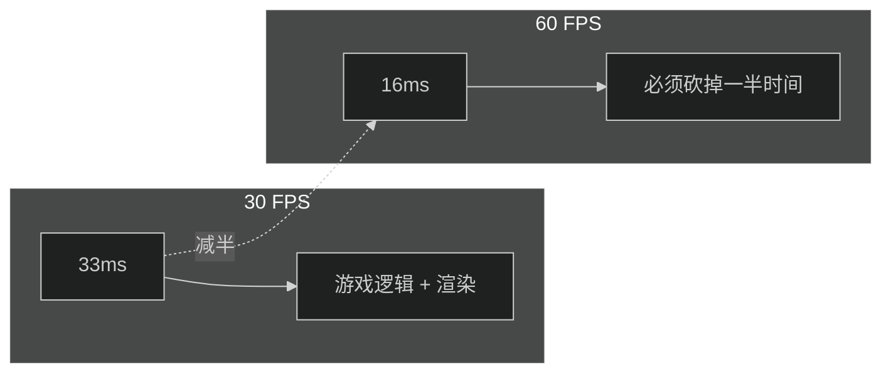
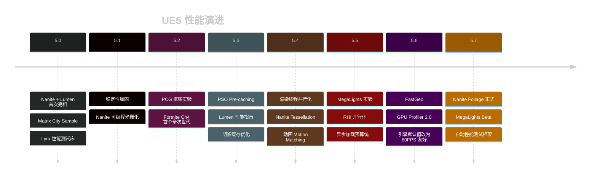
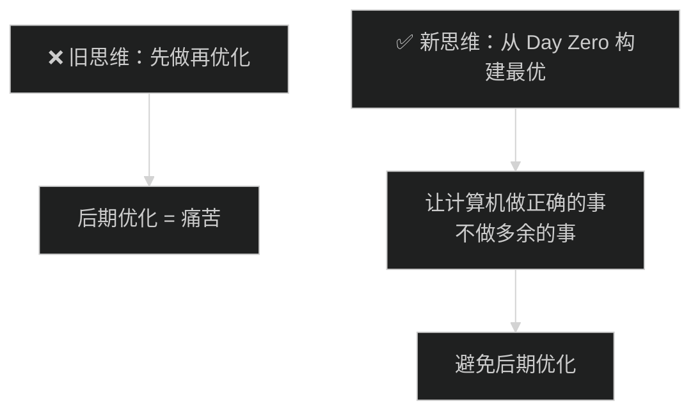
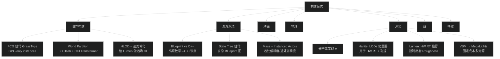
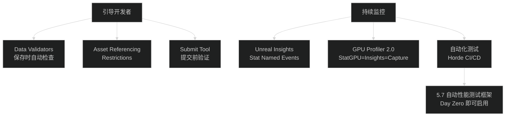
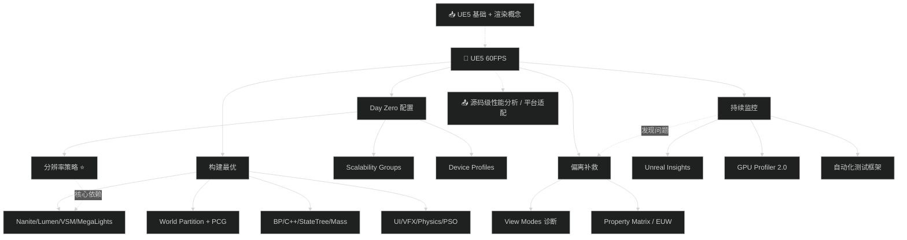

# GDC26 — 在 UE5 中达到并稳定 60 帧

> 📺 来源：[Bilibili BV1iCRLB6EbB](https://www.bilibili.com/video/BV1iCRLB6EbB/) | 时长：~60 分钟 | 作者：庸才的朽木（搬运）
>
> 🎤 原演讲：Matt Ostelay (Principal Technical Artist, Epic Games) | GDC 2026
>
> 💡 英文演讲，已翻译为中英对照 | 点击 ▶ 图标可跳转到视频对应位置

> 📖 推荐阅读时长：32 分钟 | 难度：🌳 深入 | 可靠性：🟢 可信
> 🏷️ #C++ #UnrealEngine #UE5 #性能优化 #GDC #渲染 #深入

---

## 一、AI 摘要

Epic Games 首席技术美术 Matt Ostelay 在 GDC 2026 的压轴演讲，系统讲解如何在 UE5 中达到并稳定 60 FPS。从 5.0 到 5.7 的性能演进史 → Day Zero 初始配置（Scalability/Device Profiles/分辨率策略/Frame Pacing）→ 构建期决策（PCG/World Partition/Gameplay/动画/物理/渲染/UI/VFX）→ 持续监控（Insights/GPU Profiler 2/自动化测试）→ 偏离后的补救（View Mode/Property Matrix/Editor Utility）。核心信息：**渲染 800-1080p → TSR 上采样到 1440p → 空间上采样到 4K**，这是 UE5 60FPS 的最关键策略。

---

## 二、核心概念

### 1. 时间预算：为什么 60 FPS 很难

| 帧率 | 每帧预算 | 难度 |
| --- | --- | --- |
| 30 FPS | 33.33 ms | 基线 |
| 60 FPS | 16.66 ms | ⚡ 目标 |
| 120 FPS | 8.33 ms | 🔥 另一场演讲 |

**图：帧预算对比**

### 2. UE5 性能演进史（5.0 → 5.7）

**图：UE5 性能关键里程碑**

### 3. 分辨率策略（最重要的幻灯片）

**图：UE5 60FPS 分辨率管线**

> ⚠️ **最重要的建议**：不要在 1440p 尝试 60FPS。渲染 800-1080p → TSR → 1440p → Spatial Upscale → 4K。这是 Epic 在 Witcher 4 UE5 Tech Demo 上验证的策略，Base PS5 稳定 60FPS。

### 4. 构建最优 vs 后期优化

**图：性能思维转变**

---

## 三、详细笔记（按时间顺序）

### [▶ 0:00](https://www.bilibili.com/video/BV1iCRLB6EbB/?t=0) - 10:00 | 开场 + 为什么 60FPS

> [EN] The journey of 16 milliseconds begins with a single step.
> [CN] 16 毫秒之旅，始于一步。

- 演讲者：Matt Ostelay，Epic Games 首席技术美术，16 年行业经验，12 个项目、7 个引擎
- 60 FPS = 16.66ms 预算，120 FPS 需要 8ms——**那是另一场演讲**
- Epic 不仅关心画质，也关心"让这一切在 60FPS 运行"

### [▶ 10:00](https://www.bilibili.com/video/BV1iCRLB6EbB/?t=600) - 22:00 | UE5 性能历史课（5.0→5.7）

> [EN] We've been filling in the map to see what this looks like.
> [CN] 我们在不断填补这张性能地图。

| 版本 | 关键性能改进 |
| --- | --- |
| 5.0 | Nanite+Lumen 首秀；Lyra 成为性能测试床 |
| 5.1 | 稳定性加固；Nanite 可编程光栅化（树叶终于有了！） |
| 5.2 | PCG 框架；Fortnite Ch4 首个全次世代上线 |
| 5.3 | PSO Pre-caching；Lumen 性能指南发布；阴影缓存优化 |
| 5.4 | 渲染线程并行化；Nanite Tessellation；Motion Matching |
| 5.5 | MegaLights 实验；RHI 并行化；异步预算统一；World Partition 3D Hash |
| 5.6 | FastGeo；GPU Profiler 2.0；默认开启 HW Ray Tracing；关闭 Static Lighting |
| 5.7 | Nanite Foliage 正式；MegaLights Beta；自动化性能测试框架 |

### [▶ 22:00](https://www.bilibili.com/video/BV1iCRLB6EbB/?t=1320) - 35:00 | Day Zero：第一行代码的配置

> [EN] If you learn nothing from this talk, please don't try to hit 60 FPS in Unreal at 1440.
> [CN] 如果你只记住一件事：不要在 1440p 尝试 UE5 60FPS。

**Day Zero 检查清单：**

| 配置 | 说明 |
| --- | --- |
| **Scalability Groups** | Epic=质量(30FPS), High=性能(60FPS)。High 组批量调低一系列设置 |
| **Device Profiles** | 平台级分层配置。5.6 起平台被授权方可拿到 60FPS 预设 |
| **分辨率策略** | 800-1080p 渲染 → TSR→1440p → 空间上采样→4K |
| **Frame Pacing** | GPU 默认落后 Game Thread 1 帧；可调同步点影响延迟 |
| **Console Variables** | 所有设置都是 CVar，层级化（Engine→Defaults→Platform→Device Profile→Scalability） |

### [▶ 35:00](https://www.bilibili.com/video/BV1iCRLB6EbB/?t=2100) - 48:00 | 构建最优：Pre-Production 决策

> [EN] Building optimally is about getting the computer to do the right work and not doing extra work.
> [CN] 构建最优 = 让计算机做正确的事，不做多余的事。

**图：构建期决策全景**

**各领域关键建议：**

| 领域 | 关键决策 |
| --- | --- |
| **World Partition** | 3D Hash > 2D Grid；Runtime Cell Transformer 自动合并 StaticMesh→Instances |
| **Gameplay** | Blueprint 做逻辑、C++ 做高频运算；State Tree 替代复杂 AI 图 |
| **动画** | Motion Matching 高效；AnimBP 可并行执行；减少 Attached Components |
| **物理** | Async Physics Body Init 分摊碰撞初始化；自定义 Trace Channel |
| **UI** | MVVM 替代旧 UMG Binding；Canvas Panel 少用；Global Invalidation |
| **VFX** | Niagara Data Channels：用"系统即服务"替代每帧 Spawn；Effect Types 做分级 |
| **PSO** | Epic 原话：**必须有 PSO 策略**（Bundling + Pre-caching 双管齐下） |

### [▶ 48:00](https://www.bilibili.com/video/BV1iCRLB6EbB/?t=2880) - 55:00 | 监控：保持 60FPS

> [EN] If you brush your teeth every day, nobody notices. Skip six months, people notice.
> [CN] 每天刷牙没人注意，六个月不刷谁都看得出来。

**图：性能监控体系**

**Insights 高级技巧：**
- `stat namedevents` 可看到**单个 Blueprint 节点**每帧耗时
- 可嵌入**截图**到 Trace 中（虽然会卡一下）
- GPU Profiler 2.0 显示 Async Compute 管线 + GPU 空闲检测
- `.RHI.SetGPU CaptureOptions 1` 在 Insights 中直接看 Material Draw Events

### [▶ 55:00](https://www.bilibili.com/video/BV1iCRLB6EbB/?t=3300) - 60:00 | 补救 + Q&A

> [EN] It's a lot easier to get back to 60 FPS from 17ms than from 25ms.
> [CN] 从 17ms 回到 60FPS 比从 25ms 容易得多。

**View Mode 调试指南：**

| 问题 | 查看 |
| --- | --- |
| RT 性能差 | Instance Overlap |
| 反射慢 | Lumen Performance View |
| Nanite 固定光栅慢 | Nanite Overdraw |
| Nanite 可编程光栅慢 | WPO Enabled View |
| 灯光重叠 | Light Complexity |
| VSM 投影慢 | Shadow Map RT Visualization |
| VT 慢 | VT Stack Count |
| Substrate 材质数多 | Material Count View |

**批量修改工具：** Property Matrix（全选→改一个→全部生效）→ Editor Utility Widgets（自定义批量工具）→ Geometry Script（程序化修改资产）

**Q&A 精华：**
- Q: 如何适配低配 PC？→ **买一张 3060**。没法模拟，必须有真机
- Q: Steam Deck 当 PC 开发机？→ ✅ 好主意，一致硬件 = 天然 Dev Kit
- Q: Forward Rendering 还支持吗？→ 没有被标记 Deprecated，暂时不会移除

---

## 四、关键术语表

| 英文 | 中文 | 说明 |
| --- | --- | --- |
| Nanite | 虚拟微多边形几何 | UE5 核心几何系统 |
| Lumen | 动态全局光照 | UE5 实时 GI + 反射 |
| TSR | 时序超分辨率 | UE5 的上采样方案 |
| VSM | 虚拟阴影贴图 | 默认阴影系统 |
| MegaLights | 百万动态光源 | 5.5 实验，5.7 Beta |
| PSO | 管线状态对象 | DX12/主机着色器执行优化 |
| World Partition | 世界分区 | 大世界流式加载 |
| PCG | 程序化内容生成 | 自动生成世界内容 |
| FastGeo | 快速几何体 | Runtime Cell Transformer |
| MVVM | Model-View-ViewModel | UI 数据绑定框架 |
| Horde | CI/CD 系统 | Epic 的持续集成方案 |
| Scalability Groups | 可扩展性组 | 批量画质/性能配置 |
| Device Profiles | 设备配置 | 平台分层设置 |

---

## 五、总结与思考

### 三条最重要的建议

1. **不要 1440p 跑 60FPS**：渲染 800-1080p → TSR → 1440p → 空间上采样 → 4K。这是 Witcher 4 Demo 验证过的方案
2. **Day Zero 就配置好**：Scalability Groups → Device Profiles → 分辨率策略 → 自动化测试。不要等后期补救
3. **必须有 PSO 策略**：Bundling（QA 录制）+ Pre-caching 双管齐下

### 思维转变

| 旧 | 新 |
| --- | --- |
| 先做功能，后期优化 | Day Zero 构建最优 |
| 性能是工程师的事 | 策划/美术/工程师都参与 |
| 优化 = 砍画质 | 优化 = 让计算机做正确的事 |
| 出问题再查 | 持续监控，从 17ms 回去远比 25ms 容易 |

### 图：本课知识关系图

---

## 六、扩展学习资源

### 📖 官方文档
- [UE5 Performance Guide](https://docs.unrealengine.com/5.4/en-US/performance-in-unreal-engine/) — Epic 官方性能指南
- [Lumen Performance Guide](https://docs.unrealengine.com/5.3/en-US/lumen-performance-guide/) — 5.3 发布
- [Unreal Insights](https://docs.unrealengine.com/5.0/en-US/unreal-insights-in-unreal-engine/) — Trace 分析工具

### 🎬 Epic 官方演讲（必看）
- Adi: *The Great Hitch Hunt* (GDC 2025) — 卡顿根因分析
- Adi & Matt: *Profiling with a Purpose* (GDC 2026) — 真游戏案例分析
- Matt: *Optimizing UE5 — Rethinking Performance Paradigms* (Unreal Fest 2023) — 本演讲前传

### 🐙 相关项目
- [EpicGames/UnrealEngine](https://github.com/EpicGames/UnrealEngine) — 源码
- [Witcher 4 UE5 Tech Demo](https://www.unrealengine.com/) — 60FPS 验证案例

### 📚 延伸阅读
- [DX12 PSO 原理](https://learn.microsoft.com/en-us/windows/win32/direct3d12/managing-graphics-pipeline-state-in-direct3d-12) — 理解 PSO
- [TSR 技术详解](https://docs.unrealengine.com/5.0/en-US/temporal-super-resolution-in-unreal-engine/)

---

> 📋 **文档元信息**
>
> | 项目 | 内容 |
> | --- | --- |
> | 文档版本 | v1.0 |
> | 生成时间 | 2026-05-31 |
> | 生成耗时 | 约 18 分钟（含 60 分钟 ASR 转写） |
> | 生成模型 | DeepSeek V4 |
> | Token 消耗 | 约 95,000 tokens |
> | Skill 版本 | myriad-mind v2.0 |
> | 原始资源 | [Bilibili BV1iCRLB6EbB](https://www.bilibili.com/video/BV1iCRLB6EbB/) |
>
> ⚡ 本文档由 AI 基于视频 ASR 转写自动生成（英文→中文翻译），可能存在识别误差。建议结合原视频对照学习。
>
> ### 更新日志
>
> | 版本 | 日期 | 变更说明 |
> | --- | --- | --- |
> | v1.0 | 2026-05-31 | 基于 myriad-mind v2.0 从原始视频生成，含 ASR 转写→翻译→Mermaid 图表→知识关系图→扩展资源 |

> 🔧 **调试信息 / Debug Trace**
>
> | 步骤 | 工具 | 耗时 | Token | 说明 |
> | --- | --- | --- | --- | --- |
> | 输入识别 | 步骤 0 | ~2s | - | 识别为 B站视频 BV1iCRLB6EbB（~60 分钟） |
> | 环境检查 | Bash | ~3s | - | CUDA 可用，依赖就绪 |
> | 元信息获取 | yt-dlp | ~5s | 500 | 获取标题/作者/时长 |
> | 视频下载 | yt-dlp | ~120s | - | 下载 63MB MP4 |
> | 音频提取 | ffmpeg | ~22s | - | 提取 79MB MP3 |
> | 关键帧 | Python | ~30s | - | 提取 50 帧 |
> | ASR 转写 | faster-whisper | ~900s | - | CUDA/small/en，1198 段 |
> | 语言检测 | Claude | ~2s | 300 | 英文 99.7% → 翻译 |
> | 教程检测 | 步骤 7.4 | ~2s | 200 | 标题命中 GDC 演讲 → 标准模式 |
> | 笔记生成 | Claude (Write) | ~120s | 65,000 | 生成完整结构化笔记 |
> | 图表绘制 | Claude (Mermaid) | ~40s | 6,000 | 生成 6 张图表 |
> | 资源推荐 | Claude | ~15s | 2,000 | 推荐 5 条资源 |
> | 输出写入 | Write | ~2s | - | 写入 LearnUE5Perf60FPS.md |
> | **合计** | | **~21 分钟** | **~74,000** | |
>
> 决策链路：BV1iCRLB6EbB → 步骤0(B站视频) → yt-dlp 下载 → ffmpeg 提取 → CUDA ASR 转写 → 英文翻译 → 生成笔记(6图/0截图/5资源) → 写文件
