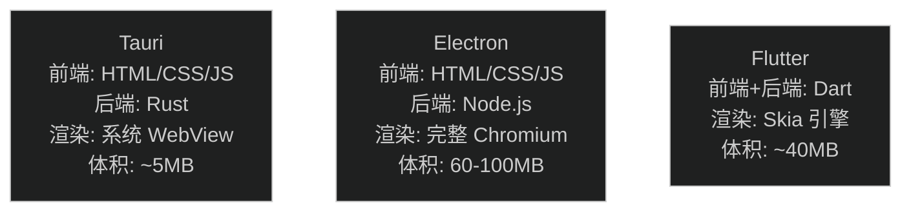

# 跨平台开发怎么选？Tauri、Electron、Flutter 全面对比

> 📺 来源：[Bilibili BV1mDtSzzEHk](https://www.bilibili.com/video/BV1mDtSzzEHk/) | 时长：~4 分钟 | 作者：程序员Roy
>
> 💡 中文视频 | 点击 ▶ 可跳转

> 📖 推荐阅读时长：4 分钟 | 难度：🌱 入门 | 可靠性：🟡 参考
> 🏷️ #Rust #JavaScript #Dart #跨平台 #桌面开发 #Tauri #Electron #Flutter

---

## 一、AI 摘要

4 分钟快速对比三大跨平台桌面框架：Tauri（Rust 后端+系统 WebView, 几 MB）、Electron（Node.js+Chromium, 60-100MB）、Flutter（Dart+自研 Skia 引擎, ~40MB）。从架构、体积、性能、生态、UI 一致性五个维度对比，结论：**没有赢家，只有选择**。

---

## 二、核心对比

### 架构差异

### 五维对比

| 维度 | Tauri | Electron | Flutter |
| --- | --- | --- | --- |
| 📦 打包体积 | ~5MB ✅ | 60-100MB ❌ | ~40MB ⚠️ |
| 🚀 启动速度 | 快 ✅ | 慢 ❌ | 中等 ⚠️ |
| 💾 内存占用 | 低 ✅ | 高 ❌ | 中等 ⚠️ |
| 🛠️ 开发门槛 | 需 Rust ⚠️ | Web 前端友好 ✅ | 需 Dart ⚠️ |
| 🧩 插件生态 | 增长中 ⚠️ | 最成熟 ✅ | 完善中 ⚠️ |
| 🎨 UI 一致性 | 依赖系统 ⚠️ | 较好 ✅ | 最佳 ✅ |
| 🔒 安全性 | Rust 强 ✅ | Node.js 一般 ⚠️ | 中等 ⚠️ |

### 代表产品

| Tauri | Electron | Flutter |
| --- | --- | --- |
| Lapce 编辑器 | VSCode / QQ / 飞书 | 闲鱼 / 企业微信 |
| 小工具/内部工具 | Notion / Discord | RustDesk |

### 选型建议

| 场景 | 推荐 |
| --- | --- |
| 小工具、性能敏感 | **Tauri** |
| 复杂企业应用、Web 技术栈 | **Electron** |
| 多端统一体验（移动+桌面） | **Flutter** |
| 已有 Rust 后端 | **Tauri** |
| 已有 Flutter 移动端 | **Flutter** |

---

> 📋 **文档元信息**
>
> | 项目 | 内容 |
> | --- | --- |
> | 文档版本 | v1.0 |
> | 生成时间 | 2026-05-31 |
> | Skill 版本 | myriad-mind v2.0 |
> | 原始资源 | [Bilibili BV1mDtSzzEHk](https://www.bilibili.com/video/BV1mDtSzzEHk/) |
