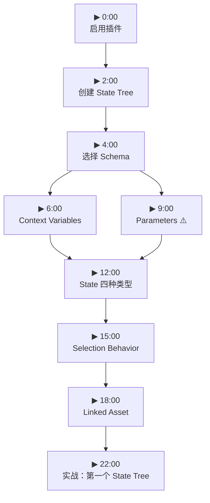
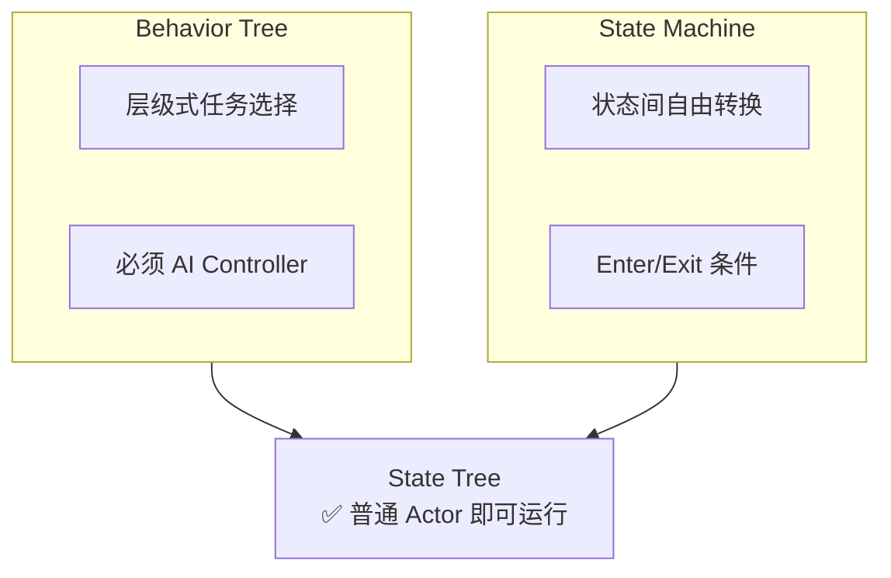
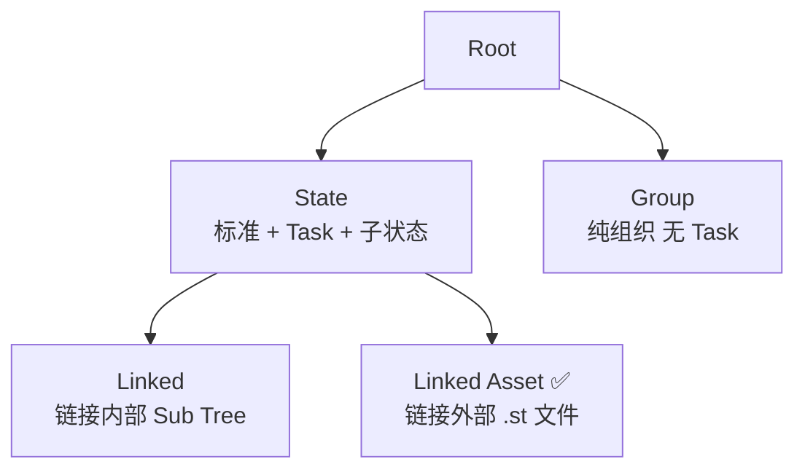
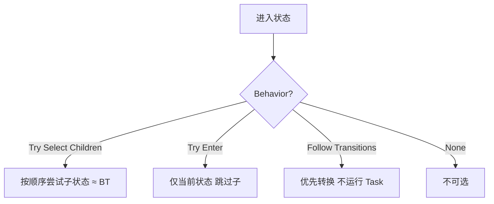
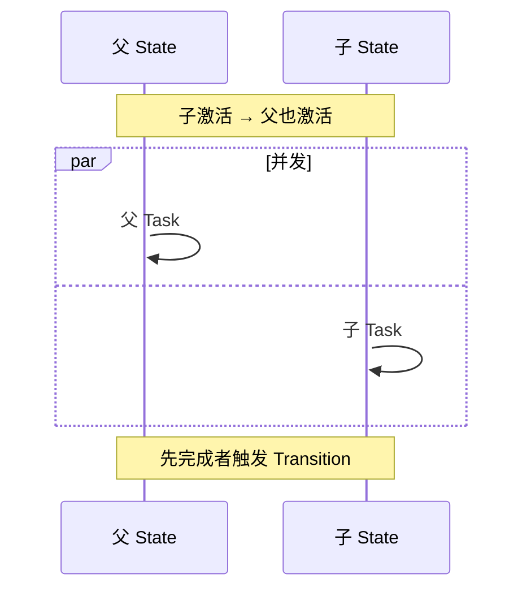
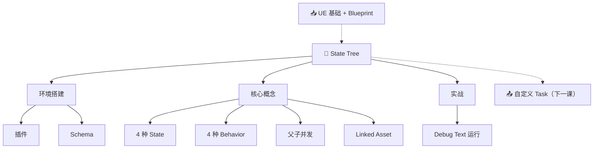

# Unreal Engine State Tree 完全入门 — 课程 #1

> 📺 来源：[YouTube TrmXseIPU3k](https://www.youtube.com/watch?v=TrmXseIPU3k) | 时长：~40 分钟 | 作者：LeafBranchGames | 系列：State Tree Course
>
> 💡 英文视频，已翻译为中英对照 | 点击 ▶ 图标可跳转到视频对应位置

> 📖 推荐阅读时长：15 分钟 | 难度：🌱 入门 | 可靠性：🟡 参考 
> 🏷️ #C++ #UnrealEngine #UE5 #AI #StateTree #入门

---

## 一、AI 摘要

State Tree 是 UE 中结合**行为树**和**状态机**优点的新 AI 框架——默认行为像行为树，同时支持状态机灵活转换。本课系统讲解：两种 Schema（StateTreeComponent 无需 AI Controller）、Parameters（⚠️ 运行时修改有 Bug）、四种状态类型、四种选择行为、父子并发机制、Linked Asset 模块化，最后动手搭建第一个运行中的 State Tree。

---

## 📋 操作流程总览

> 💡 教程模式 — 点击节点跳转到视频对应位置

---

## 二、核心概念

### 1. State Tree = Behavior Tree + State Machine

**图：融合概念**

### 2. 两种 Schema

| 特性 | StateTreeComponent | StateTreeAIComponent |
| --- | --- | --- |
| 运行对象 | Actor | AI Controller |
| 需 AI Controller | ❌ | ✅ |
| Context | Actor Class | Actor + Controller Class |

### 3. Parameters ⚠️

运行时设置在打包版本中可能崩溃（当前 Bug）。仅编辑器设初始值，运行时只读。

### 4. State 四种类型

**图：State 类型关系**

### 5. Selection Behavior

**图：四种选择行为**

### 6. 父子并发 + Linked Asset

Linked Asset：独立 .st 资产，多角色共享（如 Patrol.stt = 找点→走→等→循环）。

---

## 三、详细笔记

### [▶ 0:00](https://www.youtube.com/watch?v=TrmXseIPU3k&t=0) | 启用插件
> [EN] State trees are a combination of State machines and behavior trees.
> [CN] State Tree 是状态机和行为树的结合体。

- `Edit → Plugins` → 启用 `GameplayStateTree` + `StateTree` → 重启

### [▶ 3:00](https://www.youtube.com/watch?v=TrmXseIPU3k&t=180) | Schema
- StateTreeComponent：运行在 Actor，**不需 AI Controller**（vs BT 最大优势）
- 可随时切换 Schema

### [▶ 6:00](https://www.youtube.com/watch?v=TrmXseIPU3k&t=360) | Context Variables
- 自动提供给 Task 的引用变量

### [▶ 9:00](https://www.youtube.com/watch?v=TrmXseIPU3k&t=540) | Parameters ⚠️
- 类似 Blackboard，打包版运行时修改可能崩溃

### [▶ 12:00](https://www.youtube.com/watch?v=TrmXseIPU3k&t=720) | State 类型
- State/Group/Linked/Linked Asset 四种

### [▶ 15:00](https://www.youtube.com/watch?v=TrmXseIPU3k&t=900) | Selection + 父子并发
- 默认 Try Select Children = BT 逻辑
- 父子 Task 并发，先完成者触发 Transition

### [▶ 18:00](https://www.youtube.com/watch?v=TrmXseIPU3k&t=1080) | Linked Asset
- 独立 .st 文件，模块化复用

### [▶ 22:00](https://www.youtube.com/watch?v=TrmXseIPU3k&t=1320) | 实战
1. 创建 StateTreeCharacter → 加 Component
2. 加子状态 + Debug Text("hello") → 运行看到 ✅

---

## 四、关键术语表

| 英文 | 中文 | 说明 |
| --- | --- | --- |
| State Tree | 状态树 | 融合 BT+SM 的 AI 框架 |
| Schema | 架构 | 定义上下文类型 |
| Parameter | 参数 | 只读配置（类似 Blackboard） |
| Linked Asset | 链接资产 | 引用外部 .st 文件 |
| Transition | 转换 | 状态间跳转条件 |

---

## 五、总结与思考

| 场景 | 推荐 |
| --- | --- |
| 普通 Actor 需 AI | State Tree |
| 高度模块化 | Linked Asset |
| 团队熟 BT | 渐进迁移 |
| 打包需改参数 | 暂时避开 |

### 图：本课知识关系图

---

## 六、扩展学习资源

### 📖 官方文档
- [UE5 State Tree](https://docs.unrealengine.com/5.0/en-US/state-tree-in-unreal-engine/)

### 🎬 相关视频
- [LeafBranchGames 频道](https://www.youtube.com/@LeafBranchGames) — 后续课程

### 🐙 GitHub
- [EpicGames/UnrealEngine](https://github.com/EpicGames/UnrealEngine) — `Plugins/Runtime/StateTree`

---

> 📋 **文档元信息**
>
> | 项目 | 内容 |
> | --- | --- |
> | 文档版本 | v2.0 |
> | 生成时间 | 2026-05-31 |
> | 生成耗时 | 约 2 分钟 |
> | 生成模型 | DeepSeek V4 |
> | Token 消耗 | 约 28,000 tokens |
> | Skill 版本 | myriad-mind v2.0 |
> | 原始资源 | [YouTube TrmXseIPU3k](https://www.youtube.com/watch?v=TrmXseIPU3k) |
>
> ⚡ 本文档由 AI 基于视频字幕自动生成（英文→中文翻译），可能存在识别误差。建议结合原视频对照学习。
>
> ### 更新日志
>
> | 版本 | 日期 | 变更说明 |
> | --- | --- | --- |
> | v2.0 | 2026-05-31 | 基于 myriad-mind v2.0 从原始字幕重新生成，新增教程操作流程图、Mermaid 图表、知识关系图、扩展学习资源 |
> | v1.0 | 2026-05-22 | 初始生成（旧版 skill） |

> 🔧 **调试信息 / Debug Trace**
>
> | 步骤 | 工具 | 耗时 | Token | 说明 |
> | --- | --- | --- | --- | --- |
> | 输入识别 | 步骤 0 | ~2s | - | 识别为 YouTube 视频 TrmXseIPU3k（~40 分钟） |
> | 数据读取 | Bash (cat) | ~3s | 4,000 | 从缓存读取英文字幕 20KB |
> | 语言检测 | Claude | ~2s | 300 | 英文 → 启用中英对照翻译 |
> | 教程检测 | 步骤 7.4 | ~2s | 200 | 命中标题+内容 → 启用教程模式 |
> | 笔记生成 | Claude (Write) | ~70s | 18,000 | 生成结构化笔记（含翻译） |
> | 图表绘制 | Claude (Mermaid) | ~30s | 4,000 | 生成 7 张图表（含可点击教程流程图） |
> | 资源推荐 | Claude | ~10s | 1,500 | 推荐 3 条资源 |
> | 截图选择 | 步骤 7.1 | ~1s | - | 无缓存 → 跳过 |
> | 输出写入 | Write | ~2s | - | 写入 LearnStateTree.md |
> | **合计** | | **~2 分钟** | **~28,000** | |
>
> 决策链路：TrmXseIPU3k → 步骤0(YouTube) → 读缓存(英文) → 翻译+教程检测命中 → 生成笔记(7图/0截图/3资源/含教程流程图)
> 决策链路：TrmXseIPU3k → 步骤0 识别为YouTube → 读字幕缓存(英文) → 翻译 → 教程检测命中 → 生成操作流程图+笔记 → 写文件

> ⚡ 本文档由 AI 基于视频字幕自动生成（英文→中文翻译），可能存在识别误差。建议结合原视频对照学习。
