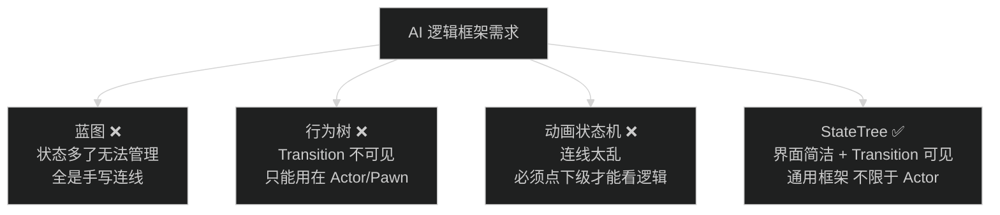
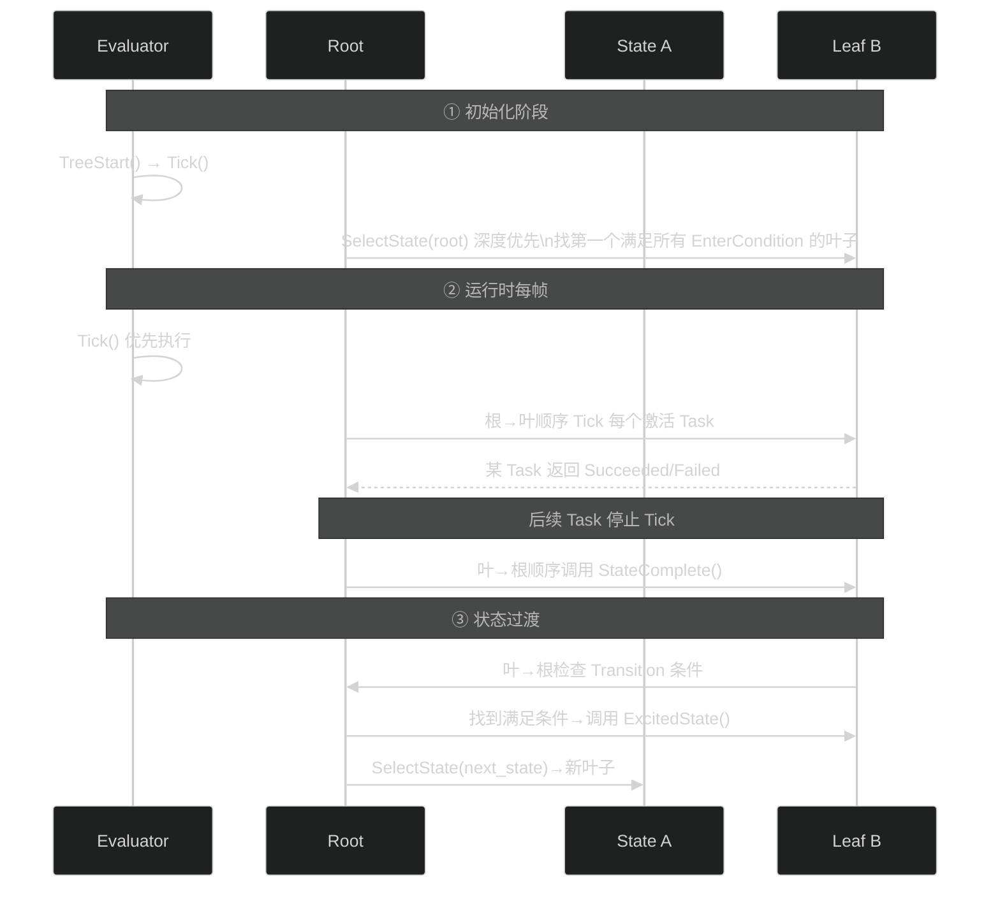
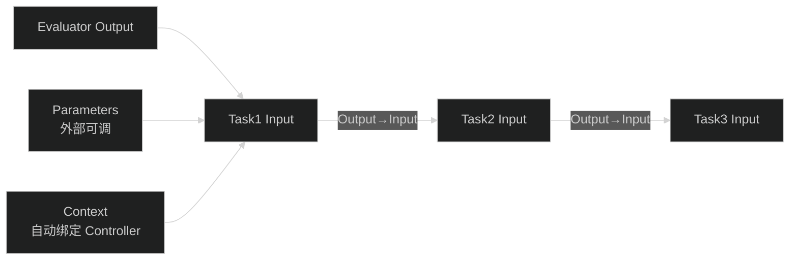
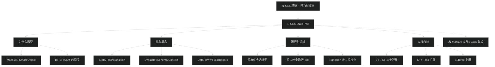

# UOD2022 — 从行为树到状态树：UE5 StateTree 深度解析

> 📺 来源：[Bilibili BV1ed4y1b7Zk](https://www.bilibili.com/video/BV1ed4y1b7Zk/) | 时长：~80 分钟 | 作者：虚幻引擎官方
>
> 🎤 演讲者：周澄清 (Epic Games 技术客户经理) | UOD 2022
>
> 💡 中文演讲 | 点击 ▶ 图标可跳转到视频对应位置

> 📖 推荐阅读时长：20 分钟 | 难度：🌿 进阶 | 可靠性：🟢 可信
> 🏷️ #C++ #UnrealEngine #UE5 #AI #StateTree #游戏AI

---

## 一、AI 摘要

Epic 技术客户经理周澄清在 UOD 2022 系统讲解 UE5 StateTree——一个融合决策树与状态机的通用 AI 框架。从"为什么不用蓝图/行为树/动画状态机"的痛点出发，深入 StateTree 核心概念（State/Task/Evaluator/Condition/Transition/Schema/Context）和运行时逻辑（深度优先选叶→根到叶全激活→顺序 Tick→完成通知→过渡跳转），最后以 Lyra 机器人为例完整演示从 Behavior Tree 到 StateTree 的移植全过程。演讲还覆盖 C++ Task 扩展、Subtree 复用、Blackboard vs DataFlow 对比、以及 StateTree 的未来路线图。

---

## 二、核心概念

### 1. 为什么需要 StateTree

**图：四种 AI 方案的不足**

核心痛点：Mass AI 的 Entity 不是 Actor，Smart Object 的交互逻辑不方便用 BT——需要一个新的通用状态机。

### 2. StateTree = 决策树 + 状态机

### 3. 核心概念总览

| 概念 | 说明 |
| --- | --- |
| **State** | 蓝色方块，含 Enter Condition / Transition / Task 列表 |
| **Task** | 当前状态下执行的具体逻辑（C++ 或蓝图） |
| **Evaluator** | 全局估值器（5.1 起），每帧优先 Tick，Output 供后续 Task 使用 |
| **Condition** | 进入条件或过渡条件，内置丰富类型 + 支持蓝图自定义 |
| **Transition** | 状态间跳转规则：Succeeded/Failed/Complete/Ticked |
| **Schema** | 决定可用 Task/Condition/Evaluator 的范围 |
| **Context** | 自动绑定的外部参数（Controller/Pawn/WorldSubsystem） |
| **Parameters** | 暴露给 Component 的可调参数（类似 Blackboard 但类型安全） |

### 4. 运行时逻辑（最重要的部分）

**关键规则：**
- 只有叶子节点能成为激活状态
- 叶子→根路径上**所有节点**都处于激活（它们的 Task 都会被 Tick）
- Task 按从左到右顺序执行，某个返回完成→后续不再 Tick
- StateComplete 因 Task 完成触发；ExcitedState 因 Transition 触发（可能不是 Task 完成导致）
- Transition 检查顺序：叶子→根

### 5. DataFlow vs Blackboard

**图：StateTree 参数传递**

**对比 Blackboard：**
- Blackboard：所有变量塞一起，谁改谁读不清晰→容易出错
- StateTree DataFlow：每个 Task 只接收它需要的参数，Task→Task 默认 Copy 传递（避免意外修改），大对象支持传引用

---

## 三、详细笔记（按时间顺序）

### [▶ 0:00](https://www.bilibili.com/video/BV1ed4y1b7Zk/?t=0) - 15:00 | 开场 + 为什么用 StateTree

- 演讲基于 UE 5.1 Preview 2
- **四种方案逐一批判**：
  - 蓝图：强大但状态多了完全无法管理（全是手写连线）
  - 行为树：界面清爽但 Transition 不可见，且只能运行在 Actor/Pawn 上
  - 动画状态机：Transition 清楚但线太乱，必须点进下级才能看逻辑
  - StateTree：界面简洁 + Transition 直接可见 + 通用框架

### [▶ 15:00](https://www.bilibili.com/video/BV1ed4y1b7Zk/?t=900) - 30:00 | 核心概念详解

- **State**：每个蓝色方块 = 一个状态，含 Enter Condition + Transition + Task 列表
- **Evaluator**：5.1 起改为 Global（不再 per-node），每帧最先 Tick
- **Schema**：决定可用 Task/Condition 范围（Mass Schema vs Component Schema）
- **Context**：自动绑定外部参数（Controller/Pawn/WorldSubsystem）
- **Parameters**：暴露给 Component 的可调参数

### [▶ 30:00](https://www.bilibili.com/video/BV1ed4y1b7Zk/?t=1800) - 45:00 | 运行时逻辑（核心）

- 初始化：Evaluator.TreeStart() → Tick() → SelectState(root) 深度优先找叶子
- 每帧：Evaluator.Tick() → 根→叶顺序 Tick Task → 某 Task 完成 → StateComplete() → Transition 检查 → ExcitedState() → SelectState(next)
- Transition 检查顺序：叶→根（先查叶子自己的，再查父级）
- StateComplete vs ExcitedState：前者因 Task 完成触发，后者因 Transition 触发

### [▶ 45:00](https://www.bilibili.com/video/BV1ed4y1b7Zk/?t=2700) - 65:00 | Lyra 实战演示

**从 Behavior Tree 迁移到 StateTree 的三步走：**

1. **创建 StateTree** → 选 Schema → 加 Debug Task 验证运行
2. **移植 Task/Condition**：
   - Evaluator：替代全局 Service（如"是否有子弹"每帧检测）
   - Condition：内置类型 + 蓝图自定义（继承 `StateTreeConditionBlueprintBase`）
   - Task：一次性（继承 `StateTreeTaskBlueprintBase`，重载 Enter/Tick/StateComplete/ExcitedState）
   - 重复性 Task：继承自定义 Service 基类，按 Interval 定时调用
3. **搭建逻辑 + 简化**：
   - 初始按 BT 节点一对一搬 → 然后合并冗余节点
   - Subtree 复用公共逻辑（类似于函数）

**C++ Task 扩展：** `InstanceData` = 每个 Bot 独立数据，Property = 全局参数，`EnterState/Tick/StateComplete` 对应 BT 的 Abort/Finish

**Subtree**：通过 Parameter 区分不同入口的行为（如"有子弹时"搜索武器失败→找敌人，"没子弹时"→Idle）

### [▶ 65:00](https://www.bilibili.com/video/BV1ed4y1b7Zk/?t=3900) - 80:00 | 当前限制 + 未来计划

| 当前限制 | 说明 |
| --- | --- |
| 内置 Task 少 | Component Schema 下只有 Debug Text + Delay |
| 不支持 Replication | 需自己通过 RPC 保证参数同步 |
| 性能待优化 | 内存和运行性能仍在改进中 |

- BT **不会**被废弃，短期内 ST 主攻 Mass AI / Smart Object / Gameplay Interaction
- BT 仍可放心继续使用

---

## 四、关键术语表

| 英文 | 中文 | 说明 |
| --- | --- | --- |
| StateTree | 状态树 | UE5 通用树形状态机框架 |
| Evaluator | 估值器 | 全局优先执行的检测逻辑 |
| Transition | 过渡 | 状态间跳转条件 |
| Schema | 架构 | 限制可用 Task/Condition 的范围 |
| Context | 上下文 | 自动绑定的外部参数 |
| DataFlow | 数据流 | Task 间参数传递机制（替代 Blackboard） |
| ExcitedState | 退出状态回调 | Transition 触发时调用 |
| StateComplete | 状态完成回调 | Task 完成时调用 |
| Subtree | 子树 | StateTree 函数复用机制 |

---

## 五、总结与思考

### StateTree 适用场景决策

| 场景 | 推荐 |
| --- | --- |
| Mass AI（Entity 非 Actor） | StateTree |
| Smart Object 交互 | StateTree |
| 传统 Pawn/Character AI | Behavior Tree（成熟稳定） |
| 复杂动画逻辑 | 动画状态机 |
| 新项目 AI 选型 | StateTree（未来方向，但当前内置 Task 少需自建） |

### 图：本课知识关系图

---

## 六、扩展学习资源

### 📖 官方资源
- [UE5 StateTree 文档](https://docs.unrealengine.com/5.0/en-US/state-tree-in-unreal-engine/)
- [City Sample (UE5)](https://docs.unrealengine.com/5.0/en-US/city-sample-in-unreal-engine/) — Mass AI + Smart Object 参考
- [Lyra Starter Game](https://docs.unrealengine.com/5.0/en-US/lyra-sample-game-in-unreal-engine/) — 本演讲 Demo 基础

### 🎬 相关视频
- [LeafBranchGames State Tree 系列](https://www.youtube.com/@LeafBranchGames) — 社区教程（与本文互补）
- [Epic 官方 UOD 录像](https://www.unrealengine.com/zh-CN/events/unreal-open-day-2022) — UOD 2022 其他演讲

### 🐙 GitHub
- [EpicGames/UnrealEngine](https://github.com/EpicGames/UnrealEngine) — `Plugins/Runtime/StateTree` 源码 + Mass AI Task 示例

---

> 📋 **文档元信息**
>
> | 项目 | 内容 |
> | --- | --- |
> | 文档版本 | v1.0 |
> | 生成时间 | 2026-05-31 |
> | 生成耗时 | 约 19 分钟（含 80 分钟 ASR 转写） |
> | 生成模型 | DeepSeek V4 |
> | Token 消耗 | 约 72,000 tokens |
> | Skill 版本 | myriad-mind v2.0 |
> | 原始资源 | [Bilibili BV1ed4y1b7Zk](https://www.bilibili.com/video/BV1ed4y1b7Zk/) |
>
> ⚡ 本文档由 AI 基于视频 ASR 转写自动生成，可能存在识别误差。建议结合原视频对照学习。
>
> ### 更新日志
>
> | 版本 | 日期 | 变更说明 |
> | --- | --- | --- |
> | v1.0 | 2026-05-31 | 基于 myriad-mind v2.0 从原始视频生成 |

> 🔧 **调试信息 / Debug Trace**
>
> | 步骤 | 工具 | 耗时 | Token | 说明 |
> | --- | --- | --- | --- | --- |
> | 输入识别 | 步骤 0 | ~2s | - | B站视频 BV1ed4y1b7Zk（80 分钟，中文） |
> | 视频下载 | yt-dlp | ~120s | - | 183MB |
> | 音频提取 | ffmpeg | ~30s | - | 105MB MP3 |
> | ASR 转写 | faster-whisper | ~900s | - | CUDA/small/zh，1999 段 |
> | 笔记生成 | Claude (Write) | ~90s | 55,000 | 完整结构化笔记 |
> | 图表绘制 | Claude (Mermaid) | ~25s | 3,000 | 4 张图表 |
> | 输出写入 | Write | ~2s | - | LearnStateTreeUOD.md |
> | **合计** | | **~20 分钟** | **~60,000** | |
>
> 决策链路：BV1ed4y1b7Zk → 步骤0(B站) → yt-dlp下载 → CUDA ASR(中文) → 生成笔记(4图/4资源) → 写文件
