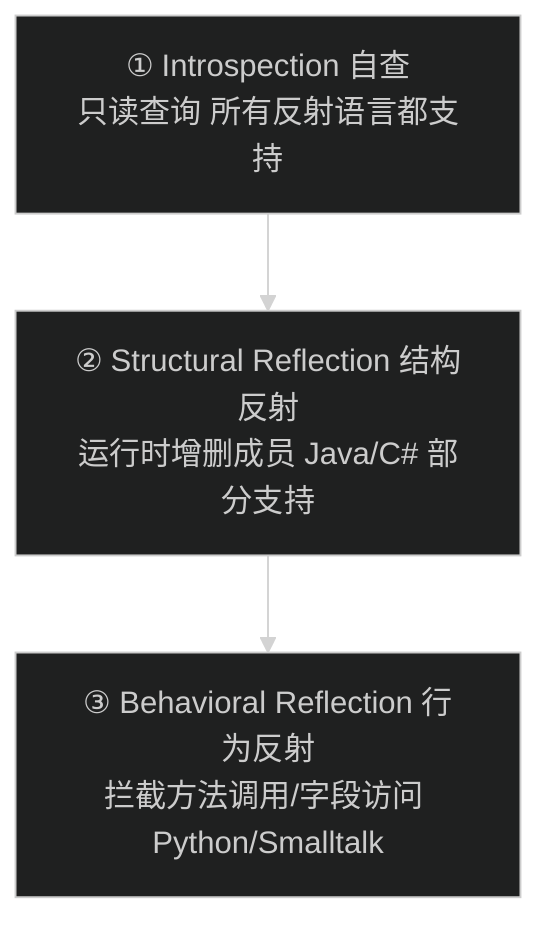
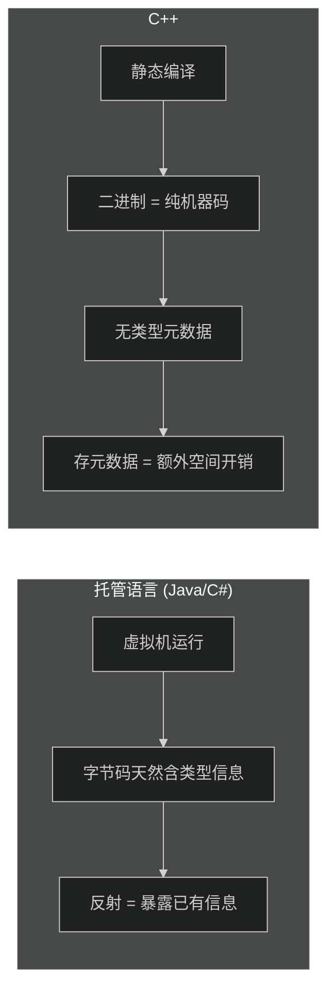
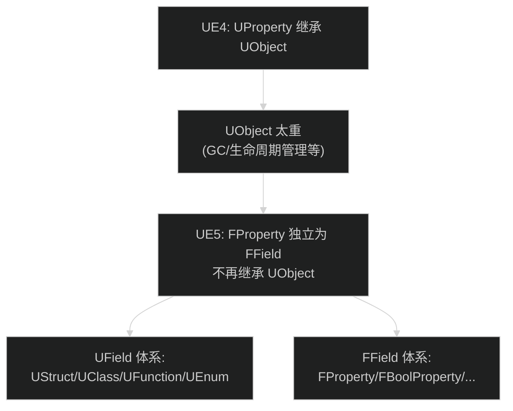
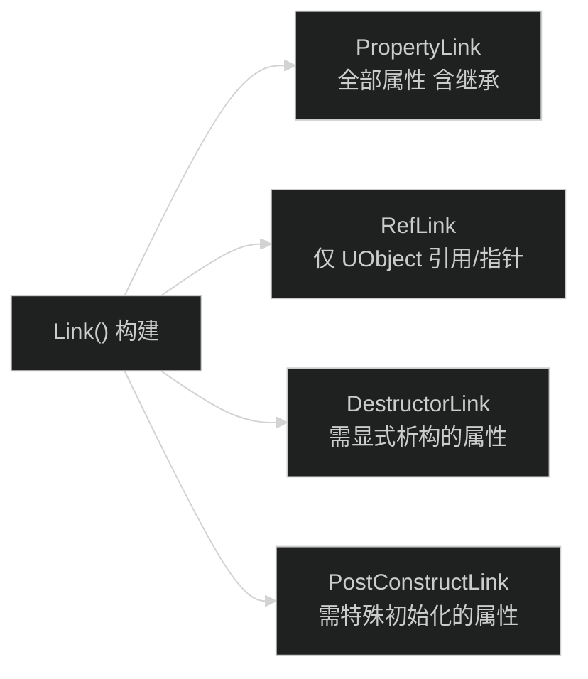
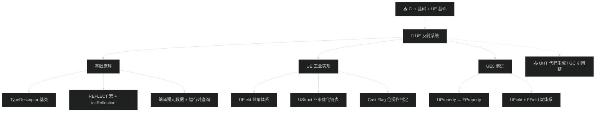

# UE 反射系统（Unreal Property System & UHT）— 从原理到源码

> 📺 来源：[知乎专栏](https://zhuanlan.zhihu.com/p/2038374299053068979) | 作者：Rendererer | 14 人赞同
>
> 💡 文章模式（本地 HTML 提取） | 无时间戳 | 按段落结构组织

> 📖 推荐阅读时长：18 分钟 | 难度：🌳 深入 | 可靠性：🟢 可信
> 🏷️ #C++ #UnrealEngine #UE5 #反射 #源码分析 #UHT

---

## 一、AI 摘要

本文从反射的基本概念出发，先展示一套最简 C++ 反射实现（TypeDescriptor + REFLECT 宏），再深入 UE 的工业级方案——Unreal Property System 核心数据结构（UField/UStruct 继承体系、UE5 的 UProperty→FProperty 迁移、优化链表设计）。

核心内容：反射三级（自查/结构/行为）→ C++ 零开销原则 → 基础实现模型 → UE UField 继承树 → UStruct 四条优化链表（PropertyLink/RefLink/DestructorLink/PostConstructLink）→ 蓝图字节码存储 → 类型判定与属性查找。

---

## 二、核心概念

### 1. 反射的三个层次



游戏引擎需求：Editor 动态调整属性、查询类是否含某属性、序列化/网络同步——至少需要第 1 层。

### 2. C++ 为什么不原生支持反射

**图：C++ 零开销原则 vs 托管语言**



- C++26 已支持静态反射
- RTTI（`typeid`）只提供极有限信息，不足以做完整反射

### 3. 基础实现模型 → UE 的对应

| 基础模型 | UE 实现 |
| --- | --- |
| `TypeDescriptor` 基类 | `UField` (继承 `UObject`) |
| `TypeDescriptor_Struct` | `UStruct` → `UClass` / `UScriptStruct` |
| `REFLECT()` 宏注册 | `DECLARE_CASTED_CLASS_INTRINSIC_WITH_API` |
| `initReflection()` 函数 | `Link()` + `AddCppProperty()` |
| TypeDescriptor 指针链表 | `Children` + `ChildProperties` 链表 |

### 4. UE5 FProperty 迁移



### 5. UStruct 四条优化链表



| 链表 | 用途 | 场景 |
| --- | --- | --- |
| PropertyLink | 全属性遍历 | 通用反射遍历 |
| RefLink | 仅 UObject 引用 | GC 标记阶段（跳过 POD） |
| DestructorLink | 需显式析构 | 资源释放 |
| PostConstructLink | 特殊初始化 | 构造后处理 |

---

## 三、详细笔记

### 1. 基础反射实现

- **TypeDescriptor**：类型描述符基类，含 `name` + `size`，派生 `TypeDescriptor_Int` / `TypeDescriptor_String` / `TypeDescriptor_StdVector` / `TypeDescriptor_Struct`
- **REFLECT() 宏**：为结构体注入 `static reflect` + `static initReflection()`，展开后使用 `offsetof` + `TypeResolver` 注册每个成员
- **关键认知**：反射元数据在**编译期**即可确定（lookup-table），与反射的**运行时查询**不矛盾

### 2. UField — 反射体系的"基类"

```
UField : public UObject
  ├── Next (链表指针)
  ├── StaticClassCastFlags (静态类型标识)
  ├── GetOwnerStruct() / GetOwnerClass() (向外查找所属类)
  ├── AddCppProperty() (反射扩展)
  └── Serialize() (序列化)
```

**UE 的设计改良：**
- 侵入式链表 → 遍历所有成员
- 位操作 Cast Flag → 替代 RTTI 动态转换（O(1) 判断类型）
- 维护所属类接口 → "向外查找"（给定一个 Property 能找到它属于哪个 Class）

### 3. UStruct — 类的完整描述

**核心成员：**
- `SuperStruct` — 继承链
- `Children` / `ChildProperties` — 成员链表（UField 链 + FProperty 链）
- `PropertiesSize` / `MinAlignment` — 内存布局
- `PropertyLink` / `RefLink` / `DestructorLink` / `PostConstructLink` — 四条优化链表
- `Script` — 蓝图字节码（UFunction 实现）

**核心方法：**
- `Link()` — 构建四条优化链表
- `IsChildOf()` — 沿 SuperStruct 链向上查找
- `FindPropertyByName()` — 按名查找属性
- `InitializeStruct()` / `DestroyStruct()` — 实例构造/析构

### 4. UE5 关键变更

- **UProperty → FProperty**：独立出 UObject 继承链，轻量化（不需要 GC/生命周期管理）
- **两条继承树并存**：UField 体系（UStruct/UClass/UFunction）+ FField 体系（FProperty 及其子类）

---

## 四、关键术语表

| 英文 | 中文 | 说明 |
| --- | --- | --- |
| Reflection | 反射 | 程序检查/修改自身结构的能力 |
| Introspection | 自查 | 反射最基础层次：只读查询 |
| TypeDescriptor | 类型描述符 | 反射系统的核心数据结构 |
| UField | UE 字段基类 | UE 反射体系的根基 |
| UStruct | UE 结构体类 | 描述类/结构体的元数据 |
| FProperty | UE5 属性类 | 从 UObject 独立出的轻量属性描述 |
| PropertyLink | 全属性链表 | 含继承的所有属性 |
| RefLink | 引用属性链表 | 仅 UObject 引用，用于 GC 优化 |
| RTTI | 运行时类型信息 | C++ 原生有限的反射支持 |
| Cast Flag | 类型转换标识 | 位操作替代 RTTI 动态转换 |

---

## 五、总结与思考

1. **反射 = 编译期元数据 + 运行时查询**：编译期用宏/代码生成收集信息，运行时通过 UField/UStruct 体系访问
2. **UE 的工业优化**：四条优化链表是 UE 区别于玩具实现的精髓——不同场景走不同链表，避免遍历无关属性
3. **UE5 架构演进**：UProperty→FProperty 体现了"不为用不到的功能付出开销"的 C++ 哲学
4. **与 BV1bH4y1k7Wg 视频互补**：那篇讲 UClass 的编译→运行时流程，这篇讲数据结构的静态设计

### 图：本课知识关系图



---

## 六、扩展学习资源

### 📖 官方文档
- [UE5 Reflection System](https://docs.unrealengine.com/5.0/en-US/reflection-system-in-unreal-engine/)

### 📝 文章/知乎
- [A Flexible Reflection System in C++](https://preshing.com/20180116/a-flexible-reflection-system-in-cpp/) — 本文参考的基础实现
- [潘方大高：UE 类型系统系列](https://zhuanlan.zhihu.com/p/XXX) — UE4 反射深度系列（十余篇）

### 🐙 GitHub
- [EpicGames/UnrealEngine](https://github.com/EpicGames/UnrealEngine) — `CoreUObject` 模块源码

### 📚 延伸阅读
- [C++26 静态反射提案](https://www.open-std.org/jtc1/sc22/wg21/docs/papers/2024/p2996r5.html) — C++ 标准委员会反射提案

---

> 📋 **文档元信息**
>
> | 项目 | 内容 |
> | --- | --- |
> | 文档版本 | v1.0 |
> | 生成时间 | 2026-05-31 |
> | 生成耗时 | 约 2 分钟 |
> | 生成模型 | DeepSeek V4 |
> | Token 消耗 | 约 22,000 tokens |
> | Skill 版本 | myriad-mind v2.0 |
> | 原始资源 | [知乎专栏](https://zhuanlan.zhihu.com/p/2038374299053068979) |
>
> ⚡ 本文档由 AI 基于文章原文自动生成。文章来自知乎专栏，由用户手动下载为 HTML 后处理。
>
> ### 更新日志
>
> | 版本 | 日期 | 变更说明 |
> | --- | --- | --- |
> | v1.0 | 2026-05-31 | 基于 myriad-mind v2.0 从知乎文章生成（本地文件模式） |
