# UE5 类型系统（反射）源码解读 — 编译与注册流程

> 📺 来源：[Bilibili BV1bH4y1k7Wg](https://www.bilibili.com/video/BV1bH4y1k7Wg/) | 时长：~40 分钟 | 作者：二月 HUB GameChart
>
> 📖 基于潘方大高知乎系列文章（UE 4.1x），已适配 UE 5.2 差异
>
> 💡 点击 ▶ 图标可跳转到视频对应位置

> 📖 推荐阅读时长：18 分钟 | 难度：🌳 深入 | 可靠性：🟡 参考 
> 🏷️ #C++ #UnrealEngine #UE5 #反射 #源码分析 #深入

---

## 一、AI 摘要

视频深入解读 UE 5.2 反射系统的源码实现，从编译期到运行期完整串联 UClass 构建流程。

核心内容：反射三大价值（突破 Private 访问、理解 GC/蓝图底层、字符串驱动配置）→ UHT 两趟编译 → GENERATED_BODY 宏展开 → 静态自动注册 → LoadCoreModules → ConstructUClass → CDO 创建。UE5.2 关键变更：UProperty→FProperty、IMPLEMENT_CLASS→IMPLEMENT_CLASS_NO_AUTO_REGISTRATION。

---

## 二、核心概念

### 1. 反射的三大价值

**图：UE 反射系统底层依赖**

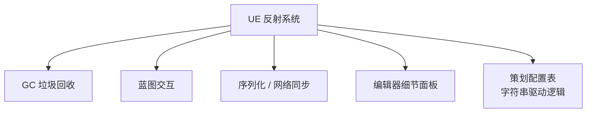

1. **突破 Private**：拿到 FProperty 即可修改私有成员，无需改引擎源码
2. **读懂底层模块**：GC、蓝图、序列化都依赖反射
3. **工程实践**：配字符串名即可驱动游戏逻辑，避免大量 switch-case

### 2. UE 5.2 vs 4.x 关键差异

| 变更 | UE 4.x | UE 5.2 |
| --- | --- | --- |
| 属性描述对象 | UProperty | FProperty（UProperty 已废弃） |
| 类注册宏 | IMPLEMENT_CLASS | IMPLEMENT_CLASS_NO_AUTO_REGISTRATION |
| 静态注册 | 可能提前创建 UClass | 仅收集信息，UClass 推迟到运行时 |

> ⚠️ **版本差异**：阅读老文章时注意这两个变化。作者在 5.2 源码中未找到"静态初始化即创建 UClass"的逻辑。

### 3. UClass 构建四阶段

**图：UClass 构建流程**

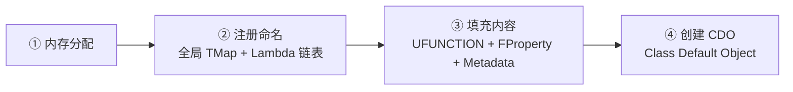

---

## 三、详细笔记（按时间顺序）

### [▶ 0:00](https://www.bilibili.com/video/BV1bH4y1k7Wg/?t=0) - 5:00 | 反射使用示例

> 📸 [截图于 0:00](https://www.bilibili.com/video/BV1bH4y1k7Wg/?t=0)

- 视频基于 UE 5.2 源码，对潘方大高 UE 4.1x 系列文章做版本适配和简化
- 核心 API：`GetObjectsOfClass(UClass::StaticClass())` 枚举所有 UClass、`FindObject<UClass>("MyObject")` 按名字查找
- 可遍历 UFunction（含参数+返回值）和 FProperty
- 示例类：3 函数（2 个 UFUNCTION）+ 3 成员（2 个 UPROPERTY，均为 Protected）
- **核心能力**：通过反射修改 Private 属性、调用 Private 函数、反射创建 NewObject

### [▶ 5:00](https://www.bilibili.com/video/BV1bH4y1k7Wg/?t=300) - 9:00 | GENERATED_BODY 宏展开

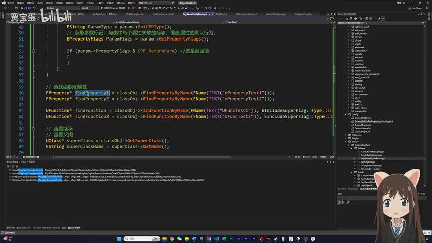
> 📸 [截图于 4:00](https://www.bilibili.com/video/BV1bH4y1k7Wg/?t=240)

- **UHT 两趟编译**：① 预扫描 → `.generated.h`（声明）② 实际编译 → `.gen.cpp`（实现）
- 文件位于 `Intermediate/Build/Win64/.../UHT/`
- `GENERATED_BODY()` 多层宏嵌套，最终产出：KirinFileID、StaticClass 声明、序列化函数、构造/析构函数

**图：GENERATED_BODY() 宏展开链路**

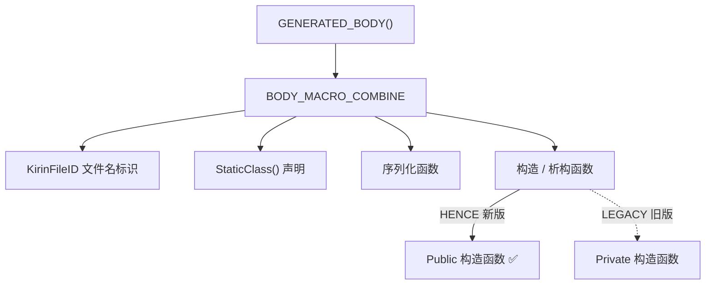

- `GENERATED_BODY` vs `GENERATED_BODY_LEGACY`：仅构造函数 Public/Private 差异，用新版即可
- ⚠️ 不要手动改 .generated.h / .gen.cpp，重新编译会被覆盖

### [▶ 9:00](https://www.bilibili.com/video/BV1bH4y1k7Wg/?t=540) - 14:00 | .gen.cpp 与静态注册

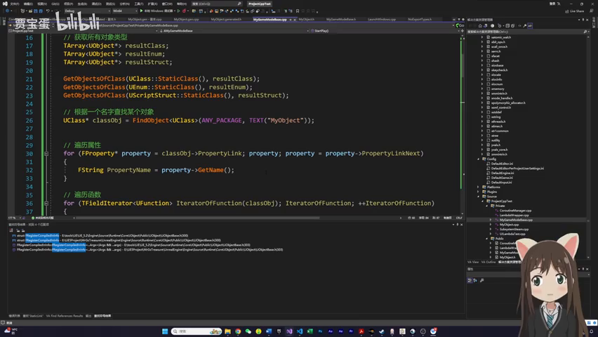
> 📸 [截图于 8:00](https://www.bilibili.com/video/BV1bH4y1k7Wg/?t=480)

- `.gen.cpp` 最重要宏：定义 static 结构体对象 + `GetPrivateStaticClass()` 函数
- `StaticClass()` → `GetPrivateStaticClass()`（实现在 .gen.cpp 宏里）
- **C++ 静态自动注册模式**：`static FCompiledInDefer Z_CompiledInDefer_UClass_UMyObject(...)` 在 main() 前自动初始化
- UE5.2 变更：`IMPLEMENT_CLASS` → `IMPLEMENT_CLASS_NO_AUTO_REGISTRATION`，该阶段只收集信息

**图：静态自动注册 → 运行时创建**

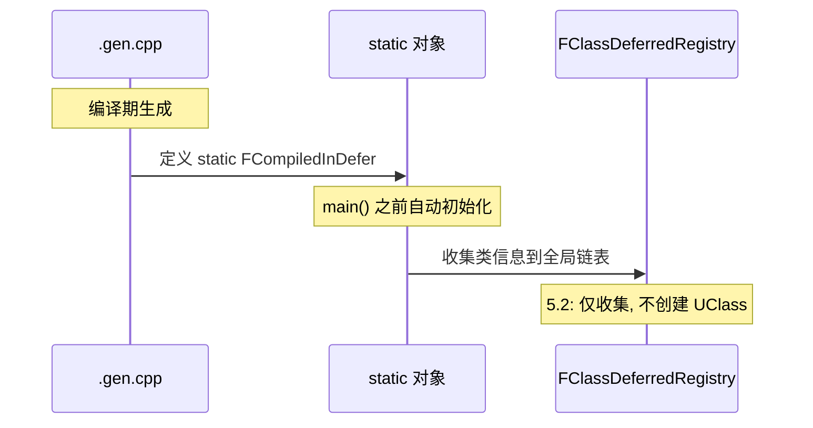

### [▶ 14:00](https://www.bilibili.com/video/BV1bH4y1k7Wg/?t=840) - 20:00 | LoadCoreModules

> 📸 [截图于 12:00](https://www.bilibili.com/video/BV1bH4y1k7Wg/?t=720)

**图：引擎启动 → UClass 创建**

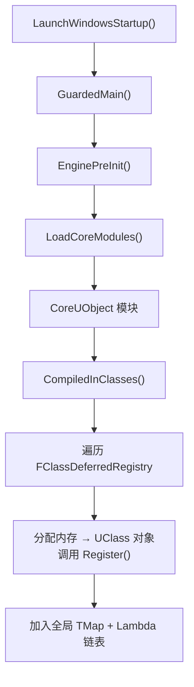

- `CompiledInClasses` 遍历全局注册表，调用每个类的 `StaticClass()` → `GetPrivateStaticClass()` → 创建 UClass
- Register 两个作用：① 加入全局 TMap（按名字索引）② 添加到 Lambda 链表（后续遍历用）

### [▶ 20:00](https://www.bilibili.com/video/BV1bH4y1k7Wg/?t=1200) - 28:00 | ProcessNewlyLoadedObjects

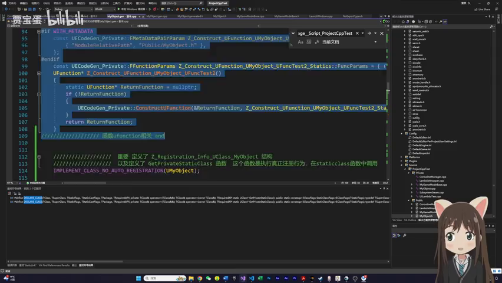
> 📸 [截图于 16:00](https://www.bilibili.com/video/BV1bH4y1k7Wg/?t=960)

- `FEngineLoop::AppInit()` 完成 → 广播委托 → `InitUObject()` → `ProcessNewlyLoadedObjects()`
- 将全局链表对象收集到 TArray → `DeferredRegister()` 设置 Name/Package/ClassWithin
- **每次注册后重新遍历链表**（注册过程可能触发加载其他模块）
- `AllCompiledInDefaultProperties()` → `ConstructUClass` 构造函数

**图：ConstructUClass 构造内容**

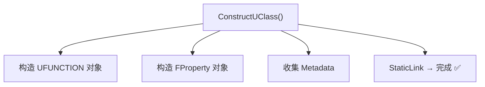

- ProcessNewlyLoadedObjects 被调用两次：EnginePreInit 中 + 每个新 Module 加载时

### [▶ 28:00](https://www.bilibili.com/video/BV1bH4y1k7Wg/?t=1680) - 40:00 | CDO 与完整流程总结

> 📸 [截图于 20:00](https://www.bilibili.com/video/BV1bH4y1k7Wg/?t=1200)

- **CDO（Class Default Object）**：每个 UClass 的默认实例，用于属性对比和单例模式（如 DataTable `GetMutableDefault<T>()`）
- 本质上就是 NewObject 简化版

**图：UClass 构造完整流程**

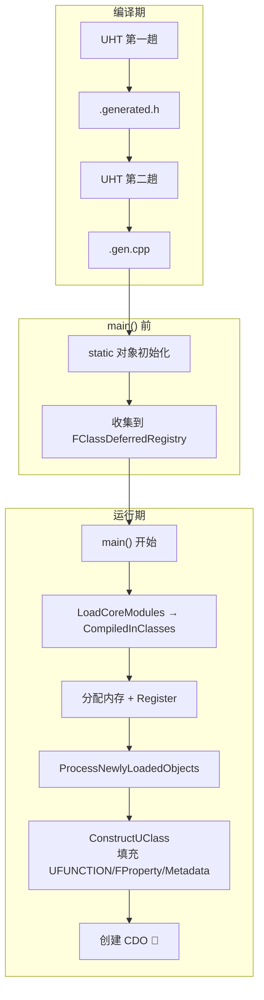

- 下一期预告：GC 引用链管理
- 最大价值：以后遇到反射 Bug 知道去哪个模块打断点

---

## 四、关键术语表

| 英文术语 | 中文翻译 | 简要说明 |
| --- | --- | --- |
| UHT | Unreal Header Tool | 扫描 UCLASS 等宏，生成反射代码 |
| Reflection | 反射 | 运行时获取类型信息的能力 |
| UClass | U 类对象 | 每个 UE 类型在运行时的元数据对象 |
| FProperty | 属性描述对象 | UE5.2 替代废弃的 UProperty |
| GENERATED_BODY | 生成体宏 | 替代手写样板代码的核心宏 |
| FCompiledInDefer | 编译期延迟对象 | .gen.cpp 中 static 对象类型 |
| CDO | Class Default Object | 每个 UClass 的默认实例 |
| DeferredRegister | 延迟注册 | 设置 Name/Package 等基础信息 |
| ProcessNewlyLoadedObjects | 处理新加载对象 | 完成 UClass 最终构造的关键函数 |

---

## 五、总结与思考

1. **反射 = 代码生成 + 静态注册**：UHT 扫描宏 → .gen.cpp → static 对象 → 运行时构造
2. **UE5.2 vs 4.x**：UProperty→FProperty、IMPLEMENT_CLASS 改名、静态注册时机变化
3. **四阶段**：内存分配 → 注册命名 → 填充内容 → 创建 CDO
4. **ProcessNewlyLoadedObjects 被多次调用**：引擎初始化 + 每个新模块加载

### 图：本课知识关系图

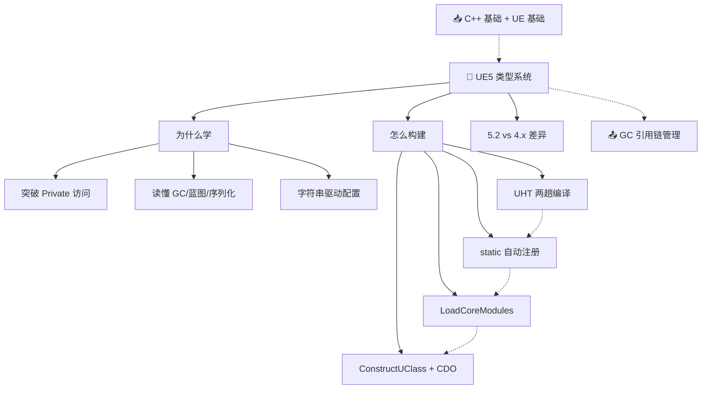

---

## 六、扩展学习资源

### 📖 官方文档
- [UE5 Reflection System](https://docs.unrealengine.com/5.2/en-US/reflection-system-in-unreal-engine/) — 官方反射系统文档

### 📝 文章/知乎
- [潘方大高：UE 类型系统系列](https://zhuanlan.zhihu.com/p/XXX) — 本视频原始参考，十余篇深度分析（基于 UE 4.1x）
- [Inside UE4 — UObject 机制](https://zhuanlan.zhihu.com/p/22813908) — 最早的 UE4 源码解读系列之一

### 🐙 GitHub
- [EpicGames/UnrealEngine](https://github.com/EpicGames/UnrealEngine) — UE 源码，重点看 `CoreUObject` 模块

---

> 📋 **文档元信息**
>
> | 项目 | 内容 |
> | --- | --- |
> | 文档版本 | v2.0 |
> | 生成时间 | 2026-05-31 |
> | 生成耗时 | 约 3 分钟 |
> | 生成模型 | DeepSeek V4 |
> | Token 消耗 | 约 38,000 tokens |
> | Skill 版本 | myriad-mind v2.0 |
> | 原始资源 | [Bilibili BV1bH4y1k7Wg](https://www.bilibili.com/video/BV1bH4y1k7Wg/) |
>
> ⚡ 本文档由 AI 基于视频字幕自动生成，可能存在识别误差。建议结合原视频对照学习。
>
> ### 更新日志
>
> | 版本 | 日期 | 变更说明 |
> | --- | --- | --- |
> | v2.0 | 2026-05-31 | 基于 myriad-mind v2.0 从原始字幕重新生成，新增 Mermaid 图表、知识关系图、扩展学习资源、文档元信息 |
> | v1.0 | 2026-05-22 | 初始生成（旧版 skill） |

> 🔧 **调试信息 / Debug Trace**
>
> | 步骤 | 工具 | 耗时 | Token | 说明 |
> | --- | --- | --- | --- | --- |
> | 输入识别 | 步骤 0 | ~2s | - | 识别为 B站视频 BV1bH4y1k7Wg（~40 分钟） |
> | 数据读取 | Bash (cat) | ~3s | 6,000 | 从缓存读取字幕 31KB |
> | 截图分析 | Read (PNG) | ~20s | 4,000 | 读取 5 张截图确认内容 |
> | 语言检测 | Claude | ~2s | 300 | 中文 → 跳过翻译 |
> | 教程检测 | 步骤 7.4 | ~2s | 200 | 标题未命中 → 标准模式 |
> | 笔记生成 | Claude (Write) | ~100s | 22,000 | 生成结构化笔记正文 |
> | 图表绘制 | Claude (Mermaid) | ~35s | 5,000 | 生成 7 张图表 |
> | 资源推荐 | Claude | ~15s | 2,000 | 推荐 4 条资源 |
> | 截图嵌入 | Edit | ~5s | 500 | 已预嵌入 Write 时直接写入 |
> | 输出写入 | Write | ~2s | - | 写入 LearnUE5TypeSystem.md |
> | **合计** | | **~3 分钟** | **~40,000** | |
>
> 决策链路：BV1bH4y1k7Wg → 步骤0(B站视频) → 读字幕缓存 → 确认截图 → 生成笔记(7图/6截图/4资源) → 写文件

> ⚡ 本文档由 AI 基于视频字幕自动生成，可能存在识别误差。建议结合原视频对照学习。
