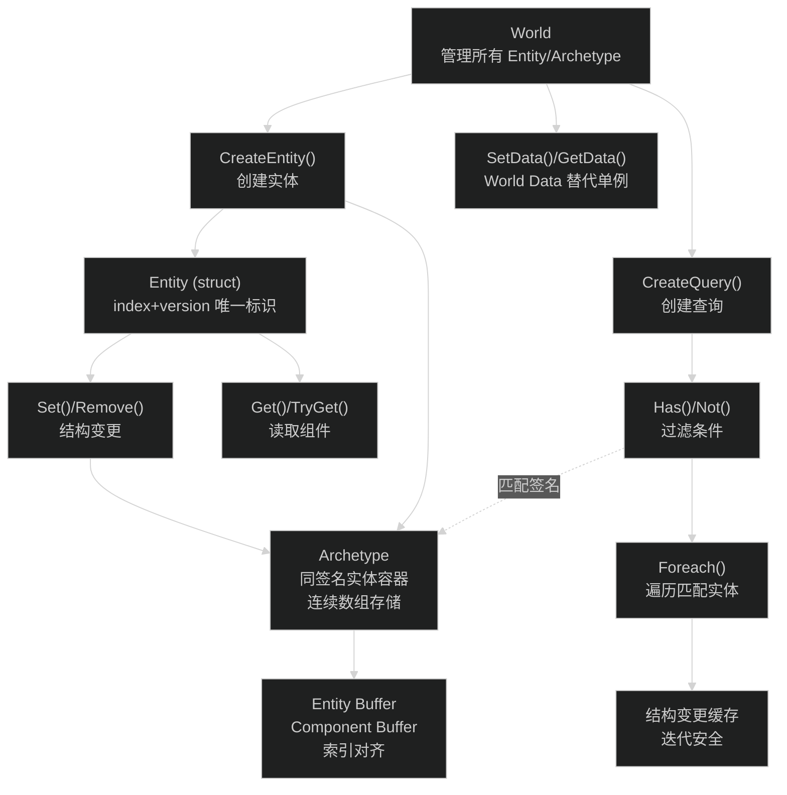
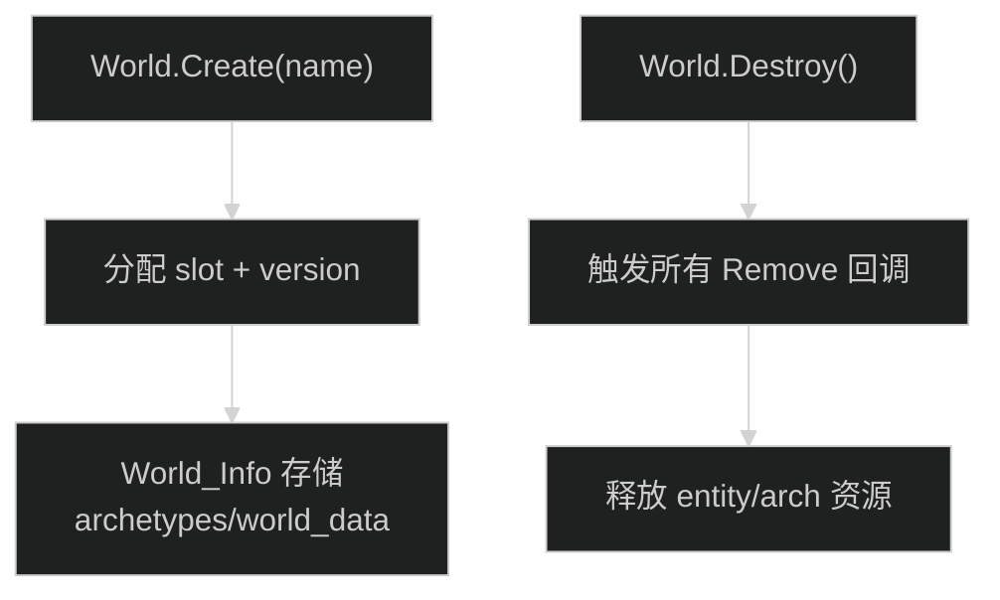
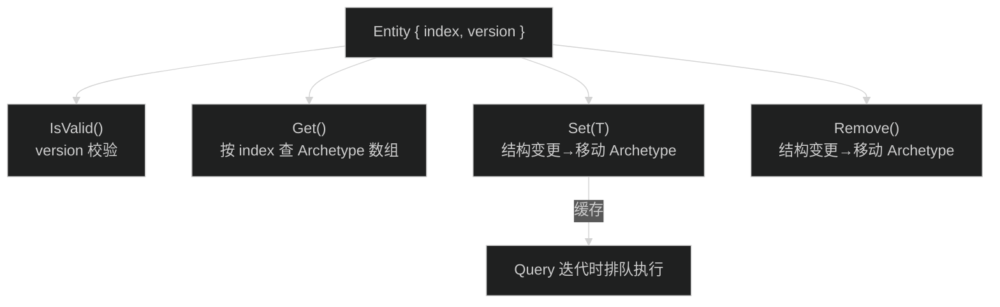
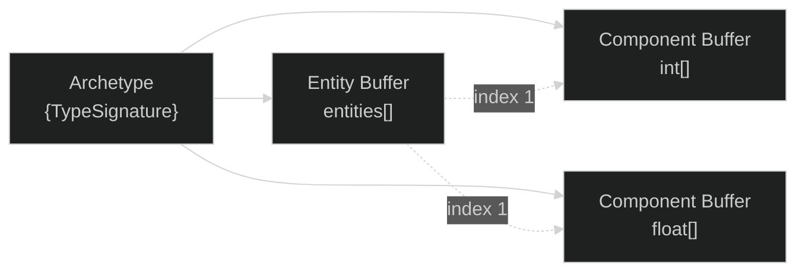
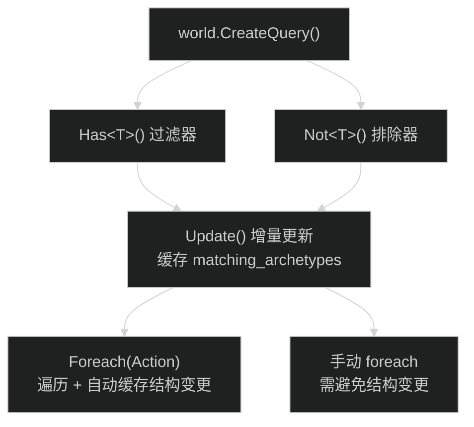
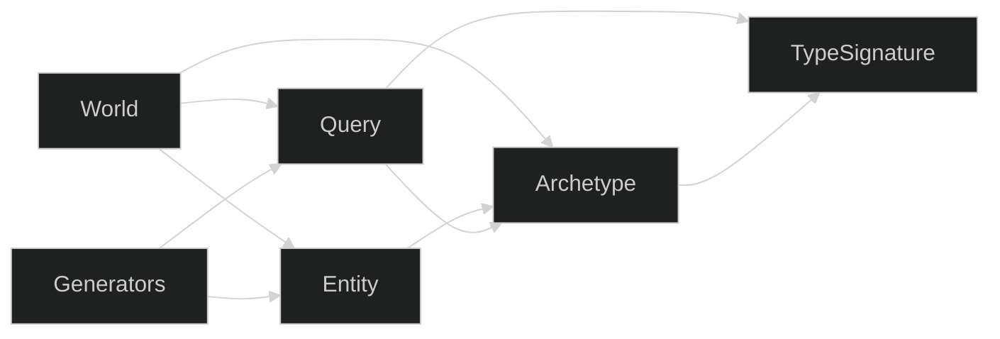

# SimpleECS — 代码分析报告

> 📂 原始资源：`D:/Project/Learn/SimpleECS`
>
> 🔮 灵力消耗：约 18,000 tokens
>
> ⚠️ 本报告由 AI 基于代码阅读生成，可能存在理解偏差。建议搭配源码阅读使用。

## 一、项目概览

**这个项目是干什么的？** SimpleECS 是一个轻量级 C# Entity Component System 框架。对标 Unity DOTS / Bevy ECS 的设计理念（Archetype 存储 + 连续数组），但零依赖、零配置——不需要标记 Component、不需要代码生成器，直接 new World 就能用。

| 项目 | 内容 |
| --- | --- |
| 项目名 | SimpleECS |
| 语言/框架 | C# (.NET Framework 4.7+) |
| 构建工具 | 无（直接编译或拖入项目） |
| 代码规模 | 10 个 `.cs` 文件，约 2,500 行 |
| 许可证 | 未声明 |
| 状态 | ⚠️ 个人爱好项目，API 可能变动 |

---

## 二、核心架构

**图：SimpleECS 整体架构**



---

## 三、目录结构

```
SimpleECS/
├── World.cs              # 世界管理（创建/销毁/查询/回调）
├── Entity.cs             # 实体（Get/Set/Has/Remove/Transfer）
├── Archetype.cs          # 原型（连续数组存储+内存管理）
├── Query.cs              # 查询（Has/Not 过滤 + Foreach 迭代）
├── QueryForeachFunctions.cs  # 查询扩展（代码生成，支持 1-12 个组件参数）
├── Generators.cs         # 代码生成器（Foreach 重载生成）
├── EntityCreateFunctions.cs  # 实体创建扩展（支持 1-32 个初始化组件）
├── TypeSignature.cs      # 类型签名（Archetype 匹配键）
├── Test.cs               # 测试代码
└── LICENSE / README.md
```

---

## 四、核心模块详解

### 模块 A：World（世界管理器）

**职责**：管理全局状态，创建/销毁 Entity 和 Query，提供组件回调注册。



**关键设计：**
- World 是 `struct`（index + version 组成唯一 ID），不是 class
- 全局静态 `World_Info.All[]` 管理所有 World 实例
- `version` 机制防止 use-after-free：销毁后 version++，旧引用自动失效
- `CreateEntity()` 默认创建空实体，`CreateEntity(a,b,c)` 重载（Generator 生成）支持最多 32 个初始化组件

### 模块 B：Entity（实体）

**职责**：轻量级 ID（index + version），提供 CRUD 操作。



**关键设计：**
- `struct` 避免 GC 压力（栈分配）
- `Get<T>()` 返回 `ref Component`，可直接修改值类型无需额外 Set
- 结构变更（Set/Remove/Destroy）在 Query 迭代时自动缓存，迭代完成后批量执行
- `entity.Has<T>()` 和 `entity.TryGet()` 提供安全查询

### 模块 C：Archetype（原型存储）

**职责**：按组件类型签名分组存储 Entity 和 Component 数据。



**关键设计：**
- 连续数组存储（SoA 结构），CPU Cache 友好
- 每个 Component 类型一个独立数组，Entity 按 index 对应
- 基于 TypeID 的哈希查找（`type_id % buffer_length`），冲突用链表解决
- `CreateEntity()` 从 Archetype 创建是最快速的方式（绕过逐个 Set）
- 数组容量以 2 的幂次增长（8→16→32→...）

### 模块 D：Query（查询系统）

**职责**：按 Has/Not 条件过滤 Archetype，批量操作匹配的 Entity。



**关键设计：**
- 缓存机制：只在 `archetype_structure_update_count` 变化时重新扫描
- `Foreach` 自动 +1 缓存计数器，迭代期间结构变更安全
- 支持最多 12 个 Foreach 组件参数（代码生成器产出）
- 还支持 World Data 的 `in` 参数（最多 4 个），替代传统 Singleton
- `DestroyMatching()` 一次性销毁匹配的 Archetype

---

## 五、依赖关系



World 是核心，所有模块都依赖它。Archetype 是数据层，Entity/Query 通过它访问数据。

---

## 六、关键入口与数据流

1. **启动**：`World.Create("name")` → 分配全局 slot → 创建 World_Info
2. **创建实体**：`world.CreateEntity(a, b, c)` → 构建 TypeSignature → 查找/创建 Archetype → 分配 Entity slot → 拷贝组件
3. **查询**：`world.CreateQuery().Has<T>().Foreach(action)` → Update 扫描 Archetype → 迭代匹配的 entity/component → 自动缓存结构变更
4. **销毁**：`world.Destroy()` → 触发所有 Remove 回调 → 释放 entity + archetype → version++ 防止悬空引用

---

## 七、代码阅读建议

**建议阅读顺序**：
1. `README.md` — 先理解 API 设计意图
2. `Entity.cs` — 最贴近用户的层，理解 ECS 操作
3. `Query.cs` — 查询系统，理解数据访问模式
4. `Archetype.cs` — 理解底层存储
5. `World.cs` — 全局管理逻辑
6. `Generators.cs` + `QueryForeachFunctions.cs` — 代码生成器，可跳过

**值得学习的模式**：
- **Index + Version 双 ID**：防止悬空引用，Unity DOTS 也是这个模式
- **结构变更缓存**：迭代安全的设计模式
- **TypeSignature 哈希表**：Archetype 快速查找
- **World Data**：用泛型字典替代 Singleton，比传统单例更灵活

**当前局限**：
- 无多线程支持（single-threaded）
- 无序列化/网络同步
- ⚠️ 个人项目，生产环境慎用

---

> 📋 **文档元信息**
>
> | 项目 | 内容 |
> | --- | --- |
> | 文档版本 | v1.0 |
> | 生成时间 | 2026-05-31 |
> | Skill 版本 | myriad-mind v2.0 |
> | 原始资源 | D:/Project/Learn/SimpleECS |
