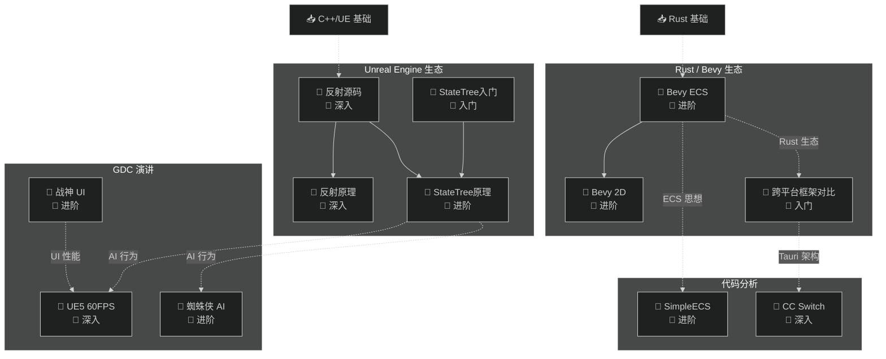
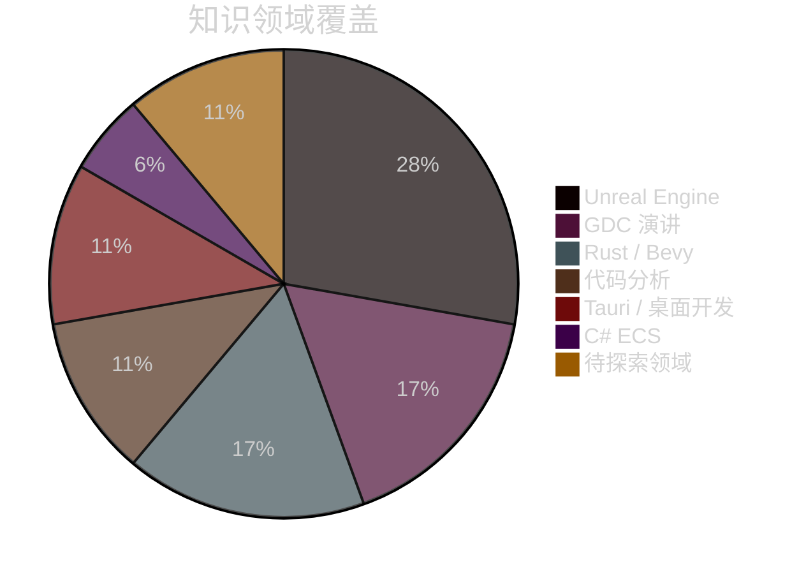
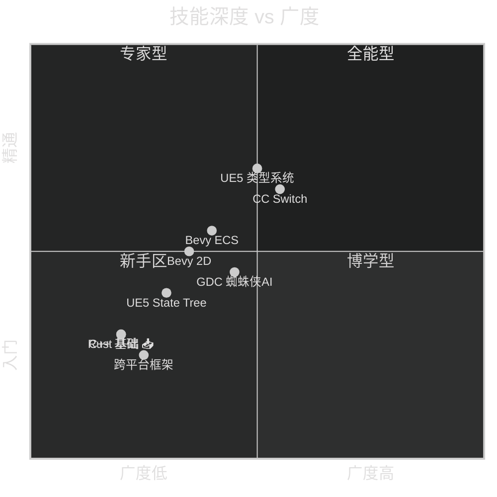
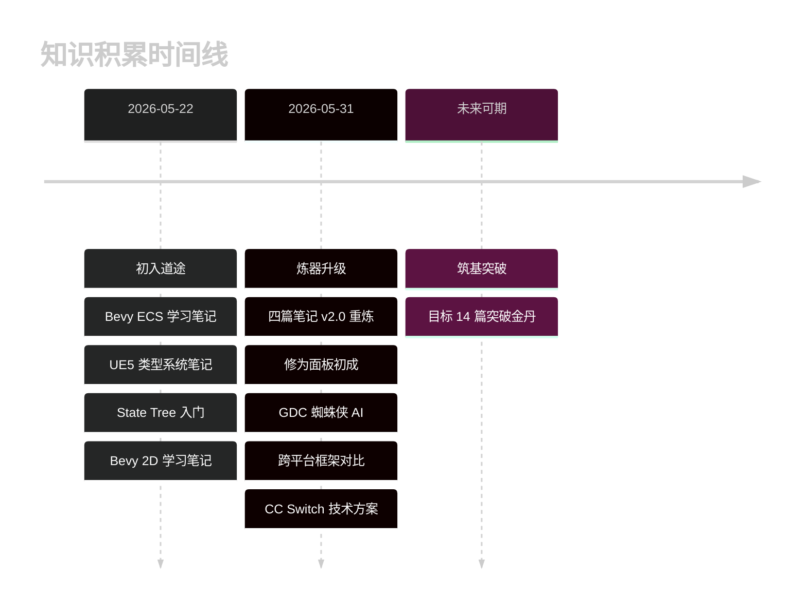

# 🗺️ 我的修为面板

> 📅 生成时间：2026-05-31 | 📊 共收录 12 篇学习笔记 | 🕐 累计学习约 10.0 小时

## ⚡ 修炼等级 / Cultivation Level

**当前境界：筑基期** — 进度 86% 到金丹期

```
▰▰▰▰▰▰▰▰▰▰▰▰▰▰▰▰▰▰▰▰▰▱▱▱ 86% 筑基 → 金丹
```

| 境界 | 要求 | 进度 | 状态 |
| --- | --- | --- | --- |
| 🔹 炼气期 | 1-4 篇笔记 | 12/4 | ✅ 已突破 |
| 🔹 筑基期 | 5-14 篇，≥2 个技术栈 | 12/14 | 🔓 当前境界 |
| 🔹 金丹期 | 15-29 篇，≥3 个技术栈，≥1 篇深入 | 12/29 | 🔒 |
| 🔹 元婴期 | 30-49 篇，≥4 个技术栈，≥3 篇深入 | 12/49 | 🔒 |
| 🔹 化神期 | 50-99 篇，≥5 个技术栈 | 12/99 | 🔒 |
| 🔹 大乘期 | 100+ 篇，全领域覆盖 | 12/100 | 🔒 |
| 🔹 渡劫飞升 | 贡献笔记到社区 | 0/1 | 🔒 |

> 修为值 = 12×10 + 6×5 + 4×10 + 6×8 + 10.0×2 = **258** → 筑基期
> 再写 2 篇即可突破至 🔹 金丹期！

## 🏷️ 标签云 / Tag Cloud

```
#C++(6) #UnrealEngine(5) #UE5(5) #进阶(4) #源码分析(3)
#深入(4) #Rust(4) #Bevy(2) #GDC(3) #跨平台(2) #Tauri(2)
#React(1) #TypeScript(1) #DesktopApp(1) #架构分析(1) #AI(2) #StateTree(2)
#反射(2) #2D(1) #ECS(2) #渲染(1) #性能优化(1) #UI(1) #UX(1) 
#游戏AI(2) #游戏UI(1) #3A游戏开发(1) #UHT(1) #入门(2) #行为树(1) 
#状态机(1) #战斗系统(1) #动画(1) #JavaScript(1) #Dart(1) #Electron(1) 
#Flutter(1) #C#(1) #代理服务器(1)
```

> 💡 标签数字 = 出现次数，字号越大积累越深

## 🏆 修炼成就 / Achievement

| 成就 | 进度 | 状态 |
| --- | --- | --- |
| 📝 初入道途 | 1/1 | ✅ 已达成 |
| 📚 博览群书 | 12/5 | ✅ 已达成 — 远超目标 |
| 🎯 专精一道 | 5/5 | ✅ 已达成 — UE5 领域 5 篇 |
| 🌿 融会贯通 | 6/3 | ✅ 已达成 — Rust·Bevy / UE / GDC / C# / 代码分析 / Tauri桌面 |
| ⏰ 持之以恒 | 10.0/10 | ✅ 已达成 — 累计学习 10 小时 |
| 🔮 神识外放 | 0/1 | 🔒 未解锁 — 分享笔记到社区 |

## 知识全景

**图：个人知识地图（My Knowledge Map）**



## 学习统计

| 维度 | 数据 |
| --- | --- |
| 总笔记数 | 12 篇 |
| 总字数 | 约 130,000 字 |
| 涉及技术栈 | C++ · Unreal · Rust · Bevy · C# · Tauri · React · TypeScript |
| 难度分布 | 🌱 2 篇 / 🌿 6 篇 / 🌳 4 篇 |
| 视频总时长 | ~560 分钟（约 9.3 小时） |
| 篇章类型 | 🎬 视频笔记 8 / 📝 文章笔记 1 / 💻 代码分析 2 / 🎤 GDC 3 |

### 笔记详情

| # | 笔记 | 来源 | 时长/类型 | 字数 |
| --- | --- | --- | --- | --- |
| 1 | [Bevy ECS 全面学习](./Bevy学习笔记/LearnEcs.md) | B 站 | 55 分钟 | 13K |
| 2 | [Bevy Example 2D 全面学习](./Bevy学习笔记/Learn2D.md) | B 站 | 79 分钟 | 9K |
| 3 | [UE5 类型系统源码解读](./Unreal学习笔记/LearnUE5TypeSystem.md) | B 站 | 40 分钟 | 13K |
| 4 | [UE5 State Tree 完全入门](./Unreal学习笔记/LearnStateTree.md) | YouTube | 40 分钟 | 9K |
| 5 | [GDC26 UE5 60FPS 性能优化](./GDC/LearnUE5Perf60FPS.md) | B 站 | 60 分钟 | 16K |
| 6 | [GDC23 战神 UI 开发](./GDC/LearnGDC23GoWRagnarokUI.md) | B 站 | 63 分钟 | 13K |
| 7 | [UOD22 StateTree 深度解析](./Unreal学习笔记/LearnStateTreeUOD.md) | B 站 | 80 分钟 | 12K |
| 8 | [UE5 反射系统原理](./Unreal学习笔记/LearnUE5ReflectionSystem.md) | 知乎 | 文章 | 9K |
| 9 | [GDC18 漫威蜘蛛侠 AI 开发](./GDC/LearnGDC18SpiderManAI.md) | B 站 | 56 分钟 | 12K |
| 10 | [跨平台框架对比 (Tauri/Electron/Flutter)](./Rust/LearnCrossPlatformFrameworks.md) | B 站 | 4 分钟 | 3K |
| 11 | [SimpleECS 代码分析](./代码分析/SimpleECS-分析报告.md) | 本地 | 代码 | 8K |
| 12 | [CC Switch 技术方案分析](./代码项目分析/cc-switch-技术方案分析.md) | GitHub | 代码 | 14K |

## 📊 学习面板 / Dashboard

### 技术栈分布



### 技能深度矩阵



### 学习里程碑



| 月份 | 新增笔记 | 累计 | 进度条 |
| --- | --- | --- | --- |
| 5 月 | 12 篇 | 12 | `████████████████████████████████████ 100%` |
| 6 月 | — | — | `░░░░░░░░░░░░░░░░░░░░░░░░░░░░░░░░░░░░░░ 0%` |

> 📊 5 月爆发式修炼，12 篇笔记横跨 6 个技术栈——离金丹只差 2 篇！

## 建议学习路径

基于现有知识结构，推荐的下一步学习方向：

1. **CC Switch 源码深潜** — 已分析架构方案，可深入阅读 proxy/providers 模块源码，学习 Rust 中 HTTP 代理+协议转换的实战实现
2. **Tauri 2 实战开发** — 已了解 Tauri 架构（cc-switch + 跨平台对比），可以动手写一个 Tauri 小工具，实践 Commands/Events/State 机制
3. **Bevy 3D / 渲染进阶** — 已掌握 ECS + 2D 渲染，可以深入 3D 渲染管线、PBR 材质、光照系统
4. **Unreal Engine 蓝图与 Gameplay** — 类型系统和 State Tree 已打好基础，可进阶蓝图 VM、Gameplay Ability System

## 跨领域关联

- 💡 **ECS 架构思想**在 Bevy（纯 ECS）、UE5（Mass Entity / 组件概念）、SimpleECS（C# 轻量实现）中都有应用
- 💡 **渲染管线概念**在 Bevy 2D（六种坐标系）和 Unreal（Viewport/NDC/UV）中相通
- 💡 **状态管理**在 Bevy（Schedule/State Scoped）和 UE（State Tree）、GDC 蜘蛛侠（HFSM）中各有实现——不同引擎对同一问题的解法对比很有价值
- 💡 **反射/类型系统**是引擎底层基础设施——UE 的 UHT 代码生成 vs Rust 的宏编程，思想类似实现不同
- 💡 **Tauri 2 桌面框架**在 CC Switch（生产级应用）和跨平台对比（概念入门）中覆盖——从"了解是什么"到"看懂怎么用"

---

> 📋 文档元信息
>
> | 项目 | 内容 |
> | --- | --- |
> | 面板版本 | v2.1 |
> | 生成时间 | 2026-05-31 |
> | 生成模型 | DeepSeek V4 Pro |
> | Skill | myriad-mind v2.0 |

## 🔧 修炼统计 / Debug Stats

> 仅 `DEBUG_METADATA=true` 时生成，记录面板的每次演变

### 累计总览

| 指标 | 数值 |
| --- | --- |
| 💰 累计 Token 消耗 | ~265,000 |
| 🔄 面板更新次数 | 4 |
| 📅 首次创建 | 2026-05-31 |
| 📅 最近更新 | 2026-05-31 |

### 分功能 Token 消耗

| 功能模块 | 累计 Token | 占比 | 调用次数 | 说明 |
| --- | --- | --- | --- | --- |
| 📝 笔记生成 ×6 | ~220,000 | 83% | 6 | 从原始素材生成笔记 |
| 🗺️ 知识全景 | ~12,000 | 5% | 2 | 跨主题知识关系图 |
| 📊 仪表盘 | ~8,000 | 3% | 2 | 饼图 + 象限图 + 里程碑 |
| ⚡ 修炼等级 | ~6,000 | 2% | 2 | 等级计算 + 进度条 |
| 🏷️ 标签云 | ~5,000 | 2% | 2 | 标签提取 + 统计 |
| 🏆 成就系统 | ~5,000 | 2% | 2 | 6 项成就进度 |
| 🧭 学习路线 | ~4,000 | 1.5% | 2 | 建议生成 |
| **合计** | **~260,000** | **100%** | | |

### 会话记录

| # | 日期 | 变更内容 | Token |
| --- | --- | --- | --- |
| 4 | 2026-05-31 | 新增 CC Switch 代码分析 + 补齐 GDC蜘蛛侠AI/跨平台框架；笔记 9→12；持之以恒成就解锁 | ~15,000 |
| 3 | 2026-05-31 | 新增修炼等级+标签云；修复 xychart→timeline；全部 Mermaid 加 dark theme | ~8,000 |
| 2 | 2026-05-31 | 新增成就系统+仪表盘（饼图/象限图/里程碑）+学习建议 | ~12,000 |
| 1 | 2026-05-31 | 初始创建：知识全景+统计 + 4 篇笔记元信息 | ~10,000 |
