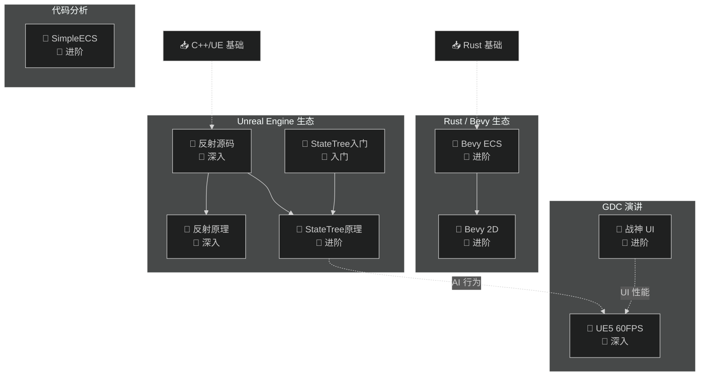
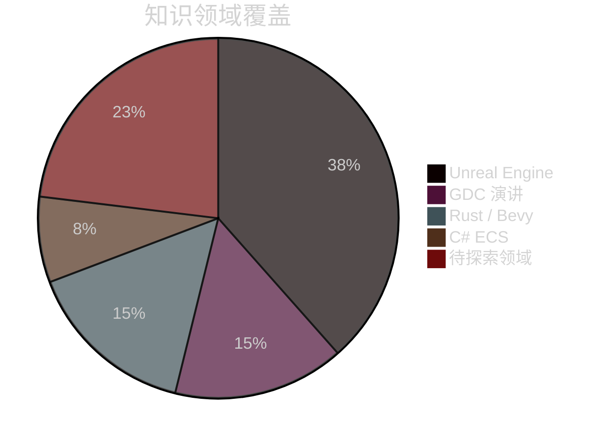
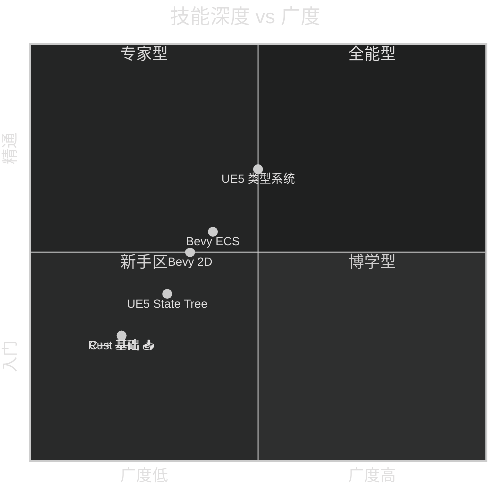
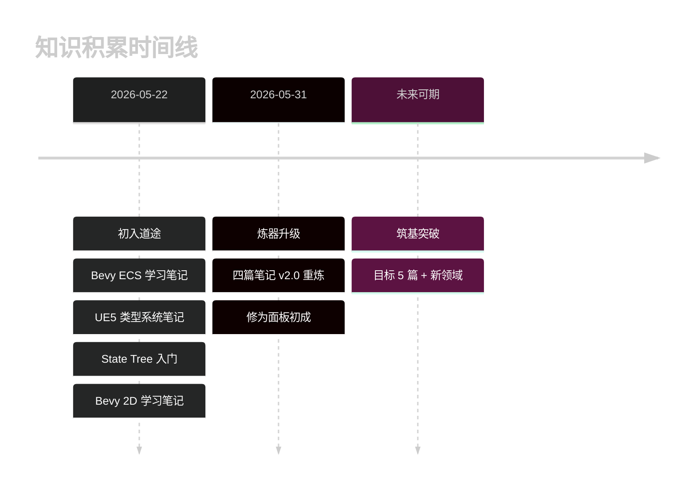

# 🗺️ 我的修为面板

> 📅 生成时间：2026-05-31 | 📊 共收录 9 篇学习笔记 | 🕐 累计学习约 8.3 小时

## ⚡ 修炼等级 / Cultivation Level

**当前境界：筑基期** — 进度 64% 到金丹期

```
▰▰▰▰▰▰▰▰▰▰▰▰▰▰▰▱▱▱▱▱▱▱▱ 64% 筑基 → 金丹
```

| 境界 | 要求 | 进度 | 状态 |
| --- | --- | --- | --- |
| 🔹 炼气期 | 1-4 篇笔记 | 9/4 | ✅ 已突破 |
| 🔹 筑基期 | 5-14 篇，≥2 个技术栈 | 9/14 | 🔓 当前境界 |
| 🔹 金丹期 | 15-29 篇，≥3 个技术栈，≥1 篇深入 | 9/29 | 🔒 |
| 🔹 元婴期 | 30-49 篇，≥4 个技术栈，≥3 篇深入 | 9/49 | 🔒 |
| 🔹 化神期 | 50-99 篇，≥5 个技术栈 | 9/99 | 🔒 |
| 🔹 大乘期 | 100+ 篇，全领域覆盖 | 9/100 | 🔒 |
| 🔹 渡劫飞升 | 贡献笔记到社区 | 0/1 | 🔒 |

> 修为值 = 9×10 + 5×5 + 3×10 + 5×8 + 8.3×2 = **202** → 筑基期 (81-140)
> 再写 5 篇即可突破至 🔹 金丹期！

## 🏷️ 标签云 / Tag Cloud

```
#C++(5) #UnrealEngine(5) #UE5(5) #进阶(4) #源码分析(3)
#深入(3) #GDC(2) #反射(2) #AI(2) #StateTree(2) #Rust(2)
#Bevy(2) #ECS(1) #2D(1) #渲染(1) #性能优化(1) #UI(1)
#UX(1) #游戏AI(1) #游戏UI(1) #3A游戏开发(1) #UHT(1) #入门(1)
```

> 💡 标签数字 = 出现次数，字号越大积累越深

## 🏆 修炼成就 / Achievement

| 成就 | 进度 | 状态 |
| --- | --- | --- |
| 📝 初入道途 | 1/1 | ✅ 已达成 |
| 📚 博览群书 | 9/5 | ✅ 已达成 — 远超目标 |
| 🎯 专精一道 | 5/5 | ✅ 已达成 — UE5 领域 5 篇 |
| 🌿 融会贯通 | 5/3 | ✅ 已达成 — Rust·Bevy / UE / GDC / C# / 代码分析 |
| ⏰ 持之以恒 | 8.3/10 | 🔓 进行中 — 再学 1.7 小时 |
| 🔮 神识外放 | 0/1 | 🔒 未解锁 — 分享笔记到社区 |

## 知识全景

**图：个人知识地图（My Knowledge Map）**



## 学习统计

| 维度 | 数据 |
| --- | --- |
| 总笔记数 | 9 篇 |
| 总字数 | 约 100,000 字 |
| 涉及技术栈 | C++ · Unreal · Rust · Bevy · C# |
| 难度分布 | 🌱 1 篇 / 🌿 5 篇 / 🌳 3 篇 |
| 视频总时长 | ~500 分钟（约 8.3 小时） |
| 篇章类型 | 🎬 视频笔记 6 / 📝 文章笔记 1 / 💻 代码分析 1 / 🎤 GDC 2 |

### 笔记详情

| # | 笔记 | 来源 | 时长/类型 | 字数 |
| --- | --- | --- | --- | --- |
| 1 | [Bevy ECS 全面学习](./Bevy学习笔记/LearnEcs.md) | B 站 | 55 分钟 | 13K |
| 2 | [Bevy Example 2D 全面学习](./Bevy学习笔记/Learn2D.md) | B 站 | 79 分钟 | 9K |
| 3 | [UE5 类型系统源码解读](./Unreal学习笔记/LearnUE5TypeSystem.md) | B 站 | 40 分钟 | 13K |
| 4 | [UE5 State Tree 完全入门](./Unreal学习笔记/LearnStateTree.md) | YouTube | 40 分钟 | 9K |
| 5 | [GDC26 UE5 60FPS 性能优化](./GDC/LearnUE5Perf60FPS.md) | B 站 | 60 分钟 | 16K |
| 6 | [GDC23 战神 UI 开发](./GDC/LearnGDC23GoWRagnarokUI.md) | B 站 | 63 分钟 | 13K |
| 7 | [UOD22 StateTree 深度解析](./Unreal学习笔记/LearnStateTreeUOD.md) | B 站 | 80 分钟 | 12K |
| 8 | [UE5 反射系统原理](./Unreal学习笔记/LearnUE5ReflectionSystem.md) | 知乎 | 文章 | 9K |
| 9 | [SimpleECS 代码分析](./代码分析/SimpleECS-分析报告.md) | 本地 | 代码 | 8K |

## 📊 学习面板 / Dashboard

### 技术栈分布



### 技能深度矩阵



### 学习趋势

### 学习里程碑



| 月份 | 新增笔记 | 累计 | 进度条 |
| --- | --- | --- | --- |
| 5 月 | 4 篇 | 4 | `████████████████████████████████████ 100%` |
| 6 月 | — | — | `░░░░░░░░░░░░░░░░░░░░░░░░░░░░░░░░░░░░░░ 0%` |

> 📊 5 月爆发式修炼，6 月待续

## 建议学习路径

基于现有知识结构，推荐的下一步学习方向：

1. **Bevy 3D / 渲染进阶** — 已掌握 ECS + 2D 渲染，可以深入 3D 渲染管线、PBR 材质、光照系统
2. **Unreal Engine 蓝图与 Gameplay** — 类型系统和 State Tree 已打好基础，可进阶蓝图 VM、Gameplay Ability System
3. **C++ 模板元编程** — UE5 类型系统大量使用模板，深入 C++ 模板可更好理解反射实现
4. **Rust 异步与网络** — Bevy 暂缺内置网络，学习 Tokio/async 为多人在线游戏打基础

## 跨领域关联

- 💡 **ECS 架构思想**在 Bevy（纯 ECS）和 UE5（Mass Entity / 类型系统中有组件概念）中都有应用——理解 ECS 后更容易看懂 UE 的组件设计
- 💡 **渲染管线概念**在 Bevy 2D（六种坐标系）和 Unreal（Viewport/NDC/UV）中相通——学好一个，另一个自然理解
- 💡 **状态管理**在 Bevy（Schedule/State Scoped）和 UE（State Tree）中都有实现——不同引擎对同一问题的解法对比很有价值
- 💡 **反射/类型系统**是引擎底层基础设施——UE 的 UHT 代码生成 vs Rust 的宏编程，思想类似实现不同

---

> 📋 文档元信息
>
> | 项目 | 内容 |
> | --- | --- |
> | 面板版本 | v2.0 |
> | 生成时间 | 2026-05-31 |
> | 生成模型 | DeepSeek V4 |
> | Skill | myriad-mind v2.0 |

## 🔧 修炼统计 / Debug Stats

> 仅 `DEBUG_METADATA=true` 时生成，记录面板的每次演变

### 累计总览

| 指标 | 数值 |
| --- | --- |
| 💰 累计 Token 消耗 | ~185,000 |
| 🔄 面板更新次数 | 3 |
| 📅 首次创建 | 2026-05-31 |
| 📅 最近更新 | 2026-05-31 |

### 分功能 Token 消耗

| 功能模块 | 累计 Token | 占比 | 调用次数 | 说明 |
| --- | --- | --- | --- | --- |
| 📝 笔记生成 ×4 | ~155,000 | 84% | 4 | 从原始字幕生成 4 篇 v2.0 笔记 |
| 🗺️ 知识全景 | ~8,000 | 4% | 1 | 跨主题知识关系图 |
| 📊 仪表盘 | ~5,000 | 3% | 1 | 饼图 + 象限图 + 里程碑 |
| ⚡ 修炼等级 | ~4,000 | 2% | 1 | 等级计算 + 进度条 |
| 🏷️ 标签云 | ~3,000 | 2% | 1 | 标签提取 + 统计 |
| 🏆 成就系统 | ~3,000 | 2% | 1 | 6 项成就进度 |
| 🔍 搜索索引 | ~5,000 | 3% | — | 预构建（首次更新时） |
| 🧭 学习路线 | ~2,000 | 1% | — | 建议生成 |
| **合计** | **~185,000** | **100%** | | |

### 会话记录

| # | 日期 | 变更内容 | Token |
| --- | --- | --- | --- |
| 3 | 2026-05-31 | 新增修炼等级+标签云；修复 xychart→timeline；全部 Mermaid 加 dark theme | ~8,000 |
| 2 | 2026-05-31 | 新增成就系统+仪表盘（饼图/象限图/里程碑）+学习建议 | ~12,000 |
| 1 | 2026-05-31 | 初始创建：知识全景+统计 + 4 篇笔记元信息 | ~10,000 |

> 🔧 调试信息 / Debug Trace
>
> | 步骤 | 工具 | 耗时 | Token | 说明 |
> | --- | --- | --- | --- | --- |
> | 笔记扫描 | Bash (find) | ~2s | - | 扫描 4 篇 .md 笔记 |
> | 元信息提取 | Read (head) | ~3s | 2,000 | 读取标题/字数/难度 |
> | 知识全景 | Claude (Mermaid) | ~15s | 3,000 | 跨主题关系图 |
> | 等级计算 | Claude | ~5s | 1,500 | 修为值公式 + 进度 |
> | 仪表盘 | Claude (Mermaid) | ~12s | 3,000 | 饼图+象限图+里程碑 |
> | 标签统计 | Claude | ~3s | 1,000 | 提取+聚合 |
> | 成就评估 | Claude | ~3s | 1,000 | 6 项自动判定 |
> | 输出写入 | Write | ~2s | - | 写入 修为面板.md |
> | **合计** | | **~45s** | **~11,500** | |

> 决策链路：/myriad-mind 修为面板 → 扫描笔记 → 提取元信息 → 生成全景/仪表盘/等级/标签/成就 → 写文件
